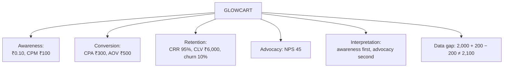

# CI-4: GlowCart KPI Worked Case

Covers: the faculty's GlowCart case solved line by line (cost per impression, CPM, CPA, AOV, CRR, CLV, churn, NPS), the data inconsistencies in the slide, the KPI table, the overall interpretation, and a second consistent practice set. **(syllabus)**

## Where this fits in the ESE

The faculty set this as a worked scenario with a results table to fill in, which is the exact shape of a 10- or 15-mark numerical case. Every figure below was recomputed. Learn the order: **cost per impression → CPM → CPA → AOV → CRR → CLV → churn → NPS → overall interpretation.**

## The case data (class)

GlowCart (an online beauty and personal-care company) ran a digital campaign. Data for the year:

| Item | Value |
|---|---|
| Spend on YouTube and Instagram advertising | ₹60,000 |
| Impressions | 6,00,000 |
| New customer acquisitions | 200 |
| Orders from these customers | 1,500 |
| Revenue from these orders | ₹7,50,000 |
| Customers at start of year | 2,000 |
| New customers acquired | 200 |
| Customers at end of year (as stated) | 2,100 |
| Customers who stopped buying | 200 |
| Orders per average customer per year | 4 |
| Average customer lifespan | 3 years |
| NPS survey | 500 customers: 300 promoters, 125 passives, 75 detractors |

## Solution, laid out as the exam answer

**1. Cost per impression and CPM**
- Cost per impression = 60,000 ÷ 6,00,000 = **₹0.10**.
- CPM = 0.10 × 1,000 = **₹100 per 1,000 impressions**.
- Meaning: each exposure costs 10 paise. Against the class comparison campaigns (₹0.02 and ₹0.08 per impression) this is the dearest exposure, so awareness spending is the least efficient part of the funnel.

**2. Cost per acquisition**
- CPA = 60,000 ÷ 200 = **₹300 per new customer**.
- Meaning: GlowCart pays ₹300 in advertising to win one customer.

**3. Average order value**
- AOV = 7,50,000 ÷ 1,500 = **₹500**.
- Meaning: the average order is worth ₹500, so one first order (₹500) is more than the CPA of ₹300 in revenue terms (profit depends on margin, not given).

**4. Customer retention rate**
- CRR = (E − N) ÷ S × 100 = (2,100 − 200) ÷ 2,000 × 100 = **95%**.
- Meaning: 95% of start-of-year customers were retained on the stated ending count.

**5. Customer lifetime value**
- CLV = AOV × purchase frequency × lifespan = 500 × 4 × 3 = **₹6,000** (revenue CLV).
- CLV : CPA = 6,000 ÷ 300 = **20 : 1** (CPA here is advertising cost only, so true CAC would be higher; and CLV is revenue, not profit).

**6. Churn rate**
- Churn = 200 ÷ 2,000 × 100 = **10%**.

**7. Net promoter score**
- Promoters 300 ÷ 500 = 60%; passives 125 ÷ 500 = 25% (ignored); detractors 75 ÷ 500 = 15%.
- NPS = 60 − 15 = **45**.
- Meaning: positive, with four times as many promoters as detractors, but 40% of respondents are not promoters.

## KPI table (the faculty's results grid, completed)

| Marketing phase | KPI | Result | Interpretation |
|---|---|---|---|
| Awareness | Cost per impression | ₹0.10 | Higher than the ₹0.02 and ₹0.08 comparison campaigns |
| Awareness | CPM | ₹100 | Expensive exposure |
| Conversion | CPA | ₹300 | Recovered by one ₹500 order in revenue terms |
| Conversion | AOV | ₹500 | Healthy basket; room to raise with bundles |
| Retention | CRR | 95% (see inconsistency) | Strong |
| Retention | CLV | ₹6,000 | 20 times the CPA |
| Retention | Churn rate | 10% | Moderate; reconcile with CRR |
| Advocacy | NPS | 45 | Good, but 40% are passives or detractors |

## Data inconsistencies in the slide (state them in the exam)

1. **Customer count does not reconcile.** 2,000 + 200 new − 200 lost = **2,000**, not the stated 2,100. With the stated 2,100, the formula (E − N) ÷ S gives 95% and implies only 100 customers lost (churn 5%). With 200 lost, churn is 10% and the consistent CRR is (2,000 − 200) ÷ 2,000 = **90%**. CRR and churn add to 100% only on consistent data.
2. **Orders per customer.** 1,500 orders from 200 new customers is 7.5 orders each, but the case also says the average customer places 4 orders a year. The AOV calculation (revenue ÷ orders) is unaffected.
3. **Slide labelling.** The formula "advertising cost ÷ impressions × 1,000" is the CPM, not the cost per impression.

**What to write in the exam:** give CRR 95% as the answer from the stated figures, add one line that on 2,000 start, 200 new and 200 lost the ending count would be 2,000 and CRR would be 90%, and give churn 10% from the stated 200 lost. This shows the numbers and the awareness of the gap, and costs no extra marks.

## Overall interpretation (class higher-order question)

Question: which area needs the most attention: awareness, conversion, retention or advocacy?

1. **Awareness:** ₹0.10 per impression is above both benchmark campaigns on the slides, and only 200 customers came from 6,00,000 impressions (0.033%).
2. **Conversion:** CPA ₹300 against AOV ₹500 is healthy.
3. **Retention:** CRR of 90% to 95%, churn 10%, and CLV 20 times CPA show strong returns.
4. **Advocacy:** NPS 45 is positive but leaves 40% of customers who are not promoters.

**Recommendation:** **awareness** needs the most attention, because it is the costliest per unit and feeds the whole funnel; shift spend to the cheaper platform and track impression-to-purchase. **Advocacy** is second: raising NPS through referral rewards brings customers in at lower cost, reducing the need for paid awareness. Retention and conversion are the strengths. State that the judgement is based on the slide's benchmarks only, since no industry benchmarks are given.

## Second practice set (fictional, consistent data)

**Data (SilkRoute Tea, fictional):** ad spend ₹45,000; impressions 9,00,000; new customers 150; orders 600; revenue ₹3,60,000; customers at start 1,000; new 100; lost 80; orders per customer per year 4; lifespan 3 years; NPS survey 200 customers: 110 promoters, 60 passives, 30 detractors.

| KPI | Working | Result |
|---|---|---|
| Cost per impression | 45,000 ÷ 9,00,000 | ₹0.05 |
| CPM | 0.05 × 1,000 | ₹50 |
| CPA | 45,000 ÷ 150 | ₹300 |
| AOV | 3,60,000 ÷ 600 | ₹600 |
| Ending customers | 1,000 + 100 − 80 | 1,020 |
| CRR | (1,020 − 100) ÷ 1,000 × 100 | 92% |
| CLV | 600 × 4 × 3 | ₹7,200 |
| Churn | 80 ÷ 1,000 × 100 | 8% |
| NPS | 110/200 = 55%; 30/200 = 15%; 55 − 15 | 40 |

Check: CRR 92% + churn 8% = 100%. Interpretation: efficient awareness (₹50 CPM), retention strong, NPS of 40 is healthy; CLV is 24 times CPA (7,200 ÷ 300).

## What to remember

- GlowCart answers: ₹0.10, ₹100 CPM, ₹300 CPA, ₹500 AOV, 95% CRR (90% on consistent data), ₹6,000 CLV, 10% churn, NPS 45.
- Order of calculation: impression cost, CPM, CPA, AOV, CRR, CLV, churn, NPS.
- The slide data do not reconcile (2,000 + 200 − 200 is not 2,100); show your figure and flag it.
- Interpretation is a judgement: argue it with the numbers and name the benchmark you used.
- CLV here is revenue CLV, and CPA is ad cost only.

## Concept map

## Flashcards
Q: GlowCart: cost per impression and CPM?
A: 60,000 ÷ 6,00,000 = ₹0.10; CPM = ₹100.

Q: GlowCart: CPA?
A: 60,000 ÷ 200 = ₹300.

Q: GlowCart: AOV?
A: 7,50,000 ÷ 1,500 = ₹500.

Q: GlowCart: CLV?
A: 500 × 4 × 3 = ₹6,000 (revenue CLV), which is 20 times the CPA of ₹300.

Q: GlowCart: churn rate and CRR?
A: Churn = 200 ÷ 2,000 = 10%; CRR = (2,100 − 200) ÷ 2,000 = 95% on the stated ending count.

Q: GlowCart: NPS?
A: 60% promoters minus 15% detractors = 45 (passives of 25% ignored).

Q: What is wrong with the GlowCart customer counts?
A: 2,000 + 200 − 200 = 2,000, not the stated 2,100; on consistent data CRR would be 90%.

Q: Which stage needs most attention in GlowCart, and why?
A: Awareness: ₹0.10 per impression is higher than the ₹0.02 and ₹0.08 comparison campaigns; advocacy is second.

Q: In the SilkRoute practice set, what are CRR and churn?
A: CRR 92% and churn 8%, adding to 100%.

## Sources
- Faculty deck CRM Unit 5 (GlowCart case); formulas from [[CRM Unit 5 - CI-3 CRM ROI and the Four-Stage KPI Framework]]
- Next node: [[CRM Unit 5 - CI-5 Impact on Organizational Performance and Employee Behaviour]]
- [[CRM Unit 5 - Implementation and Performance MOC (Node Map)]]
