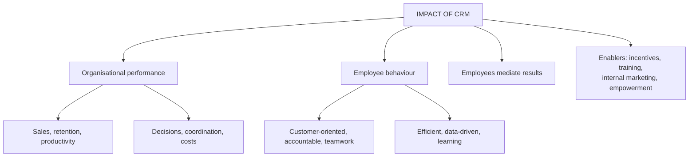

# CI-5: Impact on Organizational Performance and Employee Behaviour

Covers: the six ways CRM improves organisational performance, the six ways it changes employee behaviour, the mediating role of employees, the behavioural shifts required, and the organisational enablers. **(syllabus)**

## Where this fits in the ESE

The deck lists exactly six impacts on performance and six on behaviour, each with an example, so "Explain the impact of CRM on organisational performance and employee behaviour" is a ready 10-marker (six plus six), or a 5-marker if you take one half. Learn both lists as letters A to F.

## Impact on organisational performance (class)

| | Impact | How CRM does it | Class example or result |
|---|---|---|---|
| A | **Increase in sales** | Salespeople understand needs and buying history | A buyer of a basic laptop is offered a better laptop or accessories: cross-selling and upselling, higher sales |
| B | **Better customer retention** | Tracks interactions, complaints, purchases; spots customers likely to stop buying | Relevant offers and follow-ups: better service, higher satisfaction, retention, repeat purchase |
| C | **Improved productivity** | Automates reminders, recording customer data, reports, lead follow-up, opportunity tracking | Less administrative time, more productive time |
| D | **Faster decision making** | Reports show best-selling products, high-value customers, lead-generating campaigns, top salespeople | Decisions use actual customer data, not guesswork |
| E | **Better coordination** | Departments access relevant customer information | Marketing lead is visible to sales; after the sale service sees the history: less duplication |
| F | **Reduction in costs** | Automates repetitive work; cuts paperwork and duplicate entry; better targeting; lower acquisition cost | Efficiency, lower operating cost, better profitability |

Memory hook: **S-R-P-D-C-C**: Sales, Retention, Productivity, Decisions, Coordination, Costs.

These gains compound over time (retention-loyalty-profit logic, CV-3), and short-term financial reporting tends to understate them (CI-3).

## Impact on employee behaviour (class)

| | Behaviour change | Class example |
|---|---|---|
| A | **More customer-oriented** | From "I need to meet my sales target" to "What does this customer actually need?" |
| B | **Better accountability** | CRM records calls, follow-ups, leads, opportunities, complaints resolved, so activity is visible |
| C | **Better teamwork** | Sales need not repeatedly ask service for a customer's complaint history |
| D | **Greater efficiency** | Without CRM: check Excel, search email, call another department, update records. With CRM: open the customer profile |
| E | **Data-driven behaviour** | From "I think this customer may be interested" to checking previous purchases and interactions |
| F | **Learning and skill development** | Skills in data management, customer analysis, digital communication, sales tracking, report interpretation |

Memory hook: **C-A-T-E-D-L**: Customer-oriented, Accountability, Teamwork, Efficiency, Data-driven, Learning.

## Employees as the link (student notes, textbook)

The service-profit chain (Heskett et al.) puts employee experience upstream: internal service quality, employee satisfaction, retention and productivity, external service value, customer satisfaction, loyalty, profitability (CV-3). Frontline employees enact the moments of truth (CF-4), so their motivation and empowerment affect service quality however advanced the CRM tool is.

## Behavioural shifts required (student notes)

- From **transaction processing** to **relationship management**: an agent sees a complaint as a retention opportunity, not a ticket to close.
- **More complex roles:** employees interpret CRM insights (for example a flagged high-value customer) and adapt in real time.
- **Empowerment:** authority such as a discretionary refund limit to resolve issues without long escalation.

## Organisational enablers (student notes)

- **Incentive redesign:** reward retention and satisfaction, not only sales volume (SO-5).
- **Training:** system skills and relationship skills.
- **Internal marketing:** treat employees as an internal customer segment (the internal market in CF-2) whose buy-in has to be earned.

## Worked answer: "Explain the impact of CRM on organisational performance and employee behaviour" (10 marks)

1. One-line intro: CRM changes both results and the way people work, and the two are linked.
2. Table of six performance impacts with one example each.
3. Table of six behaviour changes with one example each.
4. Link: behaviour changes (data-driven, customer-oriented) produce the performance gains (retention, sales).
5. Enablers: incentives, training, internal marketing, empowerment.
6. Interpretation: technology alone does not deliver the gains; employee behaviour is the mediator.

## What to remember

- Six performance impacts: sales, retention, productivity, faster decisions, coordination, cost reduction.
- Six behaviour impacts: customer-oriented, accountable, team-based, efficient, data-driven, learning.
- Employee behaviour mediates CRM results (service-profit chain).
- Shift from transaction processing to relationship management; give empowerment.
- Enablers: incentive redesign, training, internal marketing.

## Concept map

## Flashcards
Q: List the six impacts of CRM on organisational performance.
A: Increase in sales, better customer retention, improved productivity, faster decision making, better coordination, reduction in costs.

Q: How does CRM increase sales?
A: Salespeople understand needs and buying history, enabling cross-selling and upselling.

Q: How does CRM reduce costs?
A: Automating repetitive work, less paperwork and duplicate entry, better targeting and lower acquisition cost.

Q: List the six impacts of CRM on employee behaviour.
A: More customer-oriented behaviour, better accountability, better teamwork, greater efficiency, data-driven behaviour, learning and skill development.

Q: What changes in a customer-oriented employee's thinking?
A: From "I need to meet my sales target" to "What does this customer actually need?"

Q: How does CRM raise accountability?
A: It records calls, follow-ups, leads, opportunities and complaints resolved, making activity visible.

Q: Why do employees mediate CRM results?
A: Frontline employees enact the moments of truth, so their motivation and empowerment shape service quality regardless of technology.

Q: Name two organisational enablers of the behaviour shift.
A: Incentive redesign towards retention and satisfaction, training, internal marketing, empowerment (any two).

## Sources
- Faculty deck CRM Unit 5; student notes; Heskett et al. (1994) (textbook)
- Next node: [[CRM Unit 5 - CI-6 Unit 5 Exam Answers]]
- [[CRM Unit 5 - Implementation and Performance MOC (Node Map)]]
