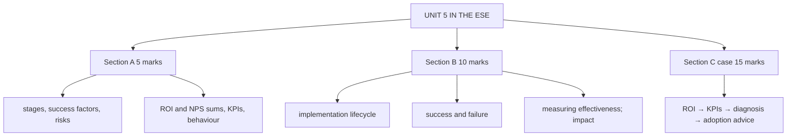

# CI-6: Unit 5 Exam Answers

Covers: what the ESE is likely to ask from Unit 5, 5-mark and 10-mark skeletons, and a 15-mark case layout with a model answer combining ROI, the KPI set and implementation diagnosis. Numbers are recomputed.

## What the test will ask

Assumed ESE: Section A 3 × 5, Section B 2 × 10, Section C one compulsory 15-mark case, 50 marks, no phone calculators. Unit 5 mixes theory (lifecycle, success and failure, impacts) with the second numerical topic (ROI and KPIs). Expect the compulsory case to draw on this unit because the faculty already set a numerical case (GlowCart). Practise the KPI order and keep calculations in a table.

## Five-mark answer skeletons

**1. Stages of CRM implementation (CI-1).** Nine stages in order, one-line objective each.

**2. Success factors in CRM implementation (CI-2).** Eight factors with one example each.

**3. Failure risks in CRM implementation (CI-2).** Six risks with the class example and the matching fix.

**4. CRM ROI with a calculation (CI-3).** Formula → table (net gain, divide by cost, percentage) → interpretation. Quick number: 50%.

**5. NPS with a calculation (CI-3).** Four steps → groups → subtraction → reading. Quick number: 70 − 10 = 60.

**6. KPIs across the customer journey (CI-3).** Four stages and their KPIs.

**7. Impact of CRM on employee behaviour (CI-5).** Six changes with one example each.

## Ten-mark answer skeletons

**A. CRM implementation lifecycle (CI-1).** Definition → nine stages with objective and activities → eleven threads → Payne and Frow → iterative loop.

**B. Success factors and failure risks (CI-2).** CRM is technology, people, process, data, culture → eight factors → six risks → mirror table → broader risks → conclusion.

**C. Measuring CRM effectiveness (CI-3, CI-4).** ROI → four-stage KPI table → formulas with check sums → balanced scorecard → challenges → interpretation.

**D. Impact on organisational performance and employee behaviour (CI-5).** Six plus six → link through employee behaviour → enablers.

## Fifteen-mark case layout (ROI, KPIs and diagnosis)

1. **ROI (3):** total cost, total benefit, ROI %, payback.
2. **KPI calculation (6):** cost per impression, CPM, CPA, AOV, CRR, churn, CLV, NPS in a table.
3. **Diagnosis (3):** which stage needs attention, with reasons.
4. **Implementation and adoption advice (3):** matching success factor or lifecycle stage; measures.

### Model answer, laid out as the exam answer

**Case (fictional):** *SilkRoute Tea (fictional)* introduced a CRM. CRM costs: licence ₹3,00,000, implementation ₹2,50,000, training ₹1,00,000, maintenance ₹1,50,000. First-year incremental benefits: extra repeat-sales margin ₹6,00,000, cross-sell margin ₹3,50,000, service cost saving ₹1,50,000. Campaign data for the year: ad spend ₹90,000; impressions 4,50,000; new customers 150; their orders 450; revenue ₹2,70,000. Customers: start 800, new 150, end 900. Orders per customer per year 3; lifespan 4 years. NPS survey of 200 customers: 90 promoters, 70 passives, 40 detractors. Staff survey: many still use personal spreadsheets.

1. **ROI**
| Step | Working | Result |
|---|---|---|
| Total cost | 3,00,000 + 2,50,000 + 1,00,000 + 1,50,000 | ₹8,00,000 |
| Total benefit | 6,00,000 + 3,50,000 + 1,50,000 | ₹11,00,000 |
| ROI | (11,00,000 − 8,00,000) ÷ 8,00,000 × 100 | **37.5%** |
| Payback (even accrual) | 8,00,000 ÷ 11,00,000 × 12 | about 8.7 months |

   Interpretation: every ₹1 invested returned ₹1.375, a positive return in year one.

2. **KPIs**
| KPI | Working | Result |
|---|---|---|
| Cost per impression | 90,000 ÷ 4,50,000 | ₹0.20 |
| CPM | 0.20 × 1,000 | ₹200 |
| CPA | 90,000 ÷ 150 | ₹600 |
| AOV | 2,70,000 ÷ 450 | ₹600 |
| Lost customers | 800 + 150 − 900 | 50 |
| CRR | (900 − 150) ÷ 800 × 100 | 93.75% |
| Churn | 50 ÷ 800 × 100 | 6.25% |
| CLV | 600 × 3 × 4 | ₹7,200 |
| CLV : CPA | 7,200 ÷ 600 | 12 : 1 |
| NPS | 90/200 = 45%; 40/200 = 20%; 45 − 20 | **25** |

   Check: CRR 93.75% + churn 6.25% = 100%.

3. **Diagnosis:** retention is strong (CRR 93.75%) and lifetime value is 12 times the acquisition cost. The two weak signals are **advocacy** (NPS 25 with 20% detractors) and the **conversion cost** (CPA ₹600 equals AOV ₹600, so the first order repays advertising only in revenue terms, and in profit terms only after repeat orders). Priority: advocacy, because a referral scheme lowers CPA and the detractors threaten the retention that currently carries the business.
4. **Implementation and adoption advice:** spreadsheets signal the failure risks of employee resistance and poor training (CI-2). Fixes: top management uses only the CRM for reports, role-based training (stage 5), a data audit so the CRM is the single source (stage 4), and monitoring adoption rate in stage 8 and 9. Track adoption rate, NPS and CPA monthly.

Close with: *a 37.5% ROI and a 12 : 1 CLV to CPA show CRM is paying back; advocacy and staff adoption are what will keep it paying.*

Caveats: CLV is revenue based; ROI is one year of benefits against all costs; CPA counts advertising cost only.

## Time rule

Order of calculation: ROI table first (it is quickest), then KPIs in the fixed order, then one paragraph of diagnosis. Always run the CRR + churn = 100% check.

## What to remember

- Unit 5 numericals: ROI = (benefit − cost) ÷ cost; KPI order: cost per impression, CPM, CPA, AOV, CRR, churn, CLV, NPS.
- Case numbers: ROI 37.5%; CPM ₹200; CPA ₹600; AOV ₹600; CRR 93.75%; churn 6.25%; CLV ₹7,200; NPS 25.
- GlowCart: ₹0.10, ₹100, ₹300, ₹500, 95%, ₹6,000, 10%, 45.
- Link every diagnosis to a success factor or failure risk from CI-2.
- Nine implementation stages and the iterative loop.

## Concept map

## Flashcards
Q: Which numerical set is most likely from Unit 5?
A: CRM ROI plus the KPI set: cost per impression, CPM, CPA, AOV, CRR, churn, CLV and NPS.

Q: In the SilkRoute case, what is the ROI?
A: (11,00,000 − 8,00,000) ÷ 8,00,000 × 100 = 37.5%.

Q: In the SilkRoute case, what are CRR and churn?
A: CRR (900 − 150) ÷ 800 = 93.75%; churn 50 ÷ 800 = 6.25%; they add to 100%.

Q: In the SilkRoute case, what is the NPS?
A: 45% promoters minus 20% detractors = 25.

Q: Why is advocacy the priority in the SilkRoute case?
A: NPS is only 25 with 20% detractors; a referral scheme would lower the CPA of ₹600 and protect retention.

Q: What check should always follow a CRR and churn calculation?
A: CRR plus churn should equal 100% on consistent data.

Q: What three caveats go with the model answer?
A: CLV is revenue not profit, ROI uses one year of benefits against all costs, and CPA counts advertising cost only.

## Sources
- Assumed ESE pattern; CI-1 to CI-5
- [[CRM Unit 5 - Implementation and Performance MOC (Node Map)]]
