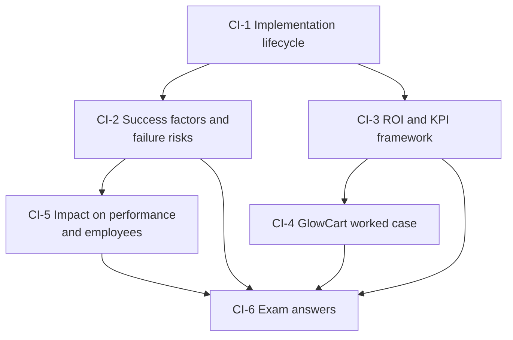

# CRM Unit 5: CRM Implementation and Performance Measurement, node map

ESE (assumed, no course plan PDF): 50 marks, Section A 3 × 5, Section B 2 × 10, Section C one compulsory 15-mark case; no phone calculators. Unit 5 is theory plus the second numerical topic: ROI and KPIs. Examples are **illustrative**; fictional firms are marked.

## Nodes

| Node | Topic | Deps | Minutes | Exam focus |
|---|---|---|---|---|
| CI-1 | CRM Implementation Lifecycle | none | 35 | yes |
| CI-2 | Success Factors and Failure Risks | CI-1 | 30 | yes |
| CI-3 | CRM ROI and the Four-Stage KPI Framework | CI-1, CV-2 | 45 | yes |
| CI-4 | GlowCart KPI Worked Case | CI-3 | 40 | yes |
| CI-5 | Impact on Organizational Performance and Employee Behaviour | CI-2 | 30 | yes |
| CI-6 | Unit 5 Exam Answers | CI-1 to CI-5 | 30 | yes |

Total reading time: about 210 minutes.

## Dependency graph

## Key formulas and numbers to know

- ROI % = (benefit − cost) ÷ cost × 100. Class example: ₹1,00,000 cost, ₹1,50,000 benefit, 50%.
- Cost per impression = cost ÷ impressions; CPM = × 1,000. CPA = cost ÷ conversions. AOV = revenue ÷ orders.
- CRR = (E − N) ÷ S × 100; churn = lost ÷ S × 100; CLV = AOV × frequency × lifespan.
- NPS = % promoters (9 to 10) − % detractors (0 to 6); passives (7 to 8) ignored. Class example: 60.
- GlowCart: ₹0.10, ₹100, ₹300, ₹500, 95% (90% on consistent data), ₹6,000, 10%, NPS 45; slide counts do not reconcile.
- Nine implementation stages; eight success factors; six failure risks; six performance impacts; six behaviour impacts.
- Illustrative case (ROI 37.5%; CPM ₹200; CPA ₹600; CRR 93.75%; CLV ₹7,200; NPS 25).

## Links
- [[CRM MOC]]
