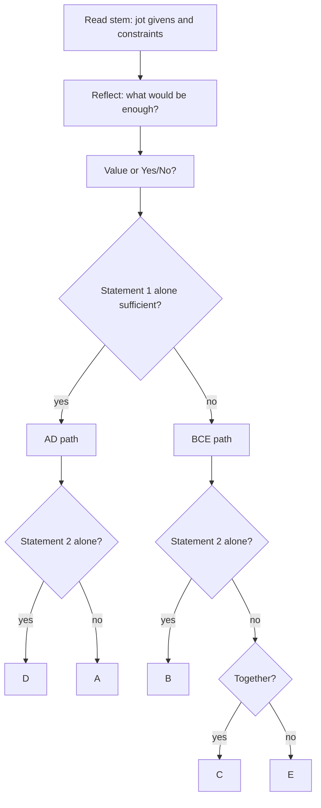

# D-1: DS Method (AD/BCE grid, judge sufficiency, don't solve)

**Why this matters for you:** your 2026-08-17 mock put DS at the 33rd percentile and DI at 68 (14th). The cause was method, not maths: you solved each question to the end and spent 3–8 minutes on DS early in the section. This node swaps solving for judging.

## What DS actually asks

- Each DS item is a question plus two statements, (1) and (2). Your job is to decide whether the data is *enough* to answer. You don't need to find the answer itself ([source](https://go.gmac.com/hubfs/07.Assessments/GMAT%20Exam/School%20Resources%202025/In-Depth-GMAT-Presentation-2025.pdf)).
- You may use the statements, your maths knowledge and everyday facts, such as the number of days in a month ([source](https://go.gmac.com/hubfs/07.Assessments/GMAT%20Exam/School%20Resources%202025/In-Depth-GMAT-Presentation-2025.pdf)).
- GMAC's own DS tips: the five answer choices never change, don't spend time solving the maths, check only whether the exact question can be answered, and don't assume figures are drawn to scale ([source](https://go.gmac.com/hubfs/07.Assessments/GMAT%20Exam/School%20Resources%202025/In-Depth-GMAT-Presentation-2025.pdf)).
- In Focus, DS sits in Data Insights. It now comes in real-world word-problem contexts plus a new verbal or logic DS type, and there are no pure algebra or number-property DS items ([source](https://e-gmat.com/blogs/beyond-numbers-the-new-face-of-data-sufficiency-questions-in-gmat-focus/)).

## The five fixed answers

| Choice | Meaning |
|---|---|
| A | (1) alone sufficient, (2) alone not |
| B | (2) alone sufficient, (1) alone not |
| C | Together sufficient, neither alone |
| D | Each alone sufficient |
| E | Not sufficient even together |

([source](https://www.crackverbal.com/resources/gmat-focus-data-sufficiency-guide/))

## AD/BCE: the decision grid

1. Judge (1) alone. If it is sufficient, the answer is **A or D**. If not, it is **B, C or E** ([source](https://www.crackverbal.com/resources/gmat-focus-data-sufficiency-guide/)).
2. Judge (2) alone, with (1) put out of your mind. On the AD path: sufficient gives D, insufficient gives A. On the BCE path: sufficient gives B ([source](https://www.crackverbal.com/resources/gmat-focus-data-sufficiency-guide/)).
3. Combine only when neither works alone. Together sufficient gives C, otherwise E ([source](https://www.crackverbal.com/resources/gmat-focus-data-sufficiency-guide/)).

## Process before the statements (stop solving here)

- **Glance and jot.** Draw a T on scratch paper and note the stem and its constraints before you read the statements ([source](https://www.manhattanprep.com/gmat/blog/gmat-data-sufficiency-follow-your-process-part-1/)).
- **Reflect.** Ask what information would be enough: a single number, a relationship, a sign? Do this before any calculation ([source](https://www.manhattanprep.com/gmat/blog/gmat-data-sufficiency-follow-your-process-part-1/)).
- **Sort the question type** (value or yes/no), **convert** units and relationships, and **define** what "sufficient" means for this stem before you choose a statement to start on ([source](https://www.crackverbal.com/resources/gmat-focus-data-sufficiency-guide/)).
- DS is a decision exercise, and it usually needs less computation than problem solving ([source](https://www.mbamission.com/blog/how-to-approach-data-sufficiency-questions-on-the-gmat/)).

## Testing cases (to prove a statement insufficient)

1. Pick numbers. 2. Check that every given is true for them. 3. Answer the question ([source](https://www.manhattanprep.com/gmat/blog/gmat-data-sufficiency-strategy-test-cases/)).
- Go hunting for the *opposite* answer. Once one case gives Yes and another gives No, the statement is insufficient and you stop ([source](https://www.manhattanprep.com/gmat/blog/gmat-data-sufficiency-strategy-test-cases/)).
- Vary the kind of number: positive, negative, zero, fractions, odd, even, prime. Valid cases from (1) can be reused on (2) ([source](https://www.manhattanprep.com/gmat/blog/gmat-data-sufficiency-strategy-test-cases/)).

## Timing target

- Aim for about 90–150 seconds on a medium DS question ([source](https://www.crackverbal.com/resources/gmat-focus-data-sufficiency-guide/)). Quant-based DS typically takes 1.5–2.5 minutes ([source](https://blog.targettestprep.com/data-insights-timing-strategy/)). Your 3–8 minutes is two to four times that.

## Worked example *(original example)*

Question: what is the value of 3a + 2b?
(1) 6a + 4b = 30. (2) a = 2.

- Reflect: you need the *combination* 3a + 2b, not a and b separately.
- (1): 6a + 4b = 2(3a + 2b) = 30, so 3a + 2b = 15. That is one value, so (1) is sufficient and you are on the AD path. Stop there; you never need a or b.
- (2): a = 2 leaves b free, so the expression can take many values. Insufficient.
- Answer **A**. The trap is deciding "two unknowns need two equations" and jumping to C.

## Traps (more in D-2)

- Assuming you must find each variable when the stem asks for a combination such as xy or a percentage ([source](https://manhattanprep.com/gmat/blog/heres-why-you-might-be-missing-gmat-data-sufficiency-problems-part-1-2)).

## Concept map

## Flashcards
Q: What is your job on a DS question?
A: Decide whether the statements give enough information to answer the question. You don't find the answer itself.

Q: Statement (1) is sufficient. Which answers are still possible?
A: A or D (the AD path).

Q: Statement (1) is insufficient. Which answers are still possible?
A: B, C or E (the BCE path).

Q: When do you combine the statements?
A: Only when neither statement is sufficient alone. Together sufficient gives C, otherwise E.

Q: What two steps come before you read the statements?
A: Jot the stem and its constraints, then reflect on what information would be sufficient.

Q: How do you prove a statement insufficient by testing cases?
A: Find one valid case that gives Yes and another that gives No, or two different values.

Q: Which kinds of numbers should you vary when testing cases?
A: Positive, negative, zero, fractions, odd, even and prime.

Q: What is the target time for a medium DS question?
A: About 90–150 seconds. Quant-based DS typically runs 1.5–2.5 minutes.

Q: Stem asks for 3a + 2b and (1) gives 6a + 4b = 30. Sufficient?
A: Yes. 6a + 4b = 2(3a + 2b), so 3a + 2b = 15. You never need a or b separately.

Q: Can you assume a DS figure is drawn to scale?
A: No. GMAC's own tips say not to.

## Sources
- https://go.gmac.com/hubfs/07.Assessments/GMAT%20Exam/School%20Resources%202025/In-Depth-GMAT-Presentation-2025.pdf
- https://e-gmat.com/blogs/beyond-numbers-the-new-face-of-data-sufficiency-questions-in-gmat-focus/
- https://www.crackverbal.com/resources/gmat-focus-data-sufficiency-guide/
- https://www.manhattanprep.com/gmat/blog/gmat-data-sufficiency-follow-your-process-part-1/
- https://www.manhattanprep.com/gmat/blog/gmat-data-sufficiency-strategy-test-cases/
- https://www.mbamission.com/blog/how-to-approach-data-sufficiency-questions-on-the-gmat/
- https://blog.targettestprep.com/data-insights-timing-strategy/
- https://manhattanprep.com/gmat/blog/heres-why-you-might-be-missing-gmat-data-sufficiency-problems-part-1-2
