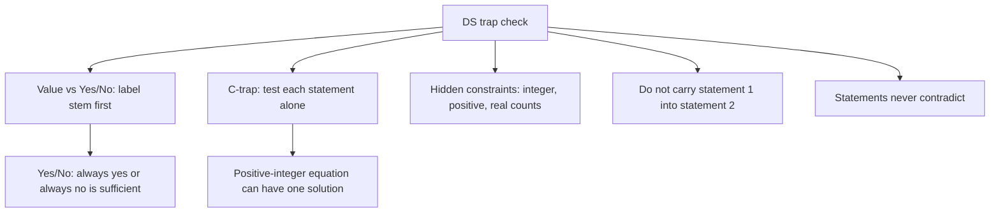

# D-2: DS Traps (value vs yes/no, hidden constraints, C-trap)

**Why this matters for you:** DS was your lowest DI sub-score (33rd percentile), and DI "felt fine" while scoring worst. These traps are the reason a DS answer can feel right and still be wrong.

## Trap 1: treating a yes/no question as a value question

- On a **value** question, a statement is sufficient only if it pins down one exact value ([source](https://manhattanprep.com/gmat/blog/why-do-we-care-about-yesno-data-sufficiency-questions)).
- On a **yes/no** question, a statement is sufficient if it gives an answer that is *always yes* or *always no*. It doesn't need to give a value ([source](https://manhattanprep.com/gmat/blog/why-do-we-care-about-yesno-data-sufficiency-questions)).
- Mixing the two up is a classic cause of saying "insufficient" when the statement was actually sufficient ([source](https://manhattanprep.com/gmat/blog/heres-why-you-might-be-missing-gmat-data-sufficiency-problems-part-1-2)).
- Fix: label the stem V or Y/N before reading the statements ("Sort") ([source](https://www.crackverbal.com/resources/gmat-focus-data-sufficiency-guide/)).

## Trap 2: the C-trap

- Two statements that look like they "obviously" need each other tempt you to pick C without testing each alone ([source](https://blog.targettestprep.com/the-c-trap-in-gmat-data-sufficiency-questions/)).
- Calling a statement insufficient when it was sufficient (a Type 2 error) happens about 50% more often than the reverse. Picking C when the answer was A or B is the classic case ([source](https://manhattanprep.com/gmat/blog/heres-why-you-might-be-missing-gmat-data-sufficiency-problems-part-1-2)).
- Warning sign: one equation in two variables, where the variables must be **positive integers** and the coefficients are larger than 1. That can still have exactly one solution ([source](https://blog.targettestprep.com/the-c-trap-in-gmat-data-sufficiency-questions/)).
- Fix: run the full AD/BCE process on every question, even when C looks obvious ([source](https://blog.targettestprep.com/the-c-trap-in-gmat-data-sufficiency-questions/)).

## Trap 3: hidden constraints in the stem

- Read the stem for limits such as integers, positive values or real-world counts. They shrink the set of valid cases ([source](https://blog.targettestprep.com/the-c-trap-in-gmat-data-sufficiency-questions/)).
- The reverse also holds: don't treat a variable as an integer unless the stem says so ([source](https://magoosh.com/gmat/integer-properties-the-most-common-gmat-question-topic)).
- Don't read silence as impossibility; something the stem doesn't mention may still exist ([source](https://www.crackverbal.com/resources/gmat-focus-data-sufficiency-guide/)).

## Trap 4: carrying information across

- When you judge (2) alone, forget (1). Bringing data over from one statement to the other is a named error type ([source](https://manhattanprep.com/gmat/blog/heres-why-you-might-be-missing-gmat-data-sufficiency-problems-part-1-2)).
- The two statements never contradict each other. If your work on (1) and (2) seems to conflict, recheck the maths ([source](https://www.manhattanprep.com/gmat/blog/gmat-data-sufficiency-strategy-test-cases/)).

## Trap 5: "nice but not necessary" and lazy translation

- A statement built to look irrelevant can still answer the question. Translate word problems into equations before you call anything insufficient ([source](https://manhattanprep.com/gmat/blog/heres-why-you-might-be-missing-gmat-data-sufficiency-problems-part-1-2)).

## Worked example 1: yes/no *(original example)*

Is x² > x? (1) x < 0. (2) x > 0.5.
- (1): a negative x gives a positive x², which is always greater than x. **Always yes**, so sufficient.
- (2): x = 0.6 gives 0.36 > 0.6, which is No. x = 2 gives 4 > 2, which is Yes. Both answers appear, so insufficient.
- Answer **A**. Statement (1) never gives a value for x and is still sufficient.

## Worked example 2: C-trap *(original example)*

x and y are positive integers. What is x? (1) 5x + 7y = 31. (2) x < 4.
- (1): test y = 1, 2, 3, 4 (y = 5 already makes 7y > 31).
  - y = 1: 5x = 24, not an integer.
  - y = 2: 5x = 17, not an integer.
  - y = 3: 5x = 10, so x = 2.
  - y = 4: 5x = 3, not an integer.
  Only (x, y) = (2, 3) works, so (1) is sufficient.
- (2): x could be 1, 2 or 3. Insufficient.
- Answer **A**, not C.

## Concept map

## Flashcards
Q: When is a statement sufficient on a yes/no DS question?
A: When it gives an answer that is always yes or always no. No specific value is needed.

Q: When is a statement sufficient on a value DS question?
A: Only when it pins down exactly one value.

Q: What is the C-trap?
A: Picking C because the statements look as if they need each other, without testing each alone first.

Q: Which equation pattern often beats the C-trap?
A: One equation in two positive-integer variables with coefficients larger than 1. It can have exactly one solution.

Q: Which error type is about 50% more common in DS?
A: Type 2: calling a statement insufficient when it was actually sufficient.

Q: Can the two DS statements contradict each other?
A: No. If they seem to, recheck your maths.

Q: When you judge statement (2), what do you do with statement (1)?
A: Ignore it completely. Carrying information across is an error.

Q: Is x² > x, given (1) x < 0?
A: Always yes, so sufficient. x² is positive and x is negative.

Q: The stem says nothing about integers. May you assume x is an integer?
A: No. Unless the stem says integer, test fractions too.

## Sources
- https://manhattanprep.com/gmat/blog/why-do-we-care-about-yesno-data-sufficiency-questions
- https://manhattanprep.com/gmat/blog/heres-why-you-might-be-missing-gmat-data-sufficiency-problems-part-1-2
- https://blog.targettestprep.com/the-c-trap-in-gmat-data-sufficiency-questions/
- https://www.crackverbal.com/resources/gmat-focus-data-sufficiency-guide/
- https://www.manhattanprep.com/gmat/blog/gmat-data-sufficiency-strategy-test-cases/
- https://magoosh.com/gmat/integer-properties-the-most-common-gmat-question-topic
