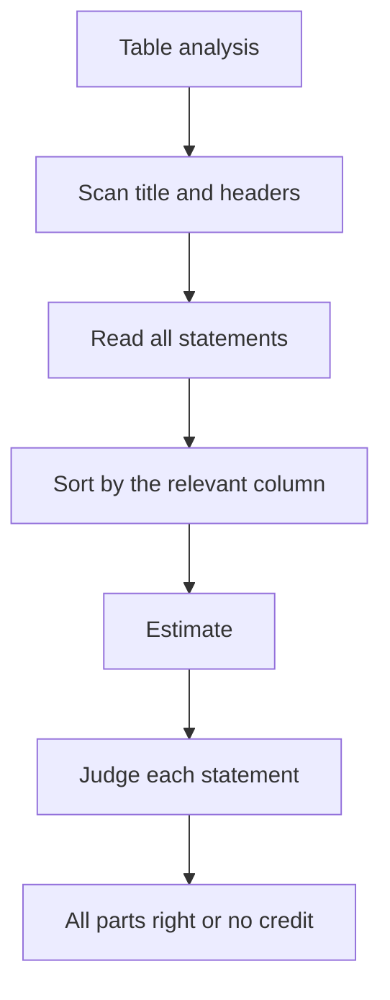

# D-3: Table Analysis

**Why this matters for you:** table questions are among the quickest DI points when you use sorting. Banking them buys back time for DS, where you were losing 3–8 minutes per question.

## Format

- A sortable, spreadsheet-like table with several statements, each answered in a two-option form such as Yes/No or True/False ([source](https://go.gmac.com/hubfs/07.Assessments/GMAT%20Exam/School%20Resources%202025/In-Depth-GMAT-Presentation-2025.pdf)).
- Every part must be right to get credit. There is no partial credit ([source](https://go.gmac.com/hubfs/07.Assessments/GMAT%20Exam/School%20Resources%202025/In-Depth-GMAT-Presentation-2025.pdf)).

## Method: scan, sort, solve

1. **Scan.** Read the title, the accompanying text and every column header first ([source](https://www.crackverbal.com/resources/gmat-focus-table-analysis-guide/)).
2. **Glance at all the statements** before you start calculating, and note the answer pair, such as Yes/No ([source](https://www.manhattanprep.com/gmat/blog/know-gmat-code-ir-table-problems)).
3. **Sort** by the column the statement actually depends on. Sorting groups similar values and shows the extremes straight away ([source](https://www.crackverbal.com/resources/gmat-focus-table-analysis-guide/)).
4. **Estimate** rather than calculate exactly, whenever the statement allows ([source](https://www.crackverbal.com/resources/gmat-focus-table-analysis-guide/)).
5. Judge each statement strictly on the stated condition ([source](https://go.gmac.com/hubfs/07.Assessments/GMAT%20Exam/School%20Resources%202025/In-Depth-GMAT-Presentation-2025.pdf)).

## Timing and traps

- Target about 2 minutes per question ([source](https://www.crackverbal.com/resources/gmat-focus-table-analysis-guide/)). TTP gives a typical range of 1.5–2.5 minutes ([source](https://blog.targettestprep.com/data-insights-timing-strategy/)).
- Trap: mixing up similar columns, such as production against exports, or a share against a rank ([source](https://www.manhattanprep.com/gmat/blog/know-gmat-code-ir-table-problems)).
- Trap: drawing a conclusion the table doesn't actually support ([source](https://www.crackverbal.com/resources/gmat-focus-table-analysis-guide/)).

## Worked example *(original example)*

Table: five stores, with columns Revenue (₹ lakh) and Staff.
Statement: "The store with the highest revenue also has the most staff."
- Sort by Revenue and read the top row, then sort by Staff and read the top row. Same store? That answers it, with no arithmetic needed.

## Concept map

## Flashcards
Q: Is there partial credit on Table Analysis?
A: No. Every statement must be right.

Q: What are the three steps of table analysis?
A: Scan, sort, solve, estimating where you can.

Q: Which column do you sort by?
A: The one the statement actually depends on.

Q: What is the target time for a table question?
A: About 2 minutes (TTP: 1.5–2.5 minutes).

Q: What is the classic table trap?
A: Confusing similar columns, such as production with exports.

Q: Exact calculation or estimate?
A: Estimate whenever the statement allows.

## Sources
- https://go.gmac.com/hubfs/07.Assessments/GMAT%20Exam/School%20Resources%202025/In-Depth-GMAT-Presentation-2025.pdf
- https://www.crackverbal.com/resources/gmat-focus-table-analysis-guide/
- https://www.manhattanprep.com/gmat/blog/know-gmat-code-ir-table-problems
- https://blog.targettestprep.com/data-insights-timing-strategy/
