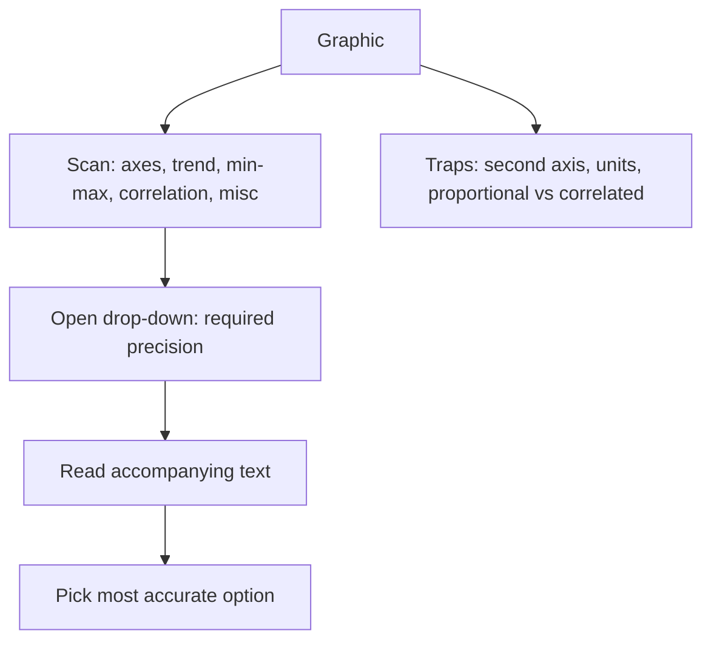

# D-4: Graphics Interpretation

**Why this matters for you:** graphics questions are about 20–30% of DI. They reward reading carefully, not calculating, so they are a dependable place to recover the DI points you lost on DS.

## Format

- A graph (scatter plot, x/y graph, bar, pie or distribution curve) followed by statements with blanks. Each blank has a drop-down menu ([source](https://go.gmac.com/hubfs/07.Assessments/GMAT%20Exam/School%20Resources%202025/In-Depth-GMAT-Presentation-2025.pdf)).
- Every blank must be right to get credit ([source](https://go.gmac.com/hubfs/07.Assessments/GMAT%20Exam/School%20Resources%202025/In-Depth-GMAT-Presentation-2025.pdf)).

## Method

- Let the question direct you, and don't get swamped by the graphic ([source](https://go.gmac.com/hubfs/07.Assessments/GMAT%20Exam/School%20Resources%202025/In-Depth-GMAT-Presentation-2025.pdf)).
- Read the accompanying text. It may hold data that isn't in the graph ([source](https://go.gmac.com/hubfs/07.Assessments/GMAT%20Exam/School%20Resources%202025/In-Depth-GMAT-Presentation-2025.pdf)).
- Open the drop-down **before** calculating. The options show how precise you need to be ([source](https://www.crackverbal.com/resources/gmat-focus-graphics-interpretation-guide/)).
- A quick scan of axes, trend, minimum and maximum, correlation and anything unusual (footnotes, a second axis, scale breaks, units) takes about 15–20 seconds ([source](https://www.crackverbal.com/resources/gmat-focus-graphics-interpretation-guide/)).
- More than one option can look plausible. Pick the one that makes the statement most accurate ([source](https://go.gmac.com/hubfs/07.Assessments/GMAT%20Exam/School%20Resources%202025/In-Depth-GMAT-Presentation-2025.pdf)).

## Traps

- "Proportional" (a constant ratio) is not the same as "correlated" (moving in the same direction) ([source](https://www.crackverbal.com/resources/gmat-focus-graphics-interpretation-guide/)).
- Missing a second y-axis or a scale break, mixing up units (thousands against units, percent against absolute), or reading a series against the wrong axis ([source](https://www.crackverbal.com/resources/gmat-focus-graphics-interpretation-guide/)).
- Calculating precisely when an estimate would do ([source](https://www.crackverbal.com/resources/gmat-focus-graphics-interpretation-guide/)).

## Timing

- Typically 1.5–3 minutes ([source](https://blog.targettestprep.com/data-insights-timing-strategy/)). Bookmark anything that passes 3 minutes ([source](https://www.crackverbal.com/resources/gmat-focus-graphics-interpretation-guide/)).

## Worked example *(original example)*

A scatter plot of ad spend (x) against sales (y) has points that rise roughly along a line but don't pass through the origin.
- "The relationship is ___ [positive / negative / none]": **positive**.
- "Sales are ___ [proportional / not proportional] to spend": **not proportional**, because the line doesn't pass through (0, 0). The proportional-vs-correlated trap.

## Concept map

## Flashcards
Q: What should you do before calculating on a GI question?
A: Open the drop-down to see how precise you need to be.

Q: What is in the quick GI scan?
A: Axes, trend, min/max, correlation, and anything unusual (footnotes, second axis, units).

Q: Proportional vs correlated?
A: Proportional means a constant ratio through the origin. Correlated means only that the variables move together.

Q: Is there partial credit for two blanks?
A: No. Both must be right.

Q: Where else can GI data hide?
A: In the accompanying text.

Q: What is the typical GI time?
A: About 1.5–3 minutes.

## Sources
- https://go.gmac.com/hubfs/07.Assessments/GMAT%20Exam/School%20Resources%202025/In-Depth-GMAT-Presentation-2025.pdf
- https://www.crackverbal.com/resources/gmat-focus-graphics-interpretation-guide/
- https://blog.targettestprep.com/data-insights-timing-strategy/
