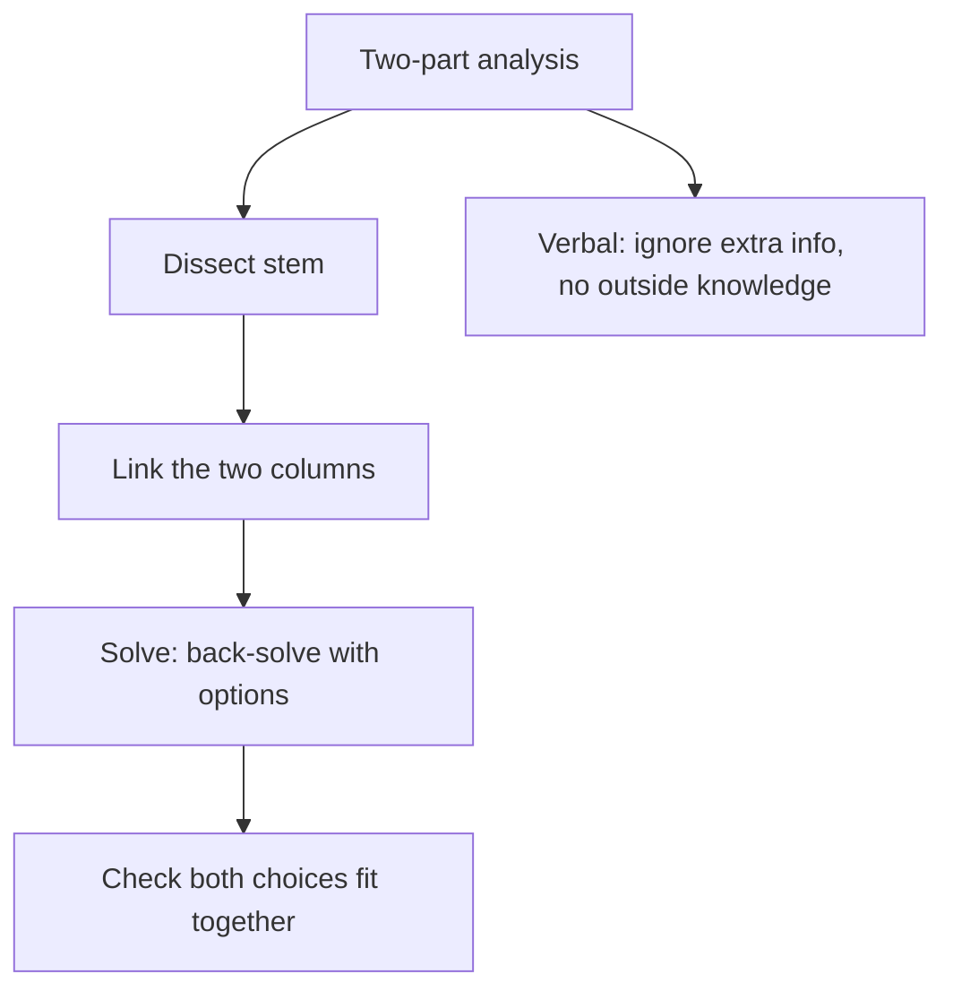

# D-5: Two-Part Analysis

**Why this matters for you:** TPA can be quant, verbal or both, and there is no partial credit. Knowing when to back-solve and when to guess keeps it from becoming another 5-minute sink like your DS.

## Format

- You make two choices, one per column, from a shared list of options. Together or separately, they must meet the stated conditions ([source](https://go.gmac.com/hubfs/07.Assessments/GMAT%20Exam/School%20Resources%202025/In-Depth-GMAT-Presentation-2025.pdf)).
- It tests trade-offs, simultaneous equations and the relationship between two entities ([source](https://go.gmac.com/hubfs/07.Assessments/GMAT%20Exam/School%20Resources%202025/In-Depth-GMAT-Presentation-2025.pdf)).
- With 5–6 options per column there are up to 36 combinations, so blind guessing rarely works ([source](https://www.crackverbal.com/resources/gmat-focus-two-part-analysis-guide/)).

## Method

1. **Dissect** the stem. 2. **Link** the two columns: how does one answer constrain the other? 3. **Solve**, often by back-solving with the listed options ([source](https://www.crackverbal.com/resources/gmat-focus-two-part-analysis-guide/)).
- Quant TPA: check your work as you go, because there are often several solution paths ([source](https://go.gmac.com/hubfs/07.Assessments/GMAT%20Exam/School%20Resources%202025/In-Depth-GMAT-Presentation-2025.pdf)).
- Verbal TPA: the prompt often gives more information than you need. Use only what is in the prompt, not outside knowledge ([source](https://go.gmac.com/hubfs/07.Assessments/GMAT%20Exam/School%20Resources%202025/In-Depth-GMAT-Presentation-2025.pdf)).
- Before submitting, check that both selections fit together ([source](https://www.crackverbal.com/resources/gmat-focus-two-part-analysis-guide/)).

## Timing

- Quant TPA typically takes 1.5–3 minutes and verbal TPA 1.5–2.5 minutes ([source](https://blog.targettestprep.com/data-insights-timing-strategy/)).

## Worked example *(original example)*

"Choose x and y from {2, 3, 4, 6, 8} so that x + y = 10 and xy = 24."
- Link: you need two numbers with sum 10 and product 24. Test pairs: 4 + 6 = 10 and 4 × 6 = 24. **x = 4, y = 6**, or the reverse if the columns allow it.
- 2 + 8 = 10 but 2 × 8 = 16, so that pair fails the second condition.

## Concept map

## Flashcards
Q: Does TPA give partial credit?
A: No. Both columns must be right.

Q: What are the three DLS steps?
A: Dissect, Link, Solve.

Q: Why does back-solving suit TPA?
A: The options for both columns are listed, so you can test them against the conditions.

Q: Verbal TPA tip?
A: The prompt often holds extra information, and outside knowledge doesn't count.

Q: How many combinations are possible with 6 options in each column?
A: Up to 36.

Q: What is the typical quant TPA time?
A: 1.5–3 minutes.

## Sources
- https://go.gmac.com/hubfs/07.Assessments/GMAT%20Exam/School%20Resources%202025/In-Depth-GMAT-Presentation-2025.pdf
- https://www.crackverbal.com/resources/gmat-focus-two-part-analysis-guide/
- https://blog.targettestprep.com/data-insights-timing-strategy/
