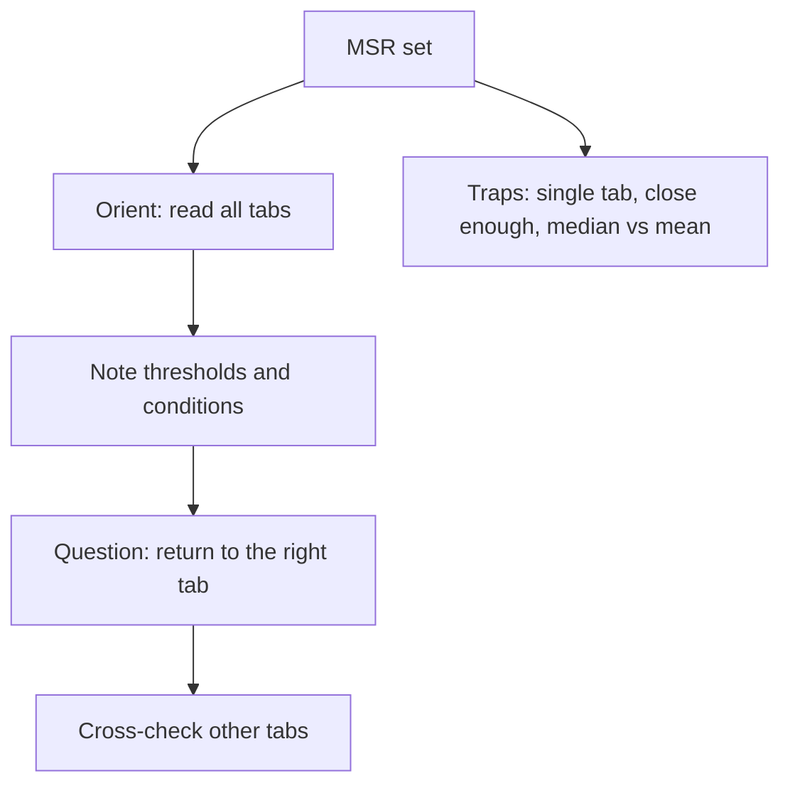

# D-6: Multi-Source Reasoning

**Why this matters for you:** MSR sets eat the most time in DI. Reading the tabs efficiently, or deliberately guessing on a set, decides whether you reach the last questions (you collapsed on the last 3 in DI).

## Format

- Data spread across 2–3 tabs (text, tables, graphics), followed by several questions ([source](https://go.gmac.com/hubfs/07.Assessments/GMAT%20Exam/School%20Resources%202025/In-Depth-GMAT-Presentation-2025.pdf)).
- Some questions are standard five-choice multiple choice. Others ask yes/no or true/false on several statements, and every part must be right ([source](https://go.gmac.com/hubfs/07.Assessments/GMAT%20Exam/School%20Resources%202025/In-Depth-GMAT-Presentation-2025.pdf)).
- Questions may ask you to spot discrepancies between sources, draw inferences, or decide which source is relevant ([source](https://go.gmac.com/hubfs/07.Assessments/GMAT%20Exam/School%20Resources%202025/In-Depth-GMAT-Presentation-2025.pdf)).

## Method

- **Orient:** read every tab before the questions. Top scorers spend about 90 seconds here rather than 20 ([source](https://www.crackverbal.com/resources/gmat-multi-source-reasoning/)).
- **Note:** jot thresholds and conditions (for example "> 50%") so you aren't flipping between tabs ([source](https://www.crackverbal.com/resources/gmat-multi-source-reasoning/)).
- TTP's view: don't try to absorb every detail on the first read. Note *where* things are and go back when a question needs them ([source](https://blog.targettestprep.com/data-insights-timing-strategy/)).
- Use only the data provided, not your own knowledge of the subject ([source](https://go.gmac.com/hubfs/07.Assessments/GMAT%20Exam/School%20Resources%202025/In-Depth-GMAT-Presentation-2025.pdf)).

## Traps

- **Single-tab trap:** an answer that looks complete from one tab. Check the other tabs too ([source](https://www.crackverbal.com/resources/gmat-multi-source-reasoning/)).
- **Close-enough trap:** the GMAT is exact, so 1,789 does not meet a 1,800 threshold ([source](https://www.crackverbal.com/resources/gmat-multi-source-reasoning/)).
- **Median vs mean:** underline statistical terms before you use them ([source](https://www.crackverbal.com/resources/gmat-multi-source-reasoning/)).

## Timing

- First read: 0.5–1.5 minutes. Single-answer questions: 1–2 minutes. Three-statement questions: 2–3 minutes ([source](https://blog.targettestprep.com/data-insights-timing-strategy/)).

## Worked example *(original example)*

Tab 1: "Grants go only to projects with a budget under ₹50 lakh." Tab 2: a table of project budgets. Tab 3: an email saying the cap rises to ₹60 lakh next year.
- Statement: "Project P (₹55 lakh) qualifies this year." The answer is **No**. Tab 3's change applies next year, so stopping at Tab 3 would be the single-tab trap.

## Concept map

## Flashcards
Q: How many tabs does an MSR set have?
A: 2–3.

Q: What do top scorers do first in MSR?
A: Read all the tabs, spending about 90 seconds, and take short notes.

Q: What is the single-tab trap?
A: An answer that looks complete from one tab while another tab changes it.

Q: Does 1,789 meet a "1,800 or more" condition?
A: No. The GMAT is exact.

Q: May you use outside knowledge in MSR?
A: No. Use only the data provided.

Q: How long should a three-statement MSR question take?
A: About 2–3 minutes.

## Sources
- https://go.gmac.com/hubfs/07.Assessments/GMAT%20Exam/School%20Resources%202025/In-Depth-GMAT-Presentation-2025.pdf
- https://www.crackverbal.com/resources/gmat-multi-source-reasoning/
- https://blog.targettestprep.com/data-insights-timing-strategy/
