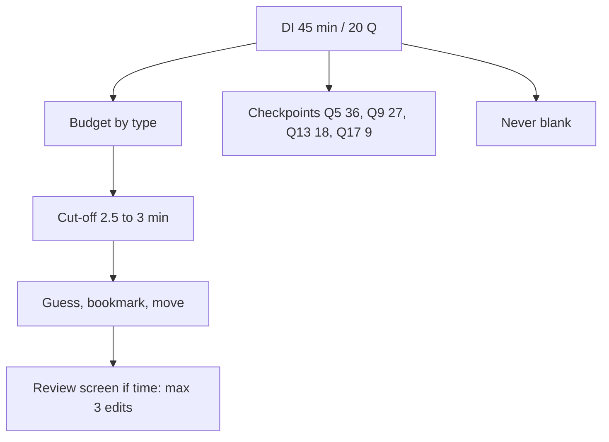

# D-7: DI Triage and Guessing

**Why this matters for you:** DI was your lowest section (68, 14th percentile), it "felt fine", and it collapsed at the end. Triage means choosing which questions get your time. That is the skill that turns 3–8-minute DS questions back into a finished section.

## The budget

- 20 questions in 45 minutes is about 2 minutes 15 seconds each. Some types need less ([source](https://blog.targettestprep.com/data-insights-timing-strategy/)).
- Typical times ([source](https://blog.targettestprep.com/data-insights-timing-strategy/)):

| Type | Typical |
|---|---|
| DS (quant) | 1.5–2.5 min |
| DS (criteria/verbal) | 2–3 min |
| Table | 1.5–2.5 min |
| Graphics | 1.5–3 min |
| TPA | 1.5–3 min |
| MSR first read | 0.5–1.5 min |

- Checkpoints (minutes left): Q5 at 36, Q9 at 27, Q13 at 18, Q17 at 9 ([source](https://blog.targettestprep.com/data-insights-timing-strategy/)).

## When to guess

- GMAC: don't waste time on a question you find extremely hard. Answer every question, even with an educated guess ([source](https://go.gmac.com/hubfs/07.Assessments/GMAT%20Exam/School%20Resources%202025/In-Depth-GMAT-Presentation-2025.pdf)).
- Use a hard cut-off of about 2.5–3 minutes. At the cut-off, eliminate what you can, guess and bookmark ([source](https://e-gmat.com/blogs/the-penalty-thats-destroying-your-gmat-score/)).
- Speed up only if you are well behind a checkpoint. The checkpoints are guides, not rules ([source](https://blog.targettestprep.com/data-insights-timing-strategy/)).
- Multi-part DI questions give no partial credit, so a half-solved question earns nothing ([source](https://go.gmac.com/hubfs/07.Assessments/GMAT%20Exam/School%20Resources%202025/In-Depth-GMAT-Presentation-2025.pdf)).

## Using the review screen

- You can bookmark any question. If time remains after the last question, you can review them all and change up to 3 answers in the section ([source](https://go.gmac.com/hubfs/07.Assessments/GMAT%20Exam/School%20Resources%202025/In-Depth-GMAT-Presentation-2025.pdf)).
- If the clock runs out, you skip the review screen entirely ([source](https://go.gmac.com/hubfs/07.Assessments/GMAT%20Exam/School%20Resources%202025/In-Depth-GMAT-Presentation-2025.pdf)).

## Your rule set *(synth)*

1. DS: run the D-1 grid, with a 2.5-minute cap.
2. A heavy MSR set or verbal TPA that looks like a 4-minute job when you are behind: guess, bookmark, move on.
3. Reach Q17 with at least 9 minutes left.

## Concept map

## Flashcards
Q: What is the average time per DI question?
A: 2 minutes 15 seconds.

Q: What are the DI checkpoints (minutes left)?
A: Q5 at 36, Q9 at 27, Q13 at 18, Q17 at 9.

Q: What is the typical time for a quant DS question?
A: 1.5–2.5 minutes.

Q: What is the per-question cut-off?
A: About 2.5–3 minutes, then guess and bookmark.

Q: How many answers can you change per section?
A: Up to 3.

Q: What happens to review if time runs out?
A: You get no review screen and move straight on.

Q: Why is a half-solved MSR or TPA question worth nothing?
A: There is no partial credit on multi-part questions.

## Sources
- https://blog.targettestprep.com/data-insights-timing-strategy/
- https://go.gmac.com/hubfs/07.Assessments/GMAT%20Exam/School%20Resources%202025/In-Depth-GMAT-Presentation-2025.pdf
- https://e-gmat.com/blogs/the-penalty-thats-destroying-your-gmat-score/
