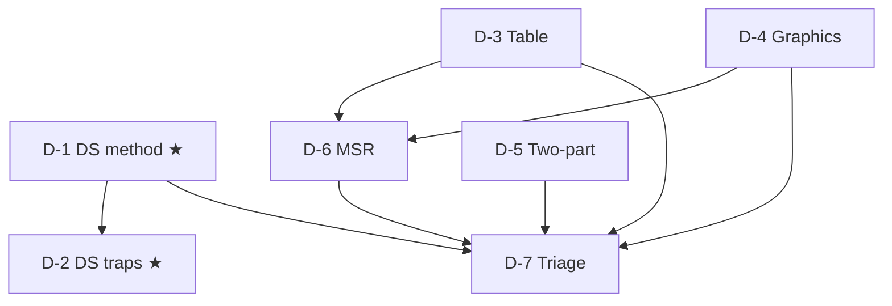

# GMAT Data Insights: node map

20 questions in 45 minutes, with an on-screen calculator. The five types are Data Sufficiency, Multi-Source Reasoning, Table Analysis, Graphics Interpretation and Two-Part Analysis (GMAC). Your mock score was DI 68 (14th percentile), the worst section, even though it "felt fine". DS was at the 33rd percentile, and the cause was method: you solved instead of judging, spending 3–8 minutes per question. So D-1 and D-2 come first. The `weight` field gives the dossier's estimated section share: DS 20–40% (30), GI 20–30% (25), TPA, Table and MSR 10–20% (15). D-7 covers the whole section, so it carries the 33% that DI contributes to the total score.

## Nodes

| Node | Topic | Deps | Minutes | Exam focus |
|---|---|---|---|---|
| D-1 | DS Method: Judge Sufficiency, Don't Solve | none | 45 | yes |
| D-2 | DS Traps: Value vs Yes/No, Hidden Constraints, C-Trap | D-1 | 40 | yes |
| D-3 | Table Analysis | none | 25 | no |
| D-4 | Graphics Interpretation | none | 25 | no |
| D-5 | Two-Part Analysis | none | 25 | no |
| D-6 | Multi-Source Reasoning | D-3, D-4 | 30 | no |
| D-7 | DI Triage and Guessing | D-1, D-3, D-4, D-5, D-6 | 25 | no |

Total reading time: about 215 minutes.

## Dependency graph

## Headline rules to know

- AD/BCE: (1) sufficient leads to A or D. (1) insufficient leads to B, C or E. Combine only when neither works alone.
- Yes/no: always yes or always no counts as sufficient. Value: exactly one value.
- C-trap: one equation in positive integers can be enough.
- Time: 2 min 15 s average. Checkpoints Q5 at 36, Q9 at 27, Q13 at 18, Q17 at 9. Cap each question at about 2.5–3 minutes.
- No partial credit on multi-part questions.
