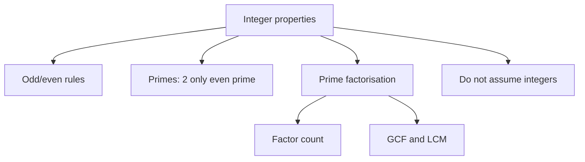

# Q-1: Number Properties

**Why this matters for you:** your mock didn't flag Value/Order/Factors as a gap. Integer rules still decide many DS cases in DI (testing cases needs odd/even, sign and integer behaviour), so keep them sharp.

## Scope on GMAT Focus

- GMAC lists "value, order, and factors" under arithmetic. No geometry knowledge is expected ([source](https://go.gmac.com/hubfs/07.Assessments/GMAT%20Exam/School%20Resources%202025/In-Depth-GMAT-Presentation-2025.pdf)).
- The topic list: factors and multiples, GCF and LCM, quotients and remainders, consecutive sets, and the special behaviour of 0 and 1 ([source](https://magoosh.com/gmat/integer-properties-the-most-common-gmat-question-topic)).

## Odd and even

- even ± even = even, odd ± odd = even, even ± odd = odd ([source](https://magoosh.com/gmat/integer-properties-the-most-common-gmat-question-topic)).
- even × anything = even, odd × odd = odd ([source](https://magoosh.com/gmat/integer-properties-the-most-common-gmat-question-topic)).
- 0 is even ([source](https://magoosh.com/gmat/integer-properties-the-most-common-gmat-question-topic)).

## Primes

- A prime has exactly two factors, 1 and itself. 2 is the only even prime ([source](https://magoosh.com/gmat/integer-properties-the-most-common-gmat-question-topic)).
- Memorise the primes up to 29: 2, 3, 5, 7, 11, 13, 17, 19, 23, 29 ([source](https://magoosh.com/gmat/integer-properties-the-most-common-gmat-question-topic)).
- 1 is not prime, because it has only one factor *(synth)*.

## Factors, GCF, LCM

- To count factors, prime-factorise, add 1 to each exponent and multiply *(synth)*.
- GCF takes the lowest power of each shared prime. LCM takes the highest power of every prime present *(synth)*.

## Integer trap

- Don't assume a variable is an integer unless the stem says so. "x < 3" allows fractions and decimals ([source](https://magoosh.com/gmat/integer-properties-the-most-common-gmat-question-topic)).

## Worked examples *(original example)*

1. n is odd. Is n² + n even? n² is odd, and odd + odd = even, so **yes, always**.
2. 360 = 2³ × 3² × 5, so the number of factors = (3+1)(2+1)(1+1) = 4 × 3 × 2 = **24**.
3. 12 = 2² × 3 and 18 = 2 × 3². GCF = 2 × 3 = **6**. LCM = 2² × 3² = **36**.

## Concept map

## Flashcards
Q: odd + odd = ?
A: Even.

Q: odd × odd = ?
A: Odd.

Q: Is 0 even?
A: Yes.

Q: What is the only even prime?
A: 2.

Q: List the primes up to 29.
A: 2, 3, 5, 7, 11, 13, 17, 19, 23, 29.

Q: How many factors does 360 have?
A: 24. 360 = 2³·3²·5, so (4)(3)(2) = 24.

Q: GCF and LCM of 12 and 18?
A: 6 and 36.

Q: Given only "x < 3", may you assume x is an integer?
A: No. Fractions and decimals are allowed.

## Sources
- https://go.gmac.com/hubfs/07.Assessments/GMAT%20Exam/School%20Resources%202025/In-Depth-GMAT-Presentation-2025.pdf
- https://magoosh.com/gmat/integer-properties-the-most-common-gmat-question-topic
