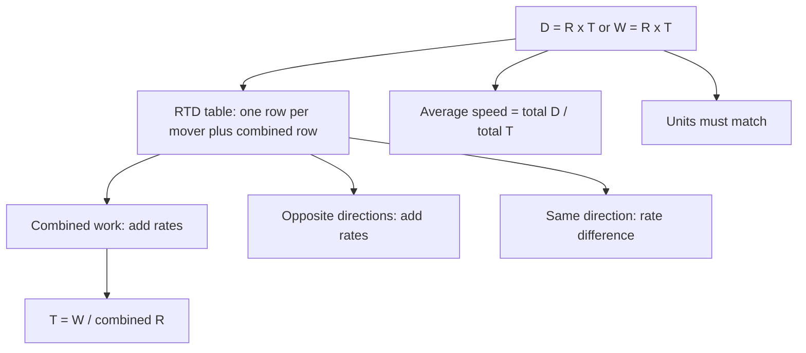

# Q-10: Rates, Work, Distance

**Why this matters for you:** "Rates" is the first word of your 22nd-percentile Quant skill. GMAC's score report groups Rates/Ratios/Percent as one fundamental skill, so rate errors pull that whole bucket down.

## One equation for everything

- **Distance = Rate × Time** for motion, and **Work = Rate × Time** for jobs. Rearrange for whichever quantity is unknown ([source](https://www.joinleland.com/library/a/gmat-rate-problems)).
- Magoosh writes the work version as A = RT ("amount = rate × time"). It is the same as D = RT ([source](https://magoosh.com/gmat/gmat-work-rate-problems/)).
- Units must match. Don't multiply mph by minutes ([source](https://magoosh.com/gmat/gmat-work-rate-problems/)).

## RTD table

- Draw three columns (Rate, Time, Distance or Work). Give each traveller or worker a row, and add a combined row ([source](https://magoosh.com/gmat/using-diagrams-to-solve-gmat-rate-problems-part-1/)).
- Express the rates with as few variables as possible (for example r and r − 30), then solve using the combined row ([source](https://magoosh.com/gmat/using-diagrams-to-solve-gmat-rate-problems-part-1/)).
- The table organises the problem and gives you equations. It doesn't replace the algebra ([source](https://magoosh.com/gmat/using-diagrams-to-solve-gmat-rate-problems-part-1/)).

## Combined work

- **Rates add. Times do not.** The rate of A plus the rate of B equals their combined rate ([source](https://magoosh.com/gmat/gmat-work-rate-problems/)).
- Turn each completion time into a rate (1 job ÷ time), add the rates, then use T = Work ÷ Rate ([source](https://magoosh.com/gmat/gmat-work-rate-problems/)).
- N identical machines at rate R have a combined rate of N × R ([source](https://magoosh.com/gmat/gmat-work-rate-problems/)).
- Smart numbers: let the job be a convenient amount, such as 60 units, to avoid fractions ([source](https://www.joinleland.com/library/a/gmat-rate-problems)).
- Opposing work (one pipe fills while another drains): subtract the draining rate from the filling rate *(synth)*.

## Relative motion

- Two travellers moving in opposite directions, toward or away from each other: **add the rates**. If they start together, the time is the same in every row ([source](https://magoosh.com/gmat/using-diagrams-to-solve-gmat-rate-problems-part-1/)).
- Travellers moving the same way (a chase): the gap closes at the *difference* of their rates *(synth)*.

## Average speed

- Average speed = total distance ÷ total time. Never average the two speeds ([source](https://www.joinleland.com/library/a/gmat-rate-problems)).
- On a multi-leg trip, work out each leg with D = RT, then divide total distance by total time ([source](https://magoosh.com/gmat/gmat-work-rate-problems/)).

## Worked examples *(original example)*

1. **Combined work.** A finishes a job in 6 h and B in 3 h. The rates are 1/6 + 1/3 = 1/6 + 2/6 = 3/6 = 1/2 job per hour, so together they take **2 h**.
2. **Average speed.** 60 km at 30 km/h takes 2 h, and 60 km back at 60 km/h takes 1 h. Average = 120 ÷ 3 = **40 km/h**, not 45.
3. **Toward each other.** Two cars start 300 km apart at 40 and 60 km/h. The combined rate is 100 km/h, so they meet after 300 ÷ 100 = **3 h**, having covered 120 km and 180 km.
4. **Fill and drain.** A tap fills a tank in 4 h and a drain empties it in 12 h. Net rate = 1/4 − 1/12 = 3/12 − 1/12 = 2/12 = 1/6, so the tank fills in **6 h**.
5. **Units.** 30 mph for 10 minutes: 10 min = 1/6 h, so the distance is 30 × 1/6 = **5 miles**.

## Traps

- Adding times instead of rates ([source](https://magoosh.com/gmat/gmat-work-rate-problems/)).
- Averaging speeds when the times or distances differ ([source](https://www.joinleland.com/library/a/gmat-rate-problems)).
- Mixing hours and minutes ([source](https://www.joinleland.com/library/a/gmat-rate-problems)).
- Not checking the answer against the problem's constraints ([source](https://www.joinleland.com/library/a/gmat-rate-problems)).

## Concept map

## Flashcards
Q: Which quantities can you add in a combined-work problem?
A: Rates. Never times.

Q: A takes 6 h and B takes 3 h. How long together?
A: 1/6 + 1/3 = 1/2 per hour, so 2 h.

Q: What is the formula for average speed?
A: Total distance ÷ total time.

Q: 60 km at 30 km/h and 60 km at 60 km/h. What is the average speed?
A: 120 ÷ 3 = 40 km/h.

Q: Two travellers move toward each other. What is the combined rate?
A: The sum of their rates.

Q: What does an RTD table contain?
A: Rate, Time and Distance columns, a row per traveller and a combined row.

Q: Fill in 4 h and drain in 12 h. How long to fill?
A: 1/4 − 1/12 = 1/6 per hour, so 6 h.

Q: 30 mph for 10 minutes covers how far?
A: 5 miles. Convert 10 min to 1/6 h first.

Q: What is the smart-number trick for work problems?
A: Set the job to a convenient amount, such as 60 units, to avoid fractions.

## Sources
- https://www.joinleland.com/library/a/gmat-rate-problems
- https://magoosh.com/gmat/gmat-work-rate-problems/
- https://magoosh.com/gmat/using-diagrams-to-solve-gmat-rate-problems-part-1/
