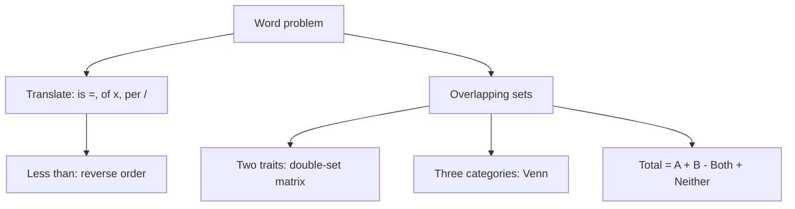

# Q-11: Word Problems (sets, overlapping groups, translation)

**Why this matters for you:** Focus DS items are now real-world word problems. Translating cleanly is the first step of D-1's "reflect", and slow translation is part of why DS took you 3–8 minutes.

## Translation

- "Is" (or "costs", "weighs") means =. "Of" means ×. "More than" means +. "Per" means ÷ ([source](https://wpapp.kaptest.com/study/gmat/land-score-translate-words-math-gmat/)).
- "Less than" reverses the order: "12 less than M" is M − 12, not 12 − M ([source](https://wpapp.kaptest.com/study/gmat/land-score-translate-words-math-gmat/)).
- Use meaningful letters (S for Sarah), translate one clause at a time, and check you answered the quantity actually asked ([source](https://wpapp.kaptest.com/study/gmat/land-score-translate-words-math-gmat/)).

## Overlapping sets

- **Two traits that split everyone** (for example member/non-member × local/non-local): use a double-set matrix. Put one trait across the columns, the other down the rows, include totals, and fill gaps by subtraction ([source](https://blog.cambridgecoaching.com/the-gmat-tutor-how-to-approach-overlapping-set-problems)).
- **One trait across several categories:** use a Venn diagram, and watch for regions you count twice when you add the circles ([source](https://blog.cambridgecoaching.com/the-gmat-tutor-how-to-approach-overlapping-set-problems)).
- Overlapping sets are one large group judged on several traits, so a diagram is the main tool ([source](https://www.prepscholar.com/gmat/blog/overlapping-sets-video/)).
- Two-set formula: Total = A + B − Both + Neither. It removes the double count *(synth)*.

## Worked examples *(original example)*

1. "Ravi is 4 years older than twice Mia's age; together they are 31." R = 2M + 4 and R + M = 31, so 3M + 4 = 31, giving M = 9 and R = 22.
2. 50 students: 30 take French, 25 take Spanish, 8 take neither. 50 = 30 + 25 − Both + 8, so Both = **13**.
3. Matrix: of 100 staff, 60 are full-time. 45 staff are remote, 20 of them full-time. Remote part-time = 45 − 20 = 25. Office part-time = (100 − 60) − 25 = **15**.

## Concept map

## Flashcards
Q: How do you translate "12 less than M"?
A: M − 12.

Q: What does "of" translate to?
A: Multiplication.

Q: When do you use a double-set matrix?
A: When two traits split the whole group into four cells.

Q: What is the two-set formula?
A: Total = A + B − Both + Neither.

Q: 50 students: 30 French, 25 Spanish, 8 neither. How many take both?
A: 13.

Q: What is the biggest Venn-diagram error?
A: Counting the overlap regions twice.

Q: What is the last step of any word problem?
A: Check that you answered the quantity actually asked.

## Sources
- https://wpapp.kaptest.com/study/gmat/land-score-translate-words-math-gmat/
- https://blog.cambridgecoaching.com/the-gmat-tutor-how-to-approach-overlapping-set-problems
- https://www.prepscholar.com/gmat/blog/overlapping-sets-video/
