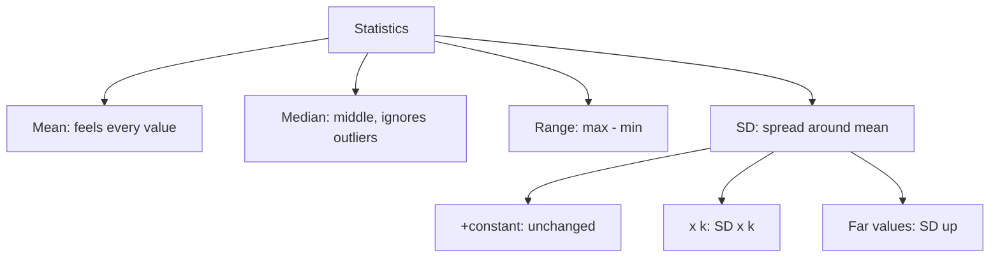

# Q-12: Statistics (mean, median, range, SD intuition)

**Why this matters for you:** GMAC lists mean, median, mode, range and standard deviation as expected arithmetic. Questions here test concepts rather than arithmetic, which suits DS judging in DI.

## Definitions

- **Mean** = sum ÷ count. Every value, including outliers, affects it ([source](https://magoosh.com/gmat/common-gmat-topic-descriptive-statistics)).
- **Median** = the middle value of the ordered list. With an even count, it is the average of the two middle values. Outliers don't move it ([source](https://magoosh.com/gmat/common-gmat-topic-descriptive-statistics)).
- **Mode** = the most frequent value. A set can have none, one or several ([source](https://blog.targettestprep.com/gmat-statistics-questions/)).
- **Range** = max − min. Only the two extremes matter ([source](https://magoosh.com/gmat/common-gmat-topic-descriptive-statistics)).
- **Standard deviation (SD)** = how spread out the values are around the mean. It is never negative, and it is 0 only when all values are equal ([source](https://magoosh.com/gmat/common-gmat-topic-descriptive-statistics)).

## SD intuition (no calculation needed)

- Adding a constant to every value leaves SD unchanged ([source](https://magoosh.com/gmat/common-gmat-topic-descriptive-statistics)).
- Multiplying every value by k multiplies SD by k (by |k| if k is negative) ([source](https://magoosh.com/gmat/common-gmat-topic-descriptive-statistics)).
- Adding values far from the mean raises SD, and outliers raise it a lot ([source](https://blog.targettestprep.com/gmat-statistics-questions/)).
- Adding a value exactly at the mean lowers SD, because the spread is shared across more values *(synth)*.
- In an evenly spaced set, mean = median ([source](https://blog.targettestprep.com/gmat-statistics-questions/)).

## Worked examples *(original example)*

1. {2, 4, 4, 6, 9}: mean = 25/5 = **5**, median = **4**, mode = **4**, range = 9 − 2 = **7**.
2. {1, 3, 8, 10}: median = (3 + 8)/2 = **5.5**.
3. Add 10 to every value in a set with SD 3: the new SD is **3**. Multiply every value by 2 instead: the new SD is **6**.

## Concept map

## Flashcards
Q: What is the median of an even-count list?
A: The average of the two middle values.

Q: Which is unaffected by outliers, the mean or the median?
A: The median.

Q: What happens to SD when you add 10 to every value?
A: Nothing. It is unchanged.

Q: What happens to SD when you multiply every value by 2?
A: It doubles.

Q: When is SD equal to 0?
A: When all values are equal.

Q: Mean, median, mode and range of {2, 4, 4, 6, 9}?
A: 5, 4, 4, 7.

Q: In an evenly spaced set, how do mean and median compare?
A: They are equal.

## Sources
- https://magoosh.com/gmat/common-gmat-topic-descriptive-statistics
- https://blog.targettestprep.com/gmat-statistics-questions/
