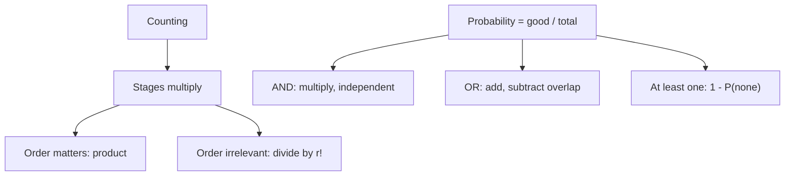

# Q-13: Counting and Probability

**Why this matters for you:** GMAC lists counting methods and elementary probability as expected content. Spend time here only after the Q-3, Q-4 and Q-10 gap is closed, because each question costs a lot of time.

## Counting

- **Fundamental counting principle:** if one choice has P options and a second has Q, together they have P × Q. This extends to any number of stages ([source](https://magoosh.com/gmat/gmat-quant-how-to-count)).
- **Order matters (permutation):** multiply the options stage by stage, for example 12 × 11 ([source](https://magoosh.com/gmat/gmat-quant-how-to-count)).
- **Order doesn't matter (combination):** take the ordered count and divide by the number of orderings of the group: ÷2 for pairs, ÷r! for groups of r ([source](https://magoosh.com/gmat/gmat-quant-how-to-count)).
- **Restrictions:** split the selection into its parts, count each part, then multiply ([source](https://magoosh.com/gmat/gmat-quant-how-to-count)).

## Probability

- Probability = successes ÷ total outcomes, a part-to-whole ratio ([source](https://www.manhattanprep.com/gmat/blog/part-to-part-and-part-to-whole-ratios/)).
- **AND (independent events):** P(A and B) = P(A) × P(B) ([source](https://magoosh.com/gmat/2012/gmat-math-probability-rules/)).
- **OR:** P(A or B) = P(A) + P(B) − P(A and B). Drop the last term if the events can't both happen ([source](https://magoosh.com/gmat/2012/gmat-math-probability-rules/)).
- **At least one:** 1 − P(none). The complement of "at least n" is "n − 1 or fewer" ([source](https://magoosh.com/gmat/gmat-math-the-probability-at-least-question/)).

## Worked examples *(original example)*

1. 4 shirts × 3 trousers = **12** outfits.
2. A president and a vice-president from 8 people: 8 × 7 = **56** (order matters).
3. A 2-person team from 8: 56 ÷ 2 = **28**. A 3-person team from 6: (6×5×4) ÷ 3! = 120 ÷ 6 = **20**.
4. A fair coin tossed 3 times. P(at least one head) = 1 − (1/2)³ = 1 − 1/8 = **7/8**.
5. A die: P(even or > 4) = 3/6 + 2/6 − 1/6 = **4/6 = 2/3**. The overlap is {6}.

## Concept map

## Flashcards
Q: What is the fundamental counting principle?
A: Multiply the number of options at each stage.

Q: President and vice-president from 8 people?
A: 56.

Q: Teams of 3 from 6 people?
A: 20.

Q: How do you turn an ordered count into a combination count?
A: Divide by r!, the number of orderings of the group.

Q: What is P(A and B) for independent events?
A: P(A) × P(B).

Q: What is the general rule for P(A or B)?
A: P(A) + P(B) − P(A and B).

Q: P(at least one head in 3 tosses)?
A: 1 − 1/8 = 7/8.

Q: What is the complement of "at least one"?
A: "None".

## Sources
- https://magoosh.com/gmat/gmat-quant-how-to-count
- https://www.manhattanprep.com/gmat/blog/part-to-part-and-part-to-whole-ratios/
- https://magoosh.com/gmat/2012/gmat-math-probability-rules/
- https://magoosh.com/gmat/gmat-math-the-probability-at-least-question/
