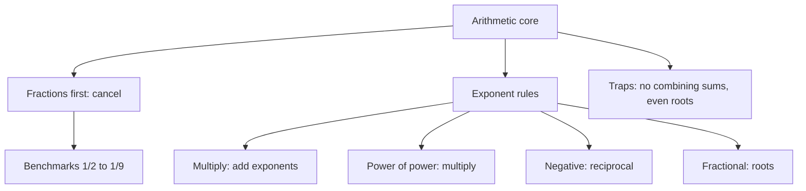

# Q-2: Arithmetic Core (fractions, decimals, exponents, roots)

**Why this matters for you:** Quant has no calculator, so slow fraction and exponent work burns the minutes you need at the end of the section (S-3). Fast conversions also feed straight into percents and ratios (Q-3, Q-4).

## Fractions and decimals

- Fraction to decimal: divide numerator by denominator. Decimal to fraction: use the place value of the last digit (0.125 = 125/1000) ([source](https://wpapp.kaptest.com/study/?p=110)).
- Work in fractions where you can, because they cancel cleanly. Memorise 1/2 to 1/9 as decimals ([source](https://wpapp.kaptest.com/study/?p=110)).
- Benchmarks: 1/8 = 0.125, 1/6 ≈ 0.167, 1/7 ≈ 0.143, 1/9 ≈ 0.111 ([source](https://wpapp.kaptest.com/study/?p=110)).
- Dividing by 5 is the same as multiplying by 2/10 ([source](https://wpapp.kaptest.com/study/?p=110)).

## Exponent rules

| Rule | Form |
|---|---|
| Same base, multiply | xʳ · xˢ = xʳ⁺ˢ |
| Same base, divide | xʳ / xˢ = xʳ⁻ˢ |
| Power of a power | (xʳ)ˢ = xʳˢ |
| Same exponent | xʳ · yʳ = (xy)ʳ |
| Zero | x⁰ = 1 |
| Negative | x⁻ʳ = 1/xʳ |
| Fractional | x^(r/s) = s-th root of xʳ |

([source](https://www.prepscholar.com/gmat/blog/gmat-exponents-questions-practice/))

## Traps

- You can't combine terms under addition: xʳ + xˢ does not simplify like a product ([source](https://www.prepscholar.com/gmat/blog/gmat-exponents-questions-practice/)).
- An even root of a negative number isn't real. An odd root has one real value ([source](https://www.prepscholar.com/gmat/blog/gmat-exponents-questions-practice/)).
- Squaring a number between 0 and 1 makes it smaller ([source](https://www.prepscholar.com/gmat/blog/gmat-exponents-questions-practice/)).

## Exam habits

- Look at the answer choices first. For approximation questions, the gap between choices tells you how precise you need to be ([source](https://go.gmac.com/hubfs/07.Assessments/GMAT%20Exam/School%20Resources%202025/In-Depth-GMAT-Presentation-2025.pdf)).

## Worked examples *(original example)*

1. 2⁵ · 2³ / 2⁶ = 2^(5+3−6) = 2² = **4**.
2. 8^(2/3) = (cube root of 8)² = 2² = **4**.
3. 3⁻² = 1/9 ≈ **0.111**.
4. 0.375 = 375/1000 = **3/8**.
5. 2^x = 34 lies between 2⁵ = 32 and 2⁶ = 64, so x is **between 5 and 6** (the same reasoning as GMAC's own sample).

## Concept map

## Flashcards
Q: xʳ · xˢ = ?
A: x^(r+s).

Q: (xʳ)ˢ = ?
A: x^(rs).

Q: x⁻ʳ = ?
A: 1/xʳ.

Q: 8^(2/3) = ?
A: 4.

Q: 1/8 as a decimal?
A: 0.125.

Q: 0.375 as a fraction?
A: 3/8.

Q: Does squaring 0.5 make it bigger or smaller?
A: Smaller: 0.25.

Q: Is the square root of a negative number real?
A: No. Even roots of negatives aren't real.

Q: 2^x = 34. Between which integers is x?
A: 5 and 6.

## Sources
- https://wpapp.kaptest.com/study/?p=110
- https://www.prepscholar.com/gmat/blog/gmat-exponents-questions-practice/
- https://go.gmac.com/hubfs/07.Assessments/GMAT%20Exam/School%20Resources%202025/In-Depth-GMAT-Presentation-2025.pdf
