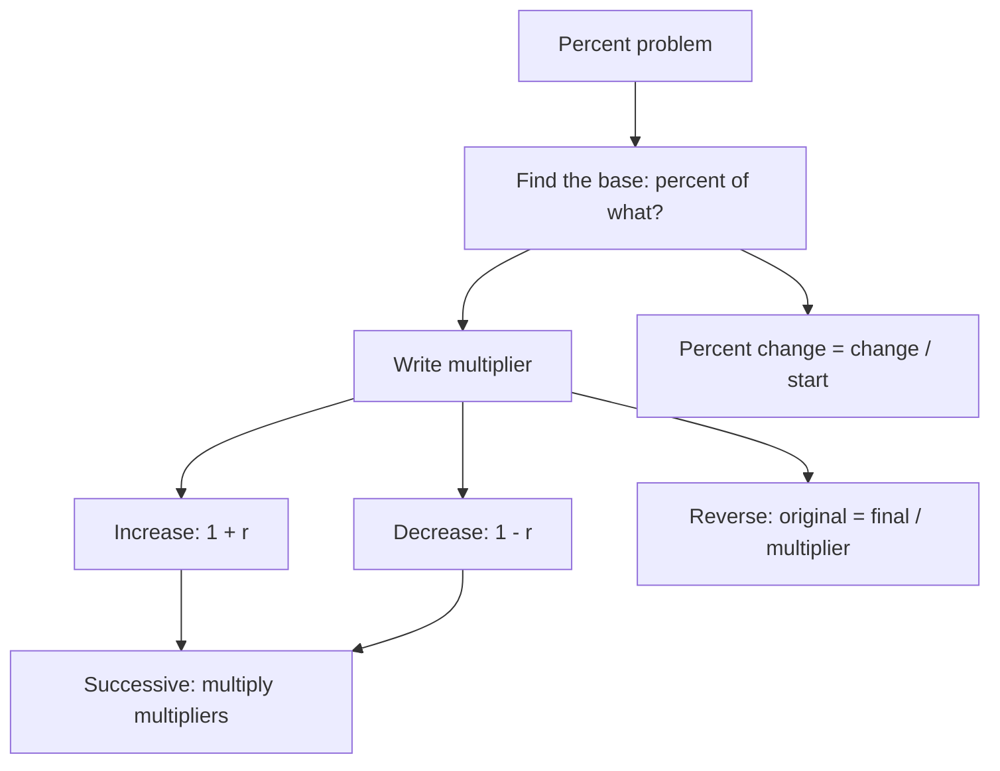

# Q-3: Percents and Percent Change

**Why this matters for you:** Rates/Ratios/Percent was your weakest Quant skill at the 22nd percentile, against QR 77 overall (43rd). GMAC lists "rates, ratios, and percents" as one core arithmetic area, so a fix here also lifts Q-4, Q-5 and Q-10.

## Core translations

- "Of" means multiply, so 20% of X = 0.20 × X ([source](https://wpapp.kaptest.com/study/?p=110)).
- To turn a percent into a decimal, move the decimal point two places left ([source](https://magoosh.com/gmat/2012/understanding-percents-on-the-gmat/)).
- A percent means nothing until it is applied to something. Always ask "percent *of what*?" ([source](https://wpapp.kaptest.com/study/?p=110)).
- "20% less than" is the same as "80% of" ([source](https://wpapp.kaptest.com/study/?p=110)).

## The multiplier method

| Situation | Multiplier |
|---|---|
| x% of a number | x/100 |
| x% increase | 1 + x/100 |
| x% decrease | 1 − x/100 |

([source](https://www.prepscholar.com/gmat/blog/gmat-percentages/))

- **Successive changes:** multiply the multipliers. Never add the percents ([source](https://magoosh.com/gmat/2012/understanding-percents-on-the-gmat/)).
- **Up then down by the same percent** does not take you back to the start, because the second change applies to a different base ([source](https://www.prepscholar.com/gmat/blog/gmat-percentages/)).

## Percent change

- Percent change = (change ÷ starting value) × 100. The starting value is always the 100% base ([source](https://magoosh.com/gmat/2012/understanding-percents-on-the-gmat/)).
- Work out which number is the start before you compute. Read percent questions twice, because the wording separates "percent change" from "percent of" ([source](https://www.prepscholar.com/gmat/blog/gmat-percentages/)).
- Percentage points are not percent: a rate that moves from 20% to 25% rises 5 percentage points, which is a 25% increase *(synth)*.

## Reverse percent (finding the original)

- If the final value = original × multiplier, then original = final ÷ multiplier. This follows from the multiplier table above ([source](https://www.prepscholar.com/gmat/blog/gmat-percentages/)).

## Worked examples *(original example)*

1. **Successive change.** A price of 80 rises 25% and then falls 20%. The multipliers give 1.25 × 0.80 = 1.00, so the final price is 80 and the net change is 0%. Check: 80 × 1.25 = 100, then 100 × 0.8 = 80.
2. **Same percent up then down.** +10% then −10% gives 1.10 × 0.90 = 0.99, a 1% net *decrease*.
3. **Reverse.** After a 15% discount an item costs 170. Original = 170 ÷ 0.85 = 200. Check: 200 × 0.85 = 170.
4. **Direction matters.** 40 to 50 is a change of 10 on a base of 40, a 25% increase. 50 to 40 is 10 on a base of 50, a 20% decrease.

## Traps

- Adding successive percents (+25% then −20% ≠ +5%) ([source](https://magoosh.com/gmat/2012/understanding-percents-on-the-gmat/)).
- Using the wrong base for percent change ([source](https://www.prepscholar.com/gmat/blog/gmat-percentages/)).
- Treating "x% less than" as subtracting x from the number instead of multiplying by (1 − x/100) ([source](https://wpapp.kaptest.com/study/?p=110)).

## Concept map

## Flashcards
Q: What is the multiplier for a 12% decrease?
A: 0.88.

Q: How do you combine successive percent changes?
A: Multiply the multipliers. Never add the percents.

Q: A value rises 10% and then falls 10%. What is the net change?
A: 1.1 × 0.9 = 0.99, a 1% decrease.

Q: What is the formula for percent change?
A: (change ÷ starting value) × 100.

Q: 40 to 50, and 50 to 40. What are the percent changes?
A: +25% (10/40) and −20% (10/50).

Q: After a 15% discount the price is 170. What was the original price?
A: 170 ÷ 0.85 = 200.

Q: "30% less than X" equals what?
A: 0.70X.

Q: A rate moves from 20% to 25%. How many percentage points, and what percent increase?
A: 5 percentage points, which is a 25% increase.

Q: 80 rises 25% and then falls 20%. What is the final value?
A: 80 × 1.25 × 0.8 = 80.

## Sources
- https://magoosh.com/gmat/2012/understanding-percents-on-the-gmat/
- https://www.prepscholar.com/gmat/blog/gmat-percentages/
- https://wpapp.kaptest.com/study/?p=110
