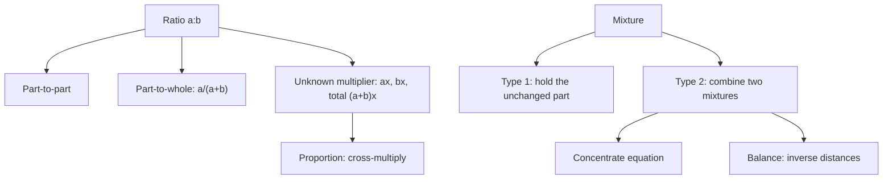

# Q-4: Ratio, Proportion, Mixtures

**Why this matters for you:** "Rates/Ratios/Percent" was your clear Quant gap (22nd percentile). Ratios also run through DS word problems in DI, so this node pays off in two sections.

## Ratios: part-to-part vs part-to-whole

- A ratio compares two parts (boys:girls). A fraction or percent compares a part to the whole ([source](https://www.manhattanprep.com/gmat/blog/part-to-part-and-part-to-whole-ratios/)).
- From a part-to-part ratio x:y, the part-to-whole fractions are x/(x+y) and y/(x+y) ([source](https://blog.targettestprep.com/gmat-ratios/)).
- With only two parts, the whole is A + B. Know any one ratio and you can write all three ([source](https://www.manhattanprep.com/gmat/blog/part-to-part-and-part-to-whole-ratios/)).
- A probability is a part-to-whole ratio (successes ÷ total), so the same conversions apply in Q-13 ([source](https://www.manhattanprep.com/gmat/blog/part-to-part-and-part-to-whole-ratios/)).

## Unknown multiplier

- If a:b = 3:5, write the actual amounts as 3x and 5x and the total as 8x. Use one more fact to solve for x ([source](https://www.manhattanprep.com/gmat/blog/part-to-part-and-part-to-whole-ratios/)).
- Given a total, divide it by the sum of the ratio parts to get the multiplier ([source](https://blog.targettestprep.com/gmat-ratios/)).
- A ratio stays the same when both terms are multiplied or divided by the same number. Use this to scale two ratios to a common middle term ([source](https://blog.targettestprep.com/gmat-ratios/)).

## Proportions

- Set the two ratios equal as fractions and cross-multiply. For example, T/30 = 4/5 gives T = 24 ([source](https://blog.targettestprep.com/gmat-ratios/)).

## Mixtures: two types

- **Type 1: change one mixture by adding or removing one component.** Find the part that stays the same, then use it to find the new total ([source](https://wpapp.kaptest.com/study/gmat/gmat-quantitative-two-types-of-mixture-problems/)).
- **Type 2: combine two mixtures to hit a target concentration.** Either write an equation for the amount of the key component, or use the balance approach, where each mixture's distance from the target fixes the ratio ([source](https://wpapp.kaptest.com/study/gmat/gmat-quantitative-two-types-of-mixture-problems/)).
- Always track two quantities: total volume, and the amount of pure concentrate (concentration × volume). Volumes add, and so do concentrate amounts ([source](https://magoosh.com/gmat/2012/gmat-solution-and-mixing-problems/)).
- DS angle: with three unknowns and only two equations, any statement that fixes one more variable is sufficient ([source](https://magoosh.com/gmat/2012/gmat-solution-and-mixing-problems/)).

## Worked examples *(original example)*

1. **Multiplier.** Red:blue = 3:5 and there are 64 marbles in total. 8x = 64, so x = 8. Red = 24, blue = 40.
2. **Linking ratios.** A:B = 2:3 and B:C = 4:5. Scale both so B = 12: A:B = 8:12 and B:C = 12:15, so A:B:C = 8:12:15.
3. **Type 1.** 40 L of solution is 25% acid, so it holds 10 L of acid. How much water makes it 20% acid? The acid stays at 10 L, so the new total = 10 ÷ 0.20 = 50 L. Add **10 L** of water.
4. **Type 2 (balance).** Mix 10% and 30% solutions to get 25%. The distances from 25 are 15 and 5. The amounts go in the *inverse* ratio of the distances, so 10% : 30% = 5 : 15 = **1 : 3**. Check: (1×10 + 3×30) ÷ 4 = 100 ÷ 4 = 25.

## Traps

- Using a part-to-part ratio as if it were a fraction of the whole: 3:5 means 3/8 of the total, not 3/5 ([source](https://blog.targettestprep.com/gmat-ratios/)).
- In Type 1 problems, forgetting that only one component changes ([source](https://wpapp.kaptest.com/study/gmat/gmat-quantitative-two-types-of-mixture-problems/)).

## Concept map

## Flashcards
Q: Red:blue = 3:5. What fraction of the total is red?
A: 3/8.

Q: Ratio 3:5 with a total of 64. Find each part.
A: x = 64 ÷ 8 = 8, so the parts are 24 and 40.

Q: A:B = 2:3 and B:C = 4:5. What is A:B:C?
A: 8:12:15.

Q: What are the two types of mixture problem?
A: Changing one mixture by adding or removing a component, and combining two mixtures to reach a target.

Q: What is the key move in a Type 1 mixture problem?
A: Find the component that doesn't change and use it to compute the new total.

Q: Which two quantities do you always track in a mixture?
A: Total volume, and the amount of pure concentrate (concentration × volume).

Q: Mix 10% and 30% to get 25%. In what ratio?
A: 1:3, the inverse of the distances 15 and 5.

Q: 40 L at 25% acid. How much water brings it to 20%?
A: 10 L. The 10 L of acid becomes 20% of 50 L.

Q: Why is probability linked to ratios?
A: Probability is a part-to-whole ratio: successes ÷ total.

## Sources
- https://www.manhattanprep.com/gmat/blog/part-to-part-and-part-to-whole-ratios/
- https://blog.targettestprep.com/gmat-ratios/
- https://wpapp.kaptest.com/study/gmat/gmat-quantitative-two-types-of-mixture-problems/
- https://magoosh.com/gmat/2012/gmat-solution-and-mixing-problems/
