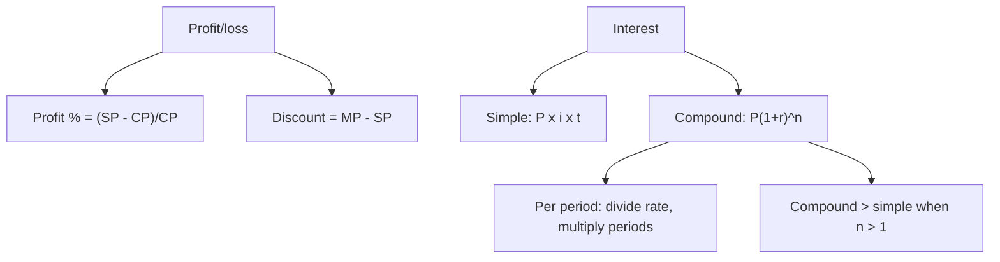

# Q-5: Profit/Loss, Simple and Compound Interest

**Why this matters for you:** these are percent problems in a business setting, so they sit in your weak Rates/Ratios/Percent bucket. Do Q-3 first. This node mostly applies the multiplier method.

## Profit, markup, discount

- Profit % on cost = (selling price − cost) ÷ cost × 100 ([source](https://wpapp.kaptest.com/study/?p=13564)).
- Some questions state profit as a percent of the selling price instead. Check which base the question uses ([source](https://wpapp.kaptest.com/study/?p=13564)).
- Discount = marked price − selling price. Profit then comes from the discounted price ([source](https://wpapp.kaptest.com/study/?p=13564)).
- A chain of markup and discount is a chain of multipliers (see Q-3) ([source](https://magoosh.com/gmat/2012/understanding-percents-on-the-gmat/)).

## Simple interest

- I = P × i × t: principal times rate times number of periods. Interest is only ever paid on the original principal ([source](https://wpapp.kaptest.com/study/?p=13564)).

## Compound interest

- Amount = P × (1 + r)ⁿ, with r the rate per period and n the number of periods ([source](https://magoosh.com/gmat/compound-interest-on-the-gmat/)).
- Semiannual: halve the annual rate and double the periods. Quarterly: divide by 4 and multiply by 4 ([source](https://magoosh.com/gmat/compound-interest-on-the-gmat/)).
- With more than one compounding period, compound interest always beats simple interest. More frequent compounding pays more, with shrinking extra gains ([source](https://magoosh.com/gmat/compound-interest-on-the-gmat/)).
- Approximation: work out simple interest first, then note that compound interest will be a little higher ([source](https://magoosh.com/gmat/compound-interest-on-the-gmat/)).

## Worked examples *(original example)*

1. Cost 400, sold at 500. Profit 100, so profit on cost = 100/400 = **25%**.
2. Marked price 600 with 10% off gives a selling price of 600 × 0.9 = 540. Cost 450, so profit 90 = 90/450 = **20%** on cost.
3. Simple interest: 2,000 at 5% for 3 years = 2,000 × 0.05 × 3 = **300**.
4. Compound: 2,000 at 10% a year for 2 years = 2,000 × 1.1² = 2,000 × 1.21 = **2,420**, against 2,400 with simple interest.
5. Semiannual: 2,000 at 10% a year for 1 year = 2,000 × 1.05² = 2,000 × 1.1025 = **2,205**, against 2,200 compounded annually.

## Concept map

## Flashcards
Q: What is the formula for profit percent on cost?
A: (SP − CP) ÷ CP × 100.

Q: Marked 600, 10% off, cost 450. Profit percent?
A: SP 540, profit 90, so 20% on cost.

Q: What is the simple interest formula?
A: I = P × i × t.

Q: What is the compound amount formula?
A: P(1 + r)ⁿ, with r and n per period.

Q: 10% a year compounded semiannually. What are the rate and periods for 1 year?
A: 5% per period, 2 periods.

Q: 2,000 at 10% compounded annually for 2 years?
A: 2,420.

Q: Compound vs simple with more than one period?
A: Compound always pays more.

## Sources
- https://wpapp.kaptest.com/study/?p=13564
- https://magoosh.com/gmat/compound-interest-on-the-gmat/
- https://magoosh.com/gmat/2012/understanding-percents-on-the-gmat/
