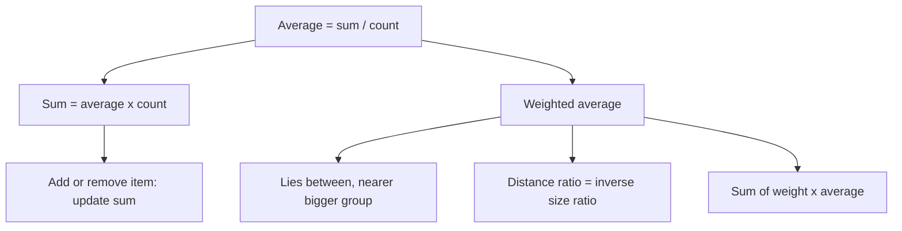

# Q-6: Averages and Weighted Averages

**Why this matters for you:** the weighted-average balance is the same tool as the mixture balance in Q-4. It also turns up in DI DS and table questions, where you need to judge a combined average without computing it.

## Sum is king

- Average = sum ÷ count, so **sum = average × count** ([source](https://magoosh.com/gmat/2012/gmat-averages-and-sums-formulas/)).
- When an item is added or removed, update the *sum* and divide by the new count ([source](https://magoosh.com/gmat/2012/gmat-averages-and-sums-formulas/)).
- To combine groups, add their sums. Never average their averages ([source](https://magoosh.com/gmat/2012/gmat-averages-and-sums-formulas/)).

## Weighted averages

- A weighted-average situation arises whenever groups of different sizes and different averages are combined ([source](https://magoosh.com/gmat/2015/gmat-math-weighted-averages/)).
- The combined average always lies between the group averages, and closer to the larger group ([source](https://magoosh.com/gmat/2015/gmat-math-weighted-averages/)).
- The ratio of the distances from the combined average is the reciprocal of the ratio of the group sizes ([source](https://magoosh.com/gmat/2015/gmat-math-weighted-averages/)).
- There are three ways to compute it: add the sums; multiply each average by its percentage weight and add; or use the distance ratio when there are two groups ([source](https://magoosh.com/gmat/2015/gmat-math-weighted-averages/)).

## Worked examples *(original example)*

1. Five numbers average 12, so the sum is 60. Add a sixth number, 18: the new sum is 78 and the new average is 78/6 = **13**.
2. Group A has 30 people averaging 70, and B has 10 averaging 90. Sums: 2,100 + 900 = 3,000, over 40 people = **75**. Check with distances: A is 5 away and B is 15 away, a ratio of 1:3, the inverse of the sizes 30:10 = 3:1.
3. Weights: 25% at 80 and 75% at 60 gives 0.25×80 + 0.75×60 = 20 + 45 = **65**.

## Concept map

## Flashcards
Q: How do you get the sum from an average?
A: Sum = average × count.

Q: Five numbers average 12 and you add 18. New average?
A: 78 ÷ 6 = 13.

Q: Where does a combined average lie?
A: Between the group averages, closer to the larger group.

Q: What is the distance ratio rule for two groups?
A: The distances from the combined average are in the inverse ratio of the group sizes.

Q: 30 people averaging 70 and 10 averaging 90. Combined average?
A: 75.

Q: 25% at 80 and 75% at 60?
A: 65.

Q: Can you average two group averages directly?
A: Only when the groups are the same size. Otherwise add the sums.

## Sources
- https://magoosh.com/gmat/2012/gmat-averages-and-sums-formulas/
- https://magoosh.com/gmat/2015/gmat-math-weighted-averages/
