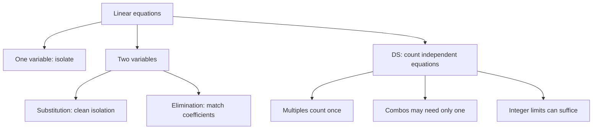

# Q-7: Linear Equations and Systems

**Why this matters for you:** algebra is a GMAC content domain in its own right. More to the point, the "how many equations do I need" instinct drives DS sufficiency in DI. Getting it right, and knowing its exceptions (D-2), is half of your DS fix.

## One variable

- Collect the constant terms, collect the variable terms, then divide by the coefficient. The goal is always to isolate the variable you want ([source](https://blog.targettestprep.com/gmat-linear-equation-problems/)).

## Two variables

- **Substitution:** isolate one variable and substitute it into the other equation. Best when that variable comes out cleanly, without fractions ([source](https://blog.targettestprep.com/gmat-linear-equation-problems/)).
- **Elimination:** scale one or both equations until one variable's coefficients match, then add or subtract. If both coefficients have the same sign, multiply one equation by −1 first ([source](https://blog.targettestprep.com/gmat-linear-equation-problems/)).
- Word problems: define the variables and translate, then pick a method ([source](https://blog.targettestprep.com/gmat-linear-equation-problems/)).

## How many equations? (DS angle)

- With three unknowns and two equations, any statement that fixes one more variable makes the system solvable ([source](https://magoosh.com/gmat/2012/gmat-solution-and-mixing-problems/)).
- Exception: the stem may ask for a combination such as x + y that a single equation already gives ([source](https://manhattanprep.com/gmat/blog/heres-why-you-might-be-missing-gmat-data-sufficiency-problems-part-1-2)).
- Exception: two equations that are multiples of each other count as one *(synth)*.
- Integer constraints can make one equation enough (the C-trap, D-2) ([source](https://blog.targettestprep.com/the-c-trap-in-gmat-data-sufficiency-questions/)).

## Worked examples *(original example)*

1. **Substitution.** 2x + 3y = 12 and x − y = 1. Then x = y + 1, so 2(y + 1) + 3y = 12, which gives 5y = 10, y = 2 and **x = 3**.
2. **Elimination.** 3x + 2y = 16 and 5x − 2y = 16. Adding gives 8x = 32, so x = 4, and 12 + 2y = 16 gives **y = 2**. Check: 20 − 4 = 16.
3. **Duplicate equation.** x + 2y = 5 and 2x + 4y = 10 are the same line, so x and y can't be found. x + 2y = 5 is still known.

## Concept map

## Flashcards
Q: When do you use substitution?
A: When one variable can be isolated cleanly, without fractions.

Q: When do you use elimination?
A: When the coefficients can be matched easily. Add or subtract to cancel a variable.

Q: Solve 2x + 3y = 12 and x − y = 1.
A: x = 3, y = 2.

Q: Solve 3x + 2y = 16 and 5x − 2y = 16.
A: x = 4, y = 2.

Q: Do x + 2y = 5 and 2x + 4y = 10 determine x and y?
A: No. They are the same equation.

Q: Three unknowns and two equations. What makes the system solvable?
A: One more independent fact that fixes a variable.

Q: Can one equation be sufficient in DS?
A: Yes, when the question asks for a combination it gives, or integer limits force a single solution.

## Sources
- https://blog.targettestprep.com/gmat-linear-equation-problems/
- https://magoosh.com/gmat/2012/gmat-solution-and-mixing-problems/
- https://manhattanprep.com/gmat/blog/heres-why-you-might-be-missing-gmat-data-sufficiency-problems-part-1-2
- https://blog.targettestprep.com/the-c-trap-in-gmat-data-sufficiency-questions/
