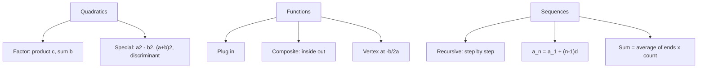

# Q-8: Quadratics, Exponents in Algebra, Functions, Sequences

**Why this matters for you:** GMAC lists algebraic manipulation, sequences and partial sums under expected algebra. Your Equal/Unequal/ALG skill wasn't flagged, so treat this node as maintenance.

## Quadratics

- To factor x² + bx + c, find two numbers whose product is c and whose sum is b. This is FOIL in reverse ([source](https://magoosh.com/gmat/algebra-on-the-gmat-how-to-factor/)).
- When the leading coefficient isn't 1, find factor pairs for both the leading coefficient and the constant, then test combinations ([source](https://magoosh.com/gmat/algebra-on-the-gmat-how-to-factor/)).
- Three formulas to know ([source](https://magoosh.com/gmat/three-algebra-formulas-essential-for-the-gmat/)):
  - difference of squares: a² − b² = (a − b)(a + b)
  - square of a binomial: (a ± b)² = a² ± 2ab + b²
  - discriminant: D = b² − 4ac, which tells you how many real roots there are
- If the product of two factors is 0, one of them is 0. Never divide both sides by a variable that could be 0 *(synth)*.

## Functions

- f(x) is notation, not multiplication. Substitute the input and evaluate ([source](https://blog.targettestprep.com/gmat-functions/)).
- Composite f(g(x)): work from the inside out ([source](https://blog.targettestprep.com/gmat-functions/)).
- Symbol functions (x # y = …): apply the rule exactly as defined ([source](https://blog.targettestprep.com/gmat-functions/)).
- For f(x) = ax² + bx + c, the minimum (a > 0) or maximum (a < 0) is at x = −b/2a. Substitute back to get the value ([source](https://blog.targettestprep.com/gmat-functions/)).

## Sequences

- Recursive: each term comes from the previous terms, so compute step by step ([source](https://magoosh.com/gmat/gmat-practice-problems-sequences)).
- Arithmetic: aₙ = a₁ + (n − 1)d ([source](https://magoosh.com/gmat/gmat-practice-problems-sequences)).
- Sum of an evenly spaced list = (first + last) ÷ 2 × number of terms. The sum of 1 to n = n(n + 1)/2 ([source](https://magoosh.com/gmat/gmat-practice-problems-sequences)).

## Worked examples *(original example)*

1. x² − 5x + 6 = 0 factors as (x − 2)(x − 3), so **x = 2 or 3**. Check: 2 × 3 = 6 and 2 + 3 = 5.
2. 49² − 51² = (49 − 51)(49 + 51) = (−2)(100) = **−200**.
3. f(x) = 2x + 1 and g(x) = x². Then f(g(3)) = f(9) = **19**.
4. f(x) = x² − 6x + 10 has its minimum at x = 6/2 = 3, and f(3) = 9 − 18 + 10 = **1**.
5. The arithmetic sequence 4, 7, 10, … has a₂₀ = 4 + 19×3 = **61**, and the sum of the first 20 terms = (4 + 61)/2 × 20 = **650**.

## Concept map

## Flashcards
Q: How do you factor x² + bx + c?
A: Find two numbers with product c and sum b.

Q: a² − b² = ?
A: (a − b)(a + b).

Q: 49² − 51² = ?
A: −200.

Q: What does the discriminant b² − 4ac tell you?
A: How many real roots the quadratic has.

Q: Where is the minimum of x² − 6x + 10, and what is its value?
A: At x = 3, value 1.

Q: f(x) = 2x + 1 and g(x) = x². f(g(3)) = ?
A: 19.

Q: What is the nth term of an arithmetic sequence?
A: a₁ + (n − 1)d.

Q: What is the sum of an evenly spaced list?
A: (first + last) ÷ 2 × number of terms.

Q: Sum of 1 to 100?
A: 100 × 101 / 2 = 5,050.

## Sources
- https://magoosh.com/gmat/algebra-on-the-gmat-how-to-factor/
- https://magoosh.com/gmat/three-algebra-formulas-essential-for-the-gmat/
- https://blog.targettestprep.com/gmat-functions/
- https://magoosh.com/gmat/gmat-practice-problems-sequences
- https://go.gmac.com/hubfs/07.Assessments/GMAT%20Exam/School%20Resources%202025/In-Depth-GMAT-Presentation-2025.pdf
