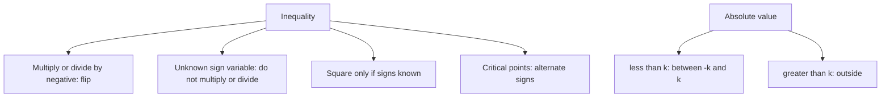

# Q-9: Inequalities and Absolute Value

**Why this matters for you:** inequalities feed straight into yes/no DS ("is x > y?"). Handle signs carelessly and a statement looks sufficient when it isn't.

## Core rules

- Multiplying or dividing by a negative **flips** the inequality. Adding or subtracting never does ([source](https://www.crackverbal.com/gmat-inequalities/)).
- Never multiply, divide or square by a variable whose sign you don't know. From xy > 1 you can't conclude x > 1/y ([source](https://www.crackverbal.com/gmat-inequalities/)).
- Inequalities pointing the same way can be added. To subtract, flip one and then add ([source](https://www.crackverbal.com/gmat-inequalities/)).
- Squaring: if both sides are positive, keep the sign. If both are negative, flip it. With mixed or unknown signs, don't square ([source](https://www.crackverbal.com/gmat-inequalities/)).

## Products and quotients

- ab > 0 means a and b have the same sign. ab < 0 means opposite signs. a/b ≥ 0 means the same sign with b ≠ 0 ([source](https://www.crackverbal.com/gmat-inequalities/)).
- **Critical points:** mark the zeros on a number line. The rightmost region is positive, and the sign alternates moving left. Use open circles for < and >, closed for ≤ and ≥ ([source](https://www.crackverbal.com/gmat-inequalities/)).

## Absolute value

- |x| < k means −k < x < k (an AND range). |x| > k means x > k or x < −k (an OR split) *(synth)*.

## Worked examples *(original example)*

1. −2x + 3 > 9 gives −2x > 6. Dividing by −2 flips the sign: **x < −3**.
2. |x − 2| < 5 gives −5 < x − 2 < 5, so **−3 < x < 7**.
3. |x + 1| > 3 gives x + 1 > 3 or x + 1 < −3, so **x > 2 or x < −4**.
4. (x − 1)(x + 4) < 0 has critical points −4 and 1. Positive on the right, negative in the middle, so **−4 < x < 1**.

## Concept map

## Flashcards
Q: When does an inequality flip?
A: When you multiply or divide by a negative number.

Q: May you divide both sides by y when y's sign is unknown?
A: No.

Q: Solve −2x + 3 > 9.
A: x < −3.

Q: Solve |x − 2| < 5.
A: −3 < x < 7.

Q: Solve |x + 1| > 3.
A: x > 2 or x < −4.

Q: (x − 1)(x + 4) < 0?
A: −4 < x < 1.

Q: What does ab < 0 tell you?
A: a and b have opposite signs and neither is zero.

Q: When may you square both sides of an inequality?
A: Only when you know both signs. Keep the sign if both are positive, flip it if both are negative.

## Sources
- https://www.crackverbal.com/gmat-inequalities/
