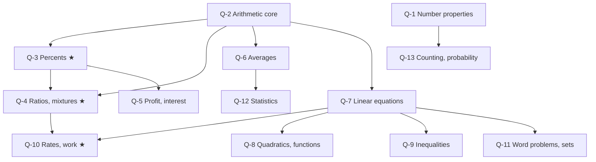

# GMAT Quantitative Reasoning: node map

21 problem-solving questions in 45 minutes, no calculator, and no geometry (GMAC). Your mock score was QR 77 (43rd percentile). The clear gap is Rates/Ratios/Percent at the 22nd percentile, so the ★ nodes Q-3, Q-4 and Q-10 come first. The `weight` field gives the dossier's estimated share of the topic's category in the section (arithmetic 30–35%, algebra 25–30%, number properties 10–15%, statistics and probability 15–20%, word problems 5–10%). These shares overlap, so they don't add up to 100.

## Nodes

| Node | Topic | Deps | Minutes | Exam focus |
|---|---|---|---|---|
| Q-3 | Percents and Percent Change | Q-2 | 40 | yes |
| Q-4 | Ratio, Proportion and Mixtures | Q-2, Q-3 | 45 | yes |
| Q-10 | Rates, Work and Distance | Q-4, Q-7 | 45 | yes |
| Q-1 | Number Properties | none | 35 | no |
| Q-2 | Arithmetic Core (fractions, decimals, exponents, roots) | none | 35 | no |
| Q-5 | Profit/Loss, Simple and Compound Interest | Q-3 | 30 | no |
| Q-6 | Averages and Weighted Averages | Q-2 | 30 | no |
| Q-7 | Linear Equations and Systems | Q-2 | 30 | no |
| Q-8 | Quadratics, Exponents in Algebra, Functions, Sequences | Q-7 | 40 | no |
| Q-9 | Inequalities and Absolute Value | Q-7 | 35 | no |
| Q-11 | Word Problems: Sets, Overlapping Groups, Translation | Q-7 | 30 | no |
| Q-12 | Statistics: Mean, Median, Range, SD | Q-6 | 30 | no |
| Q-13 | Counting and Probability | Q-1 | 40 | no |

Total reading time: about 465 minutes.

## Dependency graph

## Headline numbers to know

- Percent: 1.25 × 0.8 = 1.00. +10% then −10% = 0.99. Reverse: 170 ÷ 0.85 = 200.
- Ratio 3:5 with a total of 64 gives 24 and 40. Mixing 10% and 30% to get 25% needs a 1:3 ratio.
- Work: 6 h and 3 h together take 2 h. Average speed 30 and 60 over equal distances is 40 km/h, not 45.
- Weighted average: 30 at 70 and 10 at 90 average 75.
