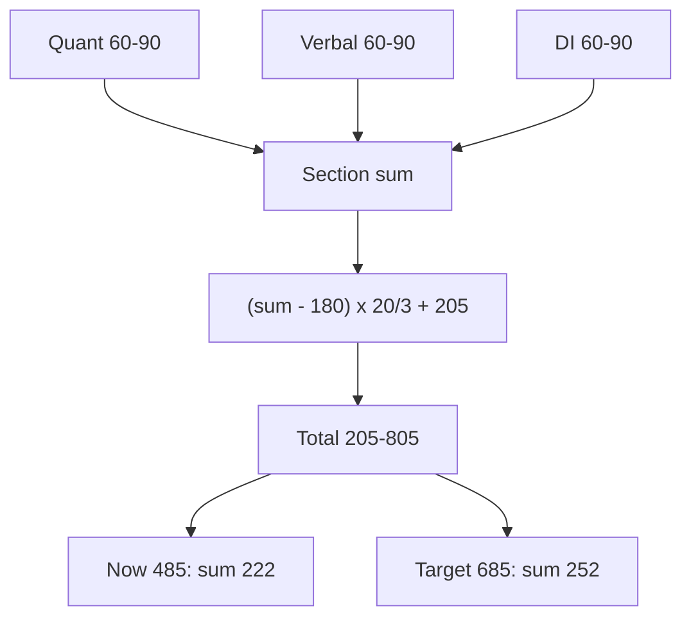

# S-1: Scoring (205–805, sections 60–90, linear in the section sum)

**Why this matters for you:** you are at 485 (Q77 V77 DI68) and aiming for 685. Because the total is linear in the section sum, a point gained anywhere counts the same. DI, at 68, has the most cheap points left.

## The official scale

- Total score 205–805 in 10-point steps. Each section score is 60–90 in 1-point steps ([source](https://go.gmac.com/hubfs/07.Assessments/GMAT%20Exam/School%20Resources%202025/In-Depth-GMAT-Presentation-2025.pdf)).
- The total uses all three sections, **weighted equally** ([source](https://go.gmac.com/hubfs/07.Assessments/GMAT%20Exam/School%20Resources%202025/In-Depth-GMAT-Presentation-2025.pdf)).
- 64 questions in 2 h 15 min: Quant 21, Verbal 23, DI 20, with 45 minutes each ([source](https://go.gmac.com/hubfs/07.Assessments/GMAT%20Exam/School%20Resources%202025/In-Depth-GMAT-Presentation-2025.pdf)).
- Scores are valid for 5 years ([source](https://go.gmac.com/hubfs/07.Assessments/GMAT%20Exam/School%20Resources%202025/In-Depth-GMAT-Presentation-2025.pdf)).
- The test adapts question by question. The first question is medium, and each answer sets the next question's difficulty ([source](https://go.gmac.com/hubfs/07.Assessments/GMAT%20Exam/School%20Resources%202025/In-Depth-GMAT-Presentation-2025.pdf)).
- GMAC calls these myths: early questions count more; some question types are weighted more; time taken lowers your score in itself ([source](https://go.gmac.com/hubfs/07.Assessments/GMAT%20Exam/School%20Resources%202025/In-Depth-GMAT-Presentation-2025.pdf)).

## Converting section scores to a total

- Total = (Q + V + DI − 180) × 20/3 + 205, rounded to a score ending in 5. This formula is published by prep companies, not GMAC ([source](https://www.crackverbal.com/resources/how-to-calculate-gmat-score/)).
- Every section point is worth the same, and about +1.5 on the section sum gives +10 on the total ([source](https://www.crackverbal.com/resources/how-to-calculate-gmat-score/)).

## Your numbers *(original example)*

- Now: 77 + 77 + 68 = 222. Then (222 − 180) × 20/3 = 42 × 20/3 = 280, and 280 + 205 = **485**. This matches your official mock.
- Target 685: (685 − 205) × 3/20 = 480 × 3/20 = 72, so you need a section sum of **252**. That is +30 section points, for example 84/84/84 or 85/84/83.

## Percentile reference (GMAC slide)

- 605 is the 72nd percentile, 655 the 91st, 705 the 98th ([source](https://go.gmac.com/hubfs/07.Assessments/GMAT%20Exam/School%20Resources%202025/In-Depth-GMAT-Presentation-2025.pdf)).

## Concept map

## Flashcards
Q: What are the total and section score ranges?
A: Total 205–805 in 10-point steps. Each section 60–90 in 1-point steps.

Q: Are the sections weighted equally?
A: Yes.

Q: What is the formula from section sum to total?
A: (Q + V + DI − 180) × 20/3 + 205, rounded to a score ending in 5.

Q: What section sum do you need for 685?
A: 252.

Q: How much does +1.5 on the section sum add to the total?
A: About +10.

Q: Your mock: 77 + 77 + 68 gives what total?
A: 485.

Q: How long are scores valid?
A: 5 years.

Q: Does the test adapt by question or by section?
A: By question. The first question is medium difficulty.

## Sources
- https://go.gmac.com/hubfs/07.Assessments/GMAT%20Exam/School%20Resources%202025/In-Depth-GMAT-Presentation-2025.pdf
- https://www.crackverbal.com/resources/how-to-calculate-gmat-score/
