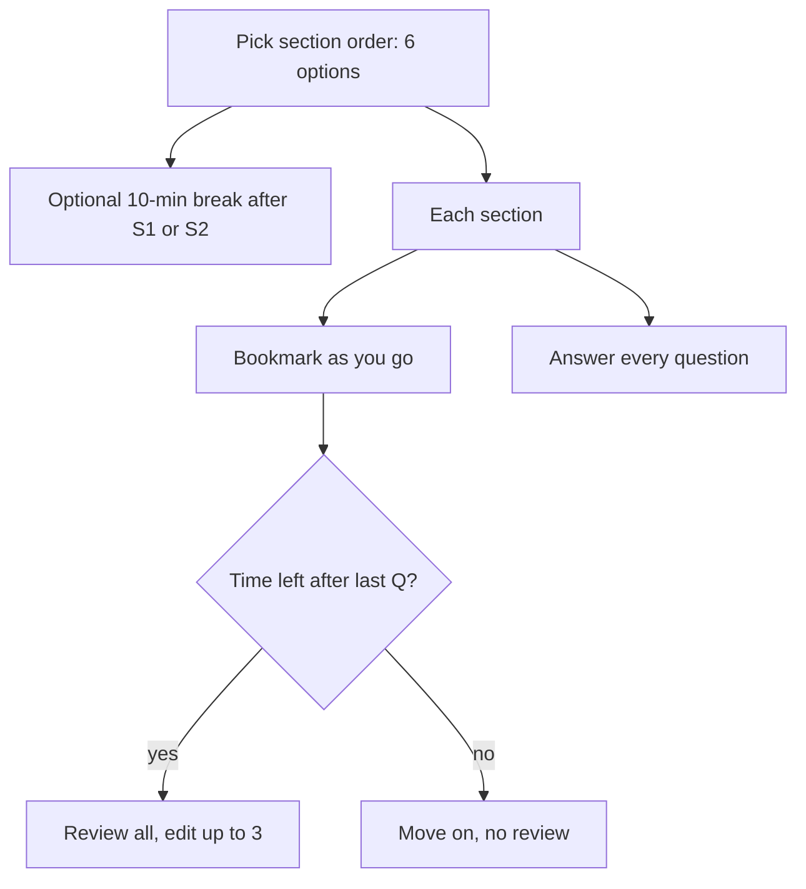

# S-2: Section Order, Bookmark and Review/Edit, No Blanks

**Why this matters for you:** the review screen is only worth anything if you finish with time to spare, and you didn't on the mock. These rules decide how you use bookmarks without wrecking your pacing.

## Section order and break

- You choose the order of the three sections. All 6 orders are allowed ([source](https://go.gmac.com/hubfs/07.Assessments/GMAT%20Exam/School%20Resources%202025/In-Depth-GMAT-Presentation-2025.pdf)).
- There is one optional 10-minute break, after the first **or** the second section. Take it after the first and you can't take another after the second. The 10 minutes include checking back in ([source](https://go.gmac.com/hubfs/07.Assessments/GMAT%20Exam/School%20Resources%202025/In-Depth-GMAT-Presentation-2025.pdf)).
- At a test centre, running over the break comes out of the next section's time ([source](https://www.mba.com/-/media/files/mba2/the-gmat-focus-edition/gmat-focus-policies-and-procedures-test-center-and-online-product-team-master_final-7may24.pdf)).

## Bookmark, review and edit

- Bookmark any question as you go. After you have answered every question in a section, the Question Review & Edit screen lists them all and shows your bookmarks ([source](https://go.gmac.com/hubfs/07.Assessments/GMAT%20Exam/School%20Resources%202025/In-Depth-GMAT-Presentation-2025.pdf)).
- You can review as many questions as you like and **change up to 3 answers per section**, but only while section time remains ([source](https://go.gmac.com/hubfs/07.Assessments/GMAT%20Exam/School%20Resources%202025/In-Depth-GMAT-Presentation-2025.pdf)).
- If no time is left, you skip the review screen and move on ([source](https://go.gmac.com/hubfs/07.Assessments/GMAT%20Exam/School%20Resources%202025/In-Depth-GMAT-Presentation-2025.pdf)).
- You can't skip ahead. Each question needs an answer before the next one appears ([source](https://blog.targettestprep.com/gmat-focus-edition-complete-guide/)).
- Changing a correct answer to a wrong one during review is not weighted more heavily than getting it wrong first time (GMAC lists this as a myth) ([source](https://go.gmac.com/hubfs/07.Assessments/GMAT%20Exam/School%20Resources%202025/In-Depth-GMAT-Presentation-2025.pdf)).

## No blanks

- Unanswered questions lower your score, so answer everything ([source](https://go.gmac.com/hubfs/07.Assessments/GMAT%20Exam/School%20Resources%202025/In-Depth-GMAT-Presentation-2025.pdf)).

## Calculator

- Quant: no calculator. DI: an on-screen calculator ([source](https://go.gmac.com/hubfs/07.Assessments/GMAT%20Exam/School%20Resources%202025/In-Depth-GMAT-Presentation-2025.pdf)).

## Your choices *(synth)*

- Order: try DI first in mocks while it is your weakest section, so it gets your freshest attention, and compare against another order.
- Bookmark only guesses where a second look could plausibly flip the answer, and spend at most 3 edits on those.

## Concept map

## Flashcards
Q: How many section orders can you choose from?
A: 6, meaning any order.

Q: When can you take the optional break?
A: After the first or the second section, once, for 10 minutes including check-in.

Q: How many answers can you change per section?
A: Up to 3.

Q: When do you reach the review screen?
A: Only after answering every question, and only while time remains.

Q: Is changing a correct answer to a wrong one penalised extra?
A: No. GMAC calls that a myth.

Q: Calculator availability?
A: None in Quant. An on-screen calculator in DI.

Q: Can you skip a question and come back to it?
A: No. You must answer it first, then bookmark it for review.

## Sources
- https://go.gmac.com/hubfs/07.Assessments/GMAT%20Exam/School%20Resources%202025/In-Depth-GMAT-Presentation-2025.pdf
- https://www.mba.com/-/media/files/mba2/the-gmat-focus-edition/gmat-focus-policies-and-procedures-test-center-and-online-product-team-master_final-7may24.pdf
- https://blog.targettestprep.com/gmat-focus-edition-complete-guide/
