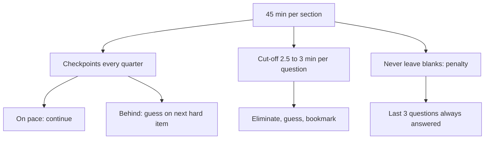

# S-3: End-of-Section Pacing

**Why this matters for you:** on the 2026-08-17 mock all three sections collapsed in the last 3 questions, and DS ate 3–8 minutes per question early in DI. A late collapse costs points in every section, so it is the cheapest fix available.

## The rules that make pacing a scoring issue

- GMAC scores you on the difficulty of the questions you get right and wrong, **and on the number you leave unanswered** ([source](https://go.gmac.com/hubfs/07.Assessments/GMAT%20Exam/School%20Resources%202025/In-Depth-GMAT-Presentation-2025.pdf)).
- GMAC calls it a myth that a blank beats a guess when time runs short, and tells you to answer every question, with an educated guess if you must ([source](https://go.gmac.com/hubfs/07.Assessments/GMAT%20Exam/School%20Resources%202025/In-Depth-GMAT-Presentation-2025.pdf)).
- GMAC also calls it a myth that taking longer on a question lowers your score in itself. Time costs you only by starving later questions ([source](https://go.gmac.com/hubfs/07.Assessments/GMAT%20Exam/School%20Resources%202025/In-Depth-GMAT-Presentation-2025.pdf)).
- e-GMAT estimates the blank penalty at about 30 × (share of the section left unanswered) section points. Its example: one blank in DI costs about 1.5 points. This is e-GMAT's estimate, not a GMAC figure ([source](https://e-gmat.com/blogs/the-penalty-thats-destroying-your-gmat-score/)).

## Time per question

| Section | Questions | Average |
|---|---|---|
| Quant | 21 in 45 min | ~2 min 9 s ([source](https://go.gmac.com/hubfs/07.Assessments/GMAT%20Exam/School%20Resources%202025/In-Depth-GMAT-Presentation-2025.pdf)) |
| Verbal | 23 in 45 min | ~2 min ([source](https://magoosh.com/gmat/about/tips/gmat-timing-strategy/)) |
| DI | 20 in 45 min | 2 min 15 s ([source](https://blog.targettestprep.com/data-insights-timing-strategy/)) |

## Checkpoints (minutes left on the clock)

- **Quant:** be at Q4 by 36, Q8 by 27, Q13 by 18, Q17 by 9 ([source](https://magoosh.com/gmat/about/tips/gmat-timing-strategy/)).
- **Verbal:** Q5 by 35, Q10 by 25, Q15 by 15, Q20 by 5 ([source](https://magoosh.com/gmat/about/tips/gmat-timing-strategy/)).
- **DI:** Q5 at 36, Q9 at 27, Q13 at 18, Q17 at 9 ([source](https://blog.targettestprep.com/data-insights-timing-strategy/)). Treat these as guides, and speed up only if you are well behind ([source](https://blog.targettestprep.com/data-insights-timing-strategy/)).

## Cut-off rules

- Don't spend more than about 3 minutes on any single problem ([source](https://magoosh.com/gmat/about/tips/gmat-timing-strategy/)).
- e-GMAT sets a 2.5-minute cut-off. If you aren't close to an answer by then, eliminate what you can, guess, bookmark and move on ([source](https://e-gmat.com/blogs/the-penalty-thats-destroying-your-gmat-score/)).
- GMAC: don't waste time on a question you find extremely hard. Make an educated guess and come back later if time allows ([source](https://go.gmac.com/hubfs/07.Assessments/GMAT%20Exam/School%20Resources%202025/In-Depth-GMAT-Presentation-2025.pdf)).
- The usual causes of unanswered questions are early time panic, getting stuck on one question, and perfectionism ([source](https://e-gmat.com/blogs/the-penalty-thats-destroying-your-gmat-score/)).
- A run of wrong answers in the final minutes points to a timing problem, not an ability problem ([source](https://e-gmat.com/blogs/master-quiz-review-turn-every-mistake-into-progress)).

## Your plan for the last three questions *(synth)*

At the final checkpoint, if you are behind, answer the remaining questions at a forced 60–90 s each. Never let the clock run out with a question still unseen.

## Concept map

## Flashcards
Q: What three things does the GMAT score use?
A: The difficulty of questions you get right, the difficulty of those you get wrong, and how many you leave unanswered.

Q: Out of time: guess or leave blank?
A: Guess. GMAC lists "blank is better" as a myth.

Q: What are the Quant checkpoints (minutes left)?
A: Q4 by 36, Q8 by 27, Q13 by 18, Q17 by 9.

Q: What are the Verbal checkpoints?
A: Q5 by 35, Q10 by 25, Q15 by 15, Q20 by 5.

Q: What are the DI checkpoints?
A: Q5 at 36, Q9 at 27, Q13 at 18, Q17 at 9.

Q: What is the per-question time cap?
A: About 3 minutes at most (e-GMAT uses 2.5).

Q: What is the average time per DI question?
A: 2 minutes 15 seconds.

Q: What does a cluster of wrong answers at the end of a section signal?
A: A timing problem, not an ability gap.

Q: e-GMAT's estimate for one blank out of 20 DI questions?
A: About 1.5 section points (30 × 5%). This is not an official GMAC figure.

## Sources
- https://go.gmac.com/hubfs/07.Assessments/GMAT%20Exam/School%20Resources%202025/In-Depth-GMAT-Presentation-2025.pdf
- https://e-gmat.com/blogs/the-penalty-thats-destroying-your-gmat-score/
- https://magoosh.com/gmat/about/tips/gmat-timing-strategy/
- https://blog.targettestprep.com/data-insights-timing-strategy/
- https://e-gmat.com/blogs/master-quiz-review-turn-every-mistake-into-progress
