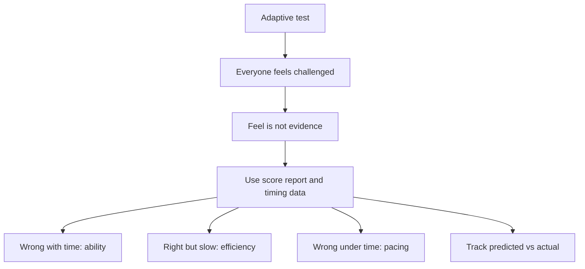

# S-4: Felt-vs-Actual (trust scores, not vibe)

**Why this matters for you:** on the mock, DI "felt fine" and was your worst section (14th percentile). An adaptive test feels hard on purpose, so how a section felt tells you little. Decide what to study from score data.

## Why feel misleads on an adaptive test

- After a correct answer you get a harder question, and after a miss an easier one, so everyone ends up facing questions near their limit ([source](https://blog.targettestprep.com/gmat-computer-adaptive/)).
- Even the questions you get right feel hard. That is the design, not a sign you are doing badly ([source](https://blog.targettestprep.com/gmat-computer-adaptive/)).
- You can't compare your question difficulty with anyone else's, because it is personalised ([source](https://blog.targettestprep.com/gmat-computer-adaptive/)).
- The reverse also holds *(synth)*: a section that feels easy may mean you are being given easier questions after misses. That fits DI on your mock.

## What to trust instead

- The official score report breaks results down by section, content domain, question type and fundamental skill, along with time management and a summary of Review & Edit ([source](https://go.gmac.com/hubfs/07.Assessments/GMAT%20Exam/School%20Resources%202025/In-Depth-GMAT-Presentation-2025.pdf)).
- After each mock, sort every question by accuracy and by time spent ([source](https://e-gmat.com/blogs/master-quiz-review-turn-every-mistake-into-progress)):
  - wrong with ample time: an ability gap, so review it longest
  - right but slow: an efficiency problem
  - wrong only because of time pressure
  - rushed errors: overconfidence
  - right and on time: confirmed, so review briefly
- Check whether the score was limited by time, by ability or by luck. Lucky guesses can hide real gaps ([source](https://e-gmat.com/blogs/master-quiz-review-turn-every-mistake-into-progress)).
- Look for patterns by question type and by section, not just individual misses ([source](https://e-gmat.com/blogs/master-quiz-review-turn-every-mistake-into-progress)).

## Your habit *(synth)*

Before you look at a mock's score, write down your predicted section scores. Track predicted minus actual over time. If DI keeps coming in under your prediction, trust the number, not the feeling.

## Concept map

## Flashcards
Q: Why does the GMAT feel hard even when you are doing well?
A: It is adaptive. Correct answers lead to harder questions until you reach your limit.

Q: What does a section that "felt fine" prove?
A: Nothing on its own. Check the score data.

Q: Which official report breakdowns should you use?
A: Section, content domain, question type, fundamental skill, time management, and the Review & Edit summary.

Q: Wrong answer despite plenty of time: which category?
A: Ability gap. Review it longest.

Q: Right answer but too slow: which category?
A: Efficiency problem.

Q: What can lucky guesses do?
A: Hide real gaps.

Q: What is the predicted-vs-actual habit?
A: Write down your predicted section scores before seeing results, and track the gap.

## Sources
- https://blog.targettestprep.com/gmat-computer-adaptive/
- https://go.gmac.com/hubfs/07.Assessments/GMAT%20Exam/School%20Resources%202025/In-Depth-GMAT-Presentation-2025.pdf
- https://e-gmat.com/blogs/master-quiz-review-turn-every-mistake-into-progress
