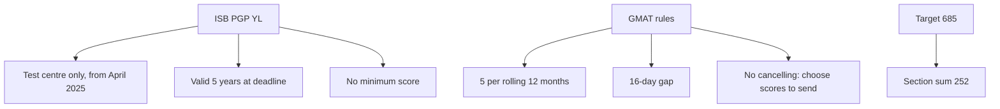

# S-5: ISB Context (test centre only, attempts, May/June 2027, 685 target)

**Why this matters for you:** you are applying to ISB PGP YL with a target of 685 and an exam window of May/June 2027. The test format and the retake rules decide how much slack you have.

## ISB rules

- PGP YL accepts GMAT, GRE (test-centre only) or CAT scores ([source](https://www.isb.edu/programmes/post-graduate-programmes/pgp-yl/faqs)).
- **Since April 2025 ISB doesn't accept online or at-home test scores.** You must test at a physical centre ([source](https://www.isb.edu/programmes/post-graduate-programmes/pgp-yl/faqs)).
- The score must be a verified, test-centre-based score that the testing agency sends to ISB directly ([source](https://www.isb.edu/programmes/post-graduate-programmes/pgp-yl/eligibility-and-requirements)).
- The score must still be valid (within 5 years) at your round's deadline. You may enter unofficial scores by the deadline if you tested by then ([source](https://www.isb.edu/programmes/post-graduate-programmes/pgp-yl/eligibility-and-requirements)).
- ISB sets no minimum GMAT score ([source](https://www.isb.edu/programmes/post-graduate-programmes/pgp-yl/eligibility-and-requirements)).

## GMAT attempt and score rules

- Up to 5 attempts in any rolling 12 months, at least 16 days apart ([source](https://go.gmac.com/hubfs/07.Assessments/GMAT%20Exam/School%20Resources%202025/In-Depth-GMAT-Presentation-2025.pdf)).
- Lifetime cap: GMAC's 2025 presentation says there is **no lifetime limit**. GMAC's May 2024 policy document still said 8 lifetime. Check mba.com before you book ([source](https://go.gmac.com/hubfs/07.Assessments/GMAT%20Exam/School%20Resources%202025/In-Depth-GMAT-Presentation-2025.pdf), [source](https://www.mba.com/-/media/files/mba2/the-gmat-focus-edition/gmat-focus-policies-and-procedures-test-center-and-online-product-team-master_final-7may24.pdf)).
- Scores can no longer be cancelled. You choose which scores to send ([source](https://go.gmac.com/hubfs/07.Assessments/GMAT%20Exam/School%20Resources%202025/In-Depth-GMAT-Presentation-2025.pdf)).
- The official score is usually ready within 1–3 days, occasionally up to 20. Five free score sends are available within 48 hours of the official score ([source](https://go.gmac.com/hubfs/07.Assessments/GMAT%20Exam/School%20Resources%202025/In-Depth-GMAT-Presentation-2025.pdf)).
- GMAC reports that retaking tends to add 20–30 points ([source](https://go.gmac.com/hubfs/07.Assessments/GMAT%20Exam/School%20Resources%202025/In-Depth-GMAT-Presentation-2025.pdf)).

## Your target

- 685 needs a section sum of 252 (see S-1). 685 is the 96th percentile on the dossier table. The dossier's ISB averages (PGP 669, YL 677) weren't re-verified on isb.edu for this note.
- Timeline *(synth)*: book a first sitting with room for at least one 16-day retake before your round deadline.

## Concept map

## Flashcards
Q: Does ISB accept online or at-home GMAT scores?
A: No. Test-centre scores only, since April 2025.

Q: What is the GMAT retake limit per year?
A: 5 attempts in a rolling 12 months.

Q: What is the minimum gap between attempts?
A: 16 days.

Q: Can you cancel a GMAT score now?
A: No. You choose which scores to send.

Q: How many free score sends do you get, and by when?
A: 5, within 48 hours of the official score.

Q: Does ISB set a minimum GMAT score?
A: No.

Q: What section sum does 685 need?
A: 252.

Q: How long until the official score is ready?
A: Usually 1–3 days, occasionally up to 20.

## Sources
- https://www.isb.edu/programmes/post-graduate-programmes/pgp-yl/faqs
- https://www.isb.edu/programmes/post-graduate-programmes/pgp-yl/eligibility-and-requirements
- https://go.gmac.com/hubfs/07.Assessments/GMAT%20Exam/School%20Resources%202025/In-Depth-GMAT-Presentation-2025.pdf
- https://www.mba.com/-/media/files/mba2/the-gmat-focus-edition/gmat-focus-policies-and-procedures-test-center-and-online-product-team-master_final-7may24.pdf
