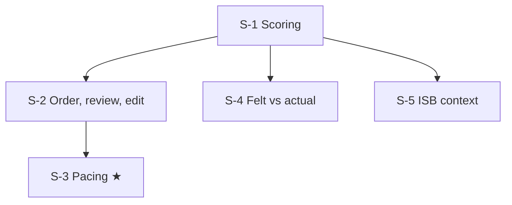

# GMAT test strategy: node map

These nodes cover how the test is scored and run, and how to manage it, rather than content. On the 2026-08-17 mock all three sections collapsed in the last 3 questions, so S-3 is the ★ node. The `weight` of 33 is each section's equal share of the total score. Every strategy node applies across all sections.

## Nodes

| Node | Topic | Deps | Minutes | Exam focus |
|---|---|---|---|---|
| S-3 | End-of-Section Pacing | S-2 | 30 | yes |
| S-1 | Scoring Scale and Section Math | none | 20 | no |
| S-2 | Section Order, Bookmark, Review/Edit, No Blanks | S-1 | 20 | no |
| S-4 | Felt vs Actual: Trust Scores, Not Vibe | S-1 | 20 | no |
| S-5 | ISB Context: Test Centre, Attempts, Timeline, Target | S-1 | 15 | no |

Total reading time: about 105 minutes.

## Dependency graph

## Headline numbers to know

- Total = (Q + V + DI − 180) × 20/3 + 205. You are at 485 (sum 222). The 685 target needs a sum of 252.
- Up to 3 answer edits per section, only with time left. One optional 10-minute break, after section 1 or 2.
- 5 attempts per rolling 12 months, 16 days apart. Scores can't be cancelled, but you choose which to send.
- ISB: test-centre scores only (since April 2025), valid 5 years at the deadline, no minimum score.
