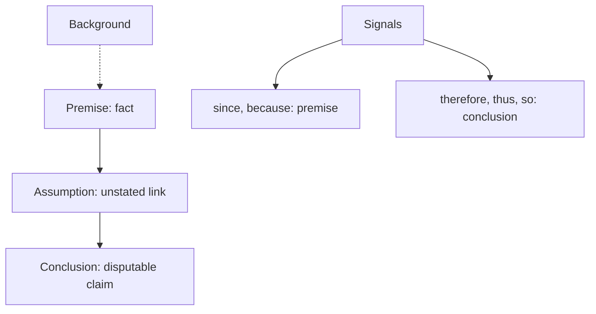

# V-1: Argument Anatomy

**Why this matters for you:** you read accurately (RC 36th percentile) but score worse on CR (22nd). Labelling the parts of each argument quickly is the foundation for V-2 to V-4.

## What CR tests

- CR checks whether you can build arguments, judge them, and form or evaluate a plan of action. Each item is a passage, usually under 100 words, with one question ([source](https://go.gmac.com/hubfs/07.Assessments/GMAT%20Exam/School%20Resources%202025/In-Depth-GMAT-Presentation-2025.pdf)).
- GMAC's tips: read every answer choice, notice *exactly* what the question asks, eliminate clearly wrong choices, and judge the reasoning by basic principles of good reasoning ([source](https://go.gmac.com/hubfs/07.Assessments/GMAT%20Exam/School%20Resources%202025/In-Depth-GMAT-Presentation-2025.pdf)).

## The parts

- **Premises:** the facts or reasons the argument rests on ([source](https://magoosh.com/gmat/introduction-to-gmat-critical-reasoning/)).
- **Conclusion:** the main claim, which the premises support ([source](https://magoosh.com/gmat/introduction-to-gmat-critical-reasoning/)).
- **Assumption:** the unstated link that must hold for the conclusion to follow ([source](https://magoosh.com/gmat/introduction-to-gmat-critical-reasoning/)).
- **Background:** context that is neither premise nor conclusion ([source](https://magoosh.com/gmat/introduction-to-gmat-critical-reasoning/)).
- Evidence is stated as fact. A conclusion is an interpretation that can be disputed ([source](https://magoosh.com/gmat/gmat-critical-reasoning-boldface-structure-questions/)).

## Signal words

- Conclusion: therefore, thus, so, we can conclude that ([source](https://magoosh.com/gmat/gmat-critical-reasoning-boldface-structure-questions/)).
- Premise: since, because ([source](https://magoosh.com/gmat/gmat-critical-reasoning-boldface-structure-questions/)).

## Process and question types

- Read the question stem first, name the type, find the conclusion and premises, spot the assumption, predict the answer, then eliminate four choices ([source](https://magoosh.com/gmat/introduction-to-gmat-critical-reasoning/)).
- The eight types are: weaken/flaw, strengthen, assumption, inference, structure (boldface), paradox, evaluate, and complete the argument. The first four make up most questions ([source](https://magoosh.com/gmat/introduction-to-gmat-critical-reasoning/)).
- Inference questions aren't arguments at all, just sets of facts ([source](https://www.manhattanprep.com/gmat/blog/gmat-critical-reasoning-inference-questions-top-tips/)).

## Worked example *(original example)*

"Since the new app cut checkout time by half in the pilot stores, the chain should roll it out nationwide."
- Premise: checkout time halved in the pilot stores (marked by "since").
- Conclusion: roll it out nationwide.
- Assumption: the pilot stores are representative of the chain's other stores.

## Concept map

## Flashcards
Q: What are the four parts of a CR argument?
A: Premise, conclusion, assumption and background.

Q: Which part is unstated?
A: The assumption.

Q: Name two conclusion signal words and two premise signal words.
A: Conclusion: therefore, thus. Premise: since, because.

Q: What is the first step in a CR question?
A: Read the stem and identify the question type.

Q: How long is a typical CR passage?
A: Under 100 words.

Q: Which four CR types make up most questions?
A: Weaken/flaw, strengthen, assumption and inference.

Q: Evidence or conclusion: which is open to dispute?
A: The conclusion.

## Sources
- https://go.gmac.com/hubfs/07.Assessments/GMAT%20Exam/School%20Resources%202025/In-Depth-GMAT-Presentation-2025.pdf
- https://magoosh.com/gmat/introduction-to-gmat-critical-reasoning/
- https://magoosh.com/gmat/gmat-critical-reasoning-boldface-structure-questions/
- https://www.manhattanprep.com/gmat/blog/gmat-critical-reasoning-inference-questions-top-tips/
