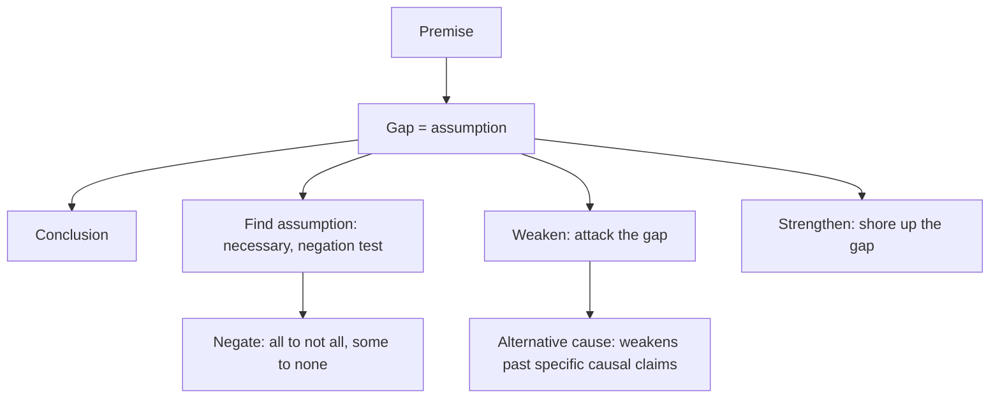

# V-2: Assumption, Strengthen, Weaken

**Why this matters for you:** Analysis/Critique was your weakest Verbal skill at the 18th percentile, and CR (22nd) trails RC (36th). Your literal comprehension is fine. The gap is spotting the unstated link, and these three question types all test exactly that.

## The assumption family

- An assumption is the unstated piece that must be true for the conclusion to follow. In Magoosh's formula, premise + assumption (+ background) = conclusion ([source](https://magoosh.com/gmat/introduction-to-gmat-critical-reasoning/)).
- Weaken, strengthen and find-the-assumption make up most CR questions ([source](https://magoosh.com/gmat/introduction-to-gmat-critical-reasoning/)).
- Process: read the question stem first, find the conclusion and premises, name the gap, predict, then eliminate ([source](https://magoosh.com/gmat/introduction-to-gmat-critical-reasoning/)).

## Find the assumption

- The right answer is the one the argument **needs**. Remove it and the argument breaks, like a car without its engine. A choice that only helps is a strengthener, not an assumption ([source](https://manhattanprep.com/gmat/blog/simple-strategy-gmat-find-the-assumption-problems)).
- **Negation test:** negate the choice. If the negated version wrecks the argument, the choice is an assumption. If it only weakens the argument, it isn't ([source](https://magoosh.com/gmat/verbal/critical-reasoning/assumptions-and-the-negation-test-on-the-gmat)).
- The negation test is quickest as a tie-breaker between the last two choices ([source](https://manhattanprep.com/gmat/blog/simple-strategy-gmat-find-the-assumption-problems)).
- How to negate: "all" becomes "not all", "some" becomes "none", and a specific claim becomes its opposite ([source](https://magoosh.com/gmat/verbal/critical-reasoning/assumptions-and-the-negation-test-on-the-gmat)).
- Wrong-answer types: irrelevant, opposite (hurts the argument), strengthener-but-not-necessary, and overstated ("most" where "some" is all the argument needs) ([source](https://manhattanprep.com/gmat/blog/simple-strategy-gmat-find-the-assumption-problems)).

## Strengthen and weaken

- Weaken by attacking the assumption. Strengthen by shoring it up. The answer adds new information that bears on the gap between premise and conclusion ([source](https://magoosh.com/gmat/introduction-to-gmat-critical-reasoning/)).
- **Causal conclusions** ("X led to Y"): an alternative cause weakens a claim about a *specific past* outcome. It does **not** weaken a general "X can lead to Y" claim, because that claim never said X was the only route ([source](https://e-gmat.com/blogs/alternate-cause-a-weakener-or-not/)).
- Common flaws to aim at: correlation taken as causation, reverse causation, and numbers confused with percentages ([source](https://www.mbacrystalball.com/blog/2012/05/22/gmat-preparation-critical-reasoning-questions-logical-flaws/)).

## Worked example *(original example)*

Argument: "Café R started a loyalty card in March. April sales were 20% above March. So the card raised sales."
- Conclusion: the card caused the rise (a past, specific cause).
- Assumption: nothing else drove April sales. Negation: "something else drove April sales". That breaks the argument, which confirms it is an assumption.
- Weaken: a large festival ran next door through April (an alternative cause).
- Strengthen: three similar cafés nearby without cards had flat April sales (rules out a seasonal cause).
- Not an assumption: "Most customers signed up for the card." It helps, but the argument survives without "most", so it is overstated.

## Concept map

## Flashcards
Q: What makes an answer a necessary assumption?
A: The argument breaks without it. Negating it destroys the conclusion.

Q: How do you use the negation test?
A: Negate the choice. If the argument collapses, the choice is the assumption. If it only weakens, it isn't.

Q: What is the negation of "all"? Of "some"?
A: "Not all", and "none".

Q: When is the negation test most efficient?
A: As a tie-breaker between the last two choices.

Q: Name four wrong-answer types on assumption questions.
A: Irrelevant, opposite, strengthener-but-not-necessary, and overstated.

Q: When does an alternative cause weaken a causal argument?
A: When the conclusion claims X caused a specific past Y. It doesn't weaken a general "X can lead to Y".

Q: What do weaken and strengthen answers target?
A: The assumption, the gap between premise and conclusion.

Q: What is Magoosh's argument formula?
A: Premise + unstated assumption + background = conclusion.

## Sources
- https://magoosh.com/gmat/introduction-to-gmat-critical-reasoning/
- https://manhattanprep.com/gmat/blog/simple-strategy-gmat-find-the-assumption-problems
- https://magoosh.com/gmat/verbal/critical-reasoning/assumptions-and-the-negation-test-on-the-gmat
- https://e-gmat.com/blogs/alternate-cause-a-weakener-or-not/
- https://www.mbacrystalball.com/blog/2012/05/22/gmat-preparation-critical-reasoning-questions-logical-flaws/
