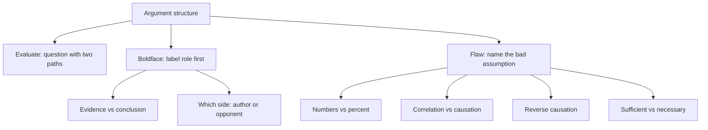

# V-3: Evaluate, Boldface/Role, Flaw

**Why this matters for you:** Analysis/Critique (18th percentile) is the skill these question types score. Each one asks *how* the argument works rather than what it says, which is the step beyond the literal reading you already do well.

## Evaluate the argument

- Asks what information would help you decide whether the conclusion is more or less likely to be valid ([source](https://www.mbamission.com/blog/all-about-critical-reasoning-questions-on-the-gmat-part-2/)).
- Evaluate belongs to the assumption family. First find the conclusion and name what the author assumes ([source](https://www.manhattanprep.com/gmat/blog/tackling-a-gmatprep-cr-evaluate-problem/)).
- **Two-path test:** the right answer is a question with two possible answers. One answer makes the argument stronger and the other makes it weaker. If both answers leave the claim unchanged, the choice is wrong ([source](https://www.manhattanprep.com/gmat/blog/tackling-a-gmatprep-cr-evaluate-problem/)).
- Wrong choices: they touch a premise but not the conclusion, cut only one way, offer an alternative plan, or wander off topic ([source](https://www.manhattanprep.com/gmat/blog/tackling-a-gmatprep-cr-evaluate-problem/)).
- Stem signals: "evaluate", "determine", "most useful to know" ([source](https://www.manhattanprep.com/gmat/blog/tackling-a-gmatprep-cr-evaluate-problem/)).

## Boldface / describe the role

- The question asks what job each bold part does in the argument. Focus on *why* the author included it, not on what it says ([source](https://www.mbamission.com/blog/all-about-critical-reasoning-questions-on-the-gmat-part-2/)).
- Separate evidence (stated as fact) from conclusions (interpretations that could be disputed). Use signal words such as "since", "because" and "therefore" ([source](https://magoosh.com/gmat/gmat-critical-reasoning-boldface-structure-questions/)).
- Many boldface arguments contain two opposing positions. Decide which side each bold part supports ([source](https://magoosh.com/gmat/gmat-critical-reasoning-boldface-structure-questions/)).
- Before you look at the choices, label each bold part in your own words: main conclusion, intermediate conclusion, evidence for, evidence against, or opposing view ([source](https://magoosh.com/gmat/gmat-critical-reasoning-boldface-structure-questions/)).
- The answer choices describe structure in abstract terms, so match roles, not topic words ([source](https://magoosh.com/gmat/gmat-critical-reasoning-boldface-structure-questions/)).

## Flaw

- Flaw is the mirror of assumption: the author assumes something that might not be true, and you name the error ([source](https://www.mbamission.com/blog/all-about-critical-reasoning-questions-on-the-gmat-part-2/)).
- Recurring flaws ([source](https://www.mbacrystalball.com/blog/2012/05/22/gmat-preparation-critical-reasoning-questions-logical-flaws/)):
  - **Numbers vs percentages:** a larger count need not be a larger share when the group sizes differ.
  - **Correlation taken as causation.**
  - **Reverse causation:** the evidence fits Y causing X just as well.
  - **Sufficient vs necessary confusion** in if/then claims.

## Worked example: role labels *(original example)*

"Some analysts argue that **the new metro line will cut city traffic**. But past lines here drew most riders from buses, not cars. So **traffic will likely stay flat**."
- Bold 1 is the opposing view that the author argues against.
- Bold 2 is the author's main conclusion.
- An evaluate question here: "Do the new line's planned routes serve areas where car commuting is common?" If yes, the argument weakens. If no, it strengthens. Two paths, so this is a valid evaluate answer.

## Concept map

## Flashcards
Q: What is the test for a correct Evaluate answer?
A: It has two possible answers. One strengthens the argument and the other weakens it.

Q: An Evaluate choice gives the same verdict whichever way it is answered. Right or wrong?
A: Wrong. It has to cut both ways.

Q: What do you focus on in a boldface question?
A: Why the author included each bold part, meaning its role, not its content.

Q: What do you do before reading boldface answer choices?
A: Label each bold part's role in your own words.

Q: How does a flaw question relate to an assumption question?
A: It is the flip side. The author relies on an assumption that might be false, and you name that error.

Q: Name four common GMAT flaws.
A: Numbers vs percentages, correlation as causation, reverse causation, and sufficient vs necessary confusion.

Q: What are the signal words for evaluate questions?
A: "Evaluate", "determine", "most useful to know".

Q: Why are numbers-vs-percent arguments flawed?
A: When groups differ in size, a larger count need not be a larger share.

## Sources
- https://www.mbamission.com/blog/all-about-critical-reasoning-questions-on-the-gmat-part-2/
- https://www.manhattanprep.com/gmat/blog/tackling-a-gmatprep-cr-evaluate-problem/
- https://magoosh.com/gmat/gmat-critical-reasoning-boldface-structure-questions/
- https://www.mbacrystalball.com/blog/2012/05/22/gmat-preparation-critical-reasoning-questions-logical-flaws/
