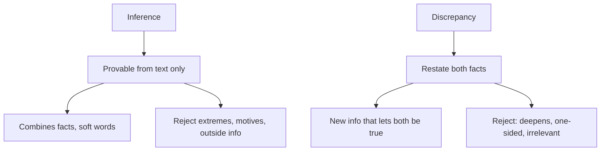

# V-4: Inference and Explain-the-Discrepancy

**Why this matters for you:** Inferred Idea was your second-weakest Verbal skill (29th percentile). Inference marks you down for going one step too far, and discrepancy questions use the same discipline: accept every stated fact exactly as given.

## Inference (must be true)

- Inference questions aren't built on arguments. You get a set of facts and must find what follows from them ([source](https://www.manhattanprep.com/gmat/blog/gmat-critical-reasoning-inference-questions-top-tips/)).
- The right answer can be proven from the passage alone, and it often **combines two or more facts** rather than repeating one ([source](https://www.manhattanprep.com/gmat/blog/gmat-critical-reasoning-inference-questions-top-tips/)).
- It usually uses soft language: "some", "can", "may", "not all" ([source](https://www.manhattanprep.com/gmat/blog/gmat-critical-reasoning-inference-questions-top-tips/)).
- Red flags in wrong answers: absolute words ("all", "only", "never", "must"), guessed causes or motives, the "coolest" takeaway rather than the provable one, outside information, and claims that sound reasonable but have no support ([source](https://www.manhattanprep.com/gmat/blog/gmat-critical-reasoning-inference-questions-top-tips/)).
- Read for hooks: quantities (for maths inferences), causal words, if/then rules, and contrast words such as "but" or "yet" ([source](https://www.manhattanprep.com/gmat/blog/gmat-critical-reasoning-inference-questions-top-tips/)).
- GMAC's own sample shows the scope rule: if a premise covers only *some* people, the inference can cover only *some* people ([source](https://go.gmac.com/hubfs/07.Assessments/GMAT%20Exam/School%20Resources%202025/In-Depth-GMAT-Presentation-2025.pdf)).

## Explain the discrepancy (paradox)

- You are given two facts that seem unlikely to sit together. Pick the choice that shows how both can be true ([source](https://magoosh.com/gmat/gmat-cr-paradox-questions/)).
- First, restate the paradox in your own words ([source](https://magoosh.com/gmat/gmat-cr-paradox-questions/)).
- The right answer adds new information that reconciles **both** facts ([source](https://www.mbamission.com/blog/all-about-critical-reasoning-questions-on-the-gmat-part-2/)).
- Trap answers: ones that **deepen** the paradox, irrelevant ones, and ones that explain only one of the two facts ([source](https://magoosh.com/gmat/gmat-cr-paradox-questions/)).

## Worked examples *(original example)*

1. **Inference.** Facts: "Every intern at firm K passed the audit test. Some interns at K were hired from abroad." Valid: "Some people hired from abroad passed the audit test" (it combines the two facts and uses soft language). Invalid: "Firms that hire abroad pass audits" (it overgeneralises beyond the facts).
2. **Discrepancy.** Facts: "Town T's bike sales doubled last year, yet bike-shop revenue fell." Resolves both: "Most new sales were cheap second-hand bikes sold online, not through shops." Deepens the paradox: "Bike-shop prices rose last year."

## Concept map

## Flashcards
Q: What makes a CR inference answer correct?
A: It can be proven from the passage alone, often by combining two facts.

Q: Which language do correct inference answers usually use?
A: Soft words: "some", "can", "may", "not all".

Q: Name three red flags in inference answer choices.
A: Absolute language, guessed causes or motives, and outside information.

Q: A premise applies to some individuals. What may you infer?
A: Only something about some individuals, not all.

Q: What is the first step on a discrepancy question?
A: Restate both facts and the apparent conflict in your own words.

Q: What does the correct discrepancy answer do?
A: It adds information that lets both facts be true together.

Q: Name three wrong-answer types on discrepancy questions.
A: Deepens the paradox, explains only one fact, irrelevant.

Q: May a discrepancy answer show that one of the facts is false?
A: No. Treat both facts as true.

## Sources
- https://www.manhattanprep.com/gmat/blog/gmat-critical-reasoning-inference-questions-top-tips/
- https://go.gmac.com/hubfs/07.Assessments/GMAT%20Exam/School%20Resources%202025/In-Depth-GMAT-Presentation-2025.pdf
- https://magoosh.com/gmat/gmat-cr-paradox-questions/
- https://www.mbamission.com/blog/all-about-critical-reasoning-questions-on-the-gmat-part-2/
