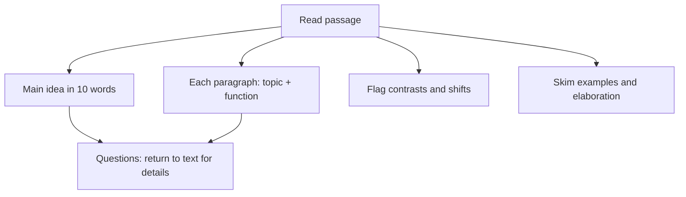

# V-5: RC Passage Mapping and Reading Speed

**Why this matters for you:** RC (36th percentile) is your stronger Verbal type, and RC is about 55–60% of the section. Faster mapping frees minutes for CR and stops the late-section collapse (S-3).

## Map, don't memorise

- Pin down the main idea and what each paragraph *does*. Look details up later when a question needs them ([source](https://magoosh.com/gmat/how-to-study-for-gmat-reading-comprehension/)).
- Notes: the main idea in 10 words or fewer, plus each paragraph's topic ([source](https://magoosh.com/gmat/how-to-study-for-gmat-reading-comprehension/)).
- For each detail, know *what* it discusses and *why* it is there. Don't memorise its content ([source](https://www.manhattanprep.com/gmat/blog/read-faster-on-the-gmat/)).
- Self-test: answer practice questions from your notes alone to see whether your map was good enough ([source](https://magoosh.com/gmat/how-to-study-for-gmat-reading-comprehension/)).

## Read faster

- Slow down for main claims, contrasts and shifts. Speed up through elaborations and examples once you have the point ([source](https://www.manhattanprep.com/gmat/blog/read-faster-on-the-gmat/)).
- Build speed outside the test: about 30 minutes of dense nonfiction a day ([source](https://www.manhattanprep.com/gmat/blog/read-faster-on-the-gmat/)). Suggested sources include *The Economist* and *Scientific American* ([source](https://magoosh.com/gmat/how-to-study-for-gmat-reading-comprehension/)).
- If reading speed stays the bottleneck, plan guesses ahead of time instead of rushing at the end ([source](https://www.manhattanprep.com/gmat/blog/read-faster-on-the-gmat/)).

## Timing

- Short passage (200–250 words): about 2.5 minutes to read. Long passage (300–350 words): about 3.5 minutes. Then about 1 minute per question ([source](https://magoosh.com/gmat/how-to-study-for-gmat-reading-comprehension/)).

## GMAC's RC tips

- Read every answer choice. Watch for choices that are only partly true, and don't pick a choice just because it is a true statement. Read words in their passage context ([source](https://go.gmac.com/hubfs/07.Assessments/GMAT%20Exam/School%20Resources%202025/In-Depth-GMAT-Presentation-2025.pdf)).

## Worked map *(original example)*

A four-paragraph passage on carbon taxes might map as:
- Main idea: "Carbon taxes cut emissions but need rebates to stay popular."
- P1: the problem. P2: evidence that taxes cut emissions. P3: political backlash. P4: the author's fix (rebates).
- Contrast flags: the "however" opening P3.

## Concept map

## Flashcards
Q: What goes in an RC passage map?
A: The main idea in 10 words or fewer, plus each paragraph's topic and function.

Q: What do you read slowly, and what do you skim?
A: Read claims, contrasts and shifts slowly. Skim elaborations and examples.

Q: How long should a short and a long passage take to read?
A: About 2.5 and 3.5 minutes respectively.

Q: How do you check whether your map was good enough?
A: Answer the questions from your notes alone.

Q: What should you know about each detail?
A: What it discusses and why it is there, not its exact content.

Q: Name one GMAC RC trap.
A: Choices that are only partly true, or true but not the answer to the question.

Q: What daily habit builds reading speed?
A: About 30 minutes of dense nonfiction.

## Sources
- https://magoosh.com/gmat/how-to-study-for-gmat-reading-comprehension/
- https://www.manhattanprep.com/gmat/blog/read-faster-on-the-gmat/
- https://go.gmac.com/hubfs/07.Assessments/GMAT%20Exam/School%20Resources%202025/In-Depth-GMAT-Presentation-2025.pdf
