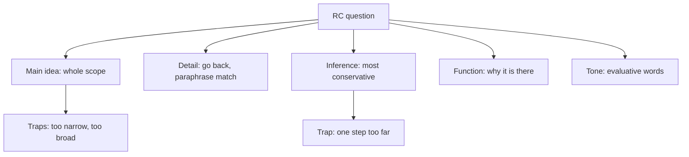

# V-6: RC Question Types

**Why this matters for you:** your Inferred Idea score (29th percentile) covers RC inference as well as CR. This node applies the V-4 discipline, never going one step past the text, to passages.

## The types GMAC names

- Main idea, supporting idea, inference, application, logical structure, and style or tone ([source](https://go.gmac.com/hubfs/07.Assessments/GMAT%20Exam/School%20Resources%202025/In-Depth-GMAT-Presentation-2025.pdf)).

## How to attack each

- **Main idea / primary purpose:** the answer covers the whole passage. Wrong answers are too narrow (one paragraph) or too broad (beyond the passage) ([source](https://www.crackverbal.com/gmat-reading-comprehension/)).
- **Detail (supporting idea):** let the question wording send you to the right spot, then reread it. Don't answer from memory ([source](https://www.mbamission.com/blog/the-master-resource-list-for-gmat-reading-comprehension-part-2/)).
  - Right answers often paraphrase. Wrong answers sometimes copy the passage's exact words to tempt you ([source](https://www.mbamission.com/blog/the-master-resource-list-for-gmat-reading-comprehension-part-2/)).
- **Inference:** choose the most cautious conclusion the text supports. The trap goes "one step too far" ([source](https://www.crackverbal.com/gmat-reading-comprehension/)).
- **Function / purpose of a detail:** ask *why* the detail is there, not what it says. Signal phrases include "in order to" and "serves to" ([source](https://www.crackverbal.com/gmat-reading-comprehension/)).
- **Tone / attitude:** look for evaluative words that show endorsement, criticism or qualification ([source](https://www.crackverbal.com/gmat-reading-comprehension/)).
- **Universal check:** you should be able to point to the sentence that supports your choice ([source](https://www.crackverbal.com/gmat-reading-comprehension/)).

## Worked example *(original example)*

Using the carbon-tax map from V-5:
- Main idea, right: "argues that carbon taxes work if paired with rebates". Too narrow: "describes political backlash". Too broad: "surveys all climate policies".
- Function of P2's study: "to support the claim that taxes reduce emissions".

## Concept map

## Flashcards
Q: Which RC types does GMAC list?
A: Main idea, supporting idea, inference, application, logical structure, and style/tone.

Q: What are the two main-idea traps?
A: Too narrow and too broad.

Q: How should you answer a detail question?
A: Find the spot in the passage and reread it. Don't rely on memory.

Q: Why be wary of a detail choice that repeats the passage's exact words?
A: Exact wording is sometimes used as a trap. Right answers often paraphrase.

Q: What does the right RC inference answer look like?
A: The most cautious conclusion the text supports, with no extra assumption.

Q: What does a function question ask?
A: Why a detail or paragraph is there, meaning its role.

Q: What is the universal check for any RC answer?
A: You can point to the sentence that supports it.

## Sources
- https://go.gmac.com/hubfs/07.Assessments/GMAT%20Exam/School%20Resources%202025/In-Depth-GMAT-Presentation-2025.pdf
- https://www.crackverbal.com/gmat-reading-comprehension/
- https://www.mbamission.com/blog/the-master-resource-list-for-gmat-reading-comprehension-part-2/
