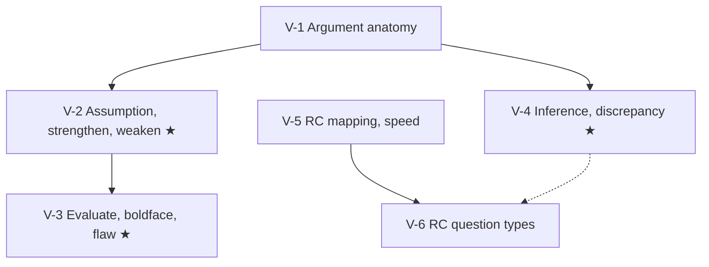

# GMAT Verbal Reasoning: node map

23 questions in 45 minutes: Reading Comprehension plus Critical Reasoning, with no Sentence Correction (GMAC). Your mock score was VR 77 (30th percentile). The gaps are Analysis/Critique (18th) and Inferred Idea (29th), and CR (22nd) is weaker than RC (36th). That makes the CR nodes V-2, V-3 and V-4 the ★ nodes. The `weight` field gives the dossier's estimated section share: CR 40–45% (42) and RC 55–60% (57).

## Nodes

| Node | Topic | Deps | Minutes | Exam focus |
|---|---|---|---|---|
| V-2 | Assumption, Strengthen, Weaken | V-1 | 45 | yes |
| V-3 | Evaluate, Boldface/Role, Flaw | V-2 | 40 | yes |
| V-4 | Inference and Explain the Discrepancy | V-1 | 40 | yes |
| V-1 | Argument Anatomy | none | 25 | no |
| V-5 | RC Passage Mapping and Reading Speed | none | 30 | no |
| V-6 | RC Question Types | V-5 | 30 | no |

Total reading time: about 210 minutes. V-1 is short, so read it before the ★ nodes.

## Dependency graph

## Headline rules to know

- Assumption = necessary. Use the negation test as a tie-breaker.
- Evaluate = the answer cuts both ways. Boldface = label each part's role before reading the choices.
- Inference = provable, cautious, often combines facts. Discrepancy = both facts stay true.
- RC: main idea in 10 words or fewer. About 2.5 or 3.5 minutes to read a passage, then about 1 minute per question.
