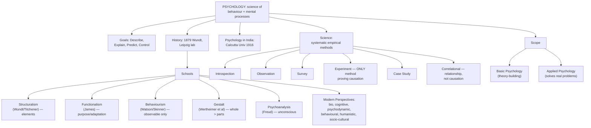

# GP1 Unit 1 — Introduction and Methods

Covers: what psychology actually is and what it is trying to do, the story of how it became a science, the schools of thought that shaped it, where India fits into that story, why psychology counts as a science at all, the six main research methods, and the basic vs applied split that organises the whole discipline.

## What is Psychology? Definition, goals, and why "common sense" isn't enough

**Psychology** is formally defined as the scientific study of behaviour and mental processes. Notice both halves of that definition matter. "Behaviour" is anything an organism does that can be observed — talking, crying, running a maze. "Mental processes" are the internal, unobservable events — thinking, feeling, remembering — that we infer from behaviour and from what people report. A science of psychology has to find ways to study both, which is exactly why the methods section of this unit exists: you cannot put a thought under a microscope, so psychologists had to invent indirect ways to get at it.

Psychology sets itself four classic **goals**, and every method and every theory in the field ultimately serves one of them:
- **Describe** — what is happening? (e.g., how much time do toddlers spend in parallel play?)
- **Explain** — why is it happening? (what causes aggression?)
- **Predict** — what will happen next? (will this student struggle academically given these risk factors?)
- **Control/Influence** — can the behaviour be changed? (can a phobia be treated?)

A useful check: whenever you meet a psychological study, ask which of these four goals it primarily serves. Description usually comes first (you cannot explain something you haven't described accurately), and control is usually the last and hardest goal to reach.

## The History of Psychology: from philosophy's basement to its own laboratory

Psychology is often called "a long past but a short history" — questions about mind and behaviour go back to Greek philosophy (Plato and Aristotle asked about the nature of the soul and memory), but psychology as a separate, experimental discipline is barely 150 years old. The conventional birth date is **1879**, when **Wilhelm Wundt** opened the first formal psychology laboratory at the University of Leipzig, Germany, to study conscious experience using controlled introspection. That single act — taking mind-related questions out of armchair philosophy and into a lab with instruments and repeatable procedures — is what separates psychology from its philosophical ancestors.

## Schools of Psychology: how the early field split into rival camps

Once psychology existed as a discipline, different groups of researchers disagreed sharply about what it should study and how. These early "schools" are worth learning as a set because later chapters (learning, memory, consciousness) constantly circle back to one school or another.

- **Structuralism** (Wundt, and later Edward Titchener) — tried to break conscious experience down into its most basic elements (sensations, images, feelings) using trained introspection. Asked: *what* are the building blocks of the mind?
- **Functionalism** (William James) — influenced by Darwin's evolution, asked instead *why* the mind works the way it does — what function does a mental process serve in helping the organism adapt and survive?
- **Behaviourism** (John B. Watson, later B. F. Skinner) — rejected the study of unobservable mental states altogether; insisted psychology should only study observable, measurable behaviour and the stimulus-response connections that produce it. This school directly underlies Unit IV (Learning).
- **Gestalt psychology** (Max Wertheimer, Kurt Koffka, Wolfgang Köhler) — argued "the whole is different from the sum of its parts": perception organises raw sensory input into meaningful wholes rather than assembling it piece by piece. Directly underlies the perception material in Unit II.
- **Psychoanalysis** (Sigmund Freud) — proposed that much of behaviour is driven by unconscious conflicts, childhood experiences, and instinctual drives, accessible through methods like free association and dream analysis rather than direct observation.

## Modern Perspectives and Psychology in India

Contemporary psychology has moved past picking a single "school" and instead studies behaviour through several complementary **perspectives** that coexist and cross-inform each other:
- **Biological/neuroscience perspective** — behaviour explained through brain, nervous system, hormones, and genetics.
- **Cognitive perspective** — behaviour explained through internal mental processes: attention, memory, problem-solving (a direct descendant of structuralism's questions, studied with modern tools).
- **Psychodynamic perspective** — the modern, updated descendant of psychoanalysis.
- **Behavioural perspective** — the modern descendant of behaviourism, still central to learning theory and therapy.
- **Humanistic perspective** — emphasises free will, personal growth, and self-actualisation (Maslow, Rogers).
- **Socio-cultural perspective** — behaviour explained through social context, culture, and relationships.

**Psychology in India** has its own trajectory: it grew initially within philosophy departments (echoing ancient Indian thought on consciousness and the mind found in Yoga and Vedanta), formalised through the first psychology department at Calcutta University (1916, under Ganganath Jha), and has since developed both Western-model empirical research and indigenous approaches that draw on Indian philosophical traditions of consciousness and well-being.

## Psychology: The Science — why it counts, and the six research Methods

Psychology qualifies as a science because it uses **systematic, empirical methods** to gather evidence rather than relying on opinion or authority — the same logic that makes physics or biology a science, just applied to behaviour and mental life. That claim rests entirely on the methods below; know each one's logic, strength, and weakness, because exam questions often ask you to identify which method a described study used.

| Method | What it does | Key strength | Key weakness |
|---|---|---|---|
| **Introspection** | Trained observers report on their own conscious experience in a structured way (Wundt's original method) | Direct access to subjective experience | Not verifiable by others; unreliable, subjective |
| **Observation** | Watching and recording behaviour as it naturally occurs, without interfering | High ecological validity (real behaviour) | No control over variables; observer bias |
| **Survey** | Structured questionnaires/interviews asked of a sample to infer facts about a larger population | Efficient, large samples, good for attitudes | Relies on honest self-report; wording effects |
| **Experiment** | Manipulating an independent variable under controlled conditions to observe its effect on a dependent variable | Only method that can establish cause-and-effect | Artificial lab setting may not generalise |
| **Case Study** | An in-depth, detailed study of a single individual or small group, often over time | Rich, detailed data on rare/unusual cases | Cannot generalise to others; no control group |
| **Correlational Research** | Measures the statistical relationship between two variables without manipulating either | Can study variables that can't ethically be manipulated (e.g., smoking and cancer) | Correlation does not imply causation |

**The single most tested distinction here:** only the **experiment** can establish causation, because it is the only method where the researcher actively manipulates one variable while holding others constant. Correlational research can show two things move together (e.g., stress and illness) but can never on its own tell you which one causes the other, or whether a third factor causes both.

## Scope of Psychology: Basic vs Applied

The discipline is conventionally split by *purpose*:
- **Basic (pure) psychology** — research conducted to build fundamental knowledge and theory about behaviour and mental processes, without an immediate practical goal (e.g., how does short-term memory work?). This is the domain of experimental, cognitive, physiological, and social psychology as research fields.
- **Applied psychology** — takes that basic knowledge and uses it to solve real-world, practical problems (e.g., clinical psychology treating disorders, industrial/organisational psychology improving workplaces, educational psychology improving teaching, counselling psychology, health psychology). Every applied branch borrows its theoretical basis from basic research.

Think of basic and applied psychology as two ends of the same pipeline: basic research generates the principles (e.g., how classical conditioning works), and applied psychology puts those principles to work (e.g., using conditioning principles to treat a phobia).

## Concept Map

## Flashcards
Q: What is the formal definition of psychology?
A: The scientific study of behaviour and mental processes.

Q: What are the four goals of psychology?
A: Describe, explain, predict, and control (influence) behaviour.

Q: Who founded the first psychology laboratory, where, and in what year?
A: Wilhelm Wundt, at the University of Leipzig, Germany, in 1879.

Q: What did structuralism try to do, and what did functionalism ask instead?
A: Structuralism tried to break conscious experience into its basic elements; functionalism asked what function/purpose a mental process serves for adaptation.

Q: Which school rejected studying unobservable mental states and focused only on observable behaviour?
A: Behaviourism (Watson, later Skinner).

Q: What is the core idea of Gestalt psychology?
A: The whole of a perceptual experience is different from, and more than, the sum of its individual parts.

Q: Which research method is the only one that can establish cause-and-effect?
A: The experiment, because it manipulates an independent variable under controlled conditions.

Q: What is the key weakness of correlational research?
A: It cannot establish causation — a relationship between two variables does not mean one causes the other.

Q: Where and when was the first psychology department established in India?
A: Calcutta University, in 1916.

Q: Distinguish basic psychology from applied psychology.
A: Basic psychology builds fundamental theoretical knowledge with no immediate practical aim; applied psychology uses that knowledge to solve real-world problems.
