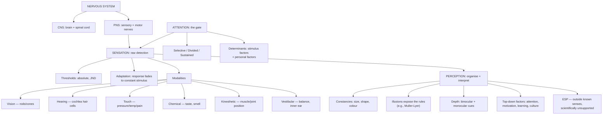

# GP1 Unit 2 — Sensation and Perception

Covers: the nervous system's basic divisions, what sensation is and how it's measured (thresholds, adaptation), each of the sense modalities, how raw sensation becomes organised perception (constancies, illusions, depth, ESP), and attention as the gateway that decides what gets processed at all.

## The Nervous System: the hardware sensation runs on

Before sensation can be discussed at all, you need the physical system that carries it. The nervous system divides into two main branches:
- **Central Nervous System (CNS)** — the brain and the spinal cord. This is the body's command centre: it receives sensory input, processes and interprets it, and issues motor commands. All conscious sensation and perception ultimately happens here.
- **Peripheral Nervous System (PNS)** — everything outside the CNS: the nerves that carry signals from sense organs *to* the CNS (sensory/afferent pathways) and from the CNS to muscles and glands (motor/efferent pathways). The PNS further splits into the somatic system (voluntary, skeletal muscle control and sensory input) and the autonomic system (involuntary control of organs, heart rate, digestion).

Sense organs (eyes, ears, skin, etc.) are the receptors that convert physical energy (light, sound waves, pressure) into neural signals — a process called **transduction** — which then travel via the PNS into the CNS to be interpreted.

## Sensation: meaning, thresholds, and adaptation

**Sensation** is the process by which sense organs detect physical energy from the environment and convert it into neural signals the brain can use. It is the raw, unprocessed input stage — before any interpretation happens.

Two measurement concepts define how sensitive a sense is:
- **Threshold** — the minimum level of stimulation needed to produce a detectable sensation.
  - **Absolute threshold**: the smallest amount of a stimulus that can be detected at all (e.g., the faintest sound you can just barely hear).
  - **Difference threshold** (just noticeable difference, JND): the smallest detectable *difference* between two stimuli (e.g., the smallest change in weight you can notice when something is added to a bag you're holding).
- **Sensory adaptation** — the gradual decrease in sensory response to a constant, unchanging stimulus over time. This is why you stop noticing a ticking clock in the room, or why a smell fades from awareness after a few minutes of continuous exposure. Adaptation exists because a nervous system that keeps firing at full strength for unchanging information would waste resources — it is far more useful to detect *change* than to endlessly report "still the same."

## The sense modalities: vision, hearing, touch, chemical, kinesthetic, vestibular

Each sense has its own receptor type and physical stimulus:

- **Vision** — receptors are rods (dim light, black-and-white, peripheral) and cones (colour, detail, central) in the retina; stimulus is light (electromagnetic wavelength).
- **Hearing (audition)** — receptors are hair cells in the cochlea of the inner ear; stimulus is sound waves, measured by frequency (pitch) and amplitude (loudness).
- **Touch and other skin senses** — the skin carries separate receptors for pressure, temperature (warmth/cold), and pain, distributed unevenly across the body (fingertips and lips are far more sensitive than the back).
- **Chemical senses** — taste (gustation, receptors: taste buds on the tongue) and smell (olfaction, receptors: olfactory receptors in the nasal cavity) both work by detecting chemical molecules directly, unlike the energy-based senses above.
- **Kinesthetic sense** — receptors in muscles, tendons, and joints that inform the brain about the position and movement of body parts, without needing to look at them (how you know your arm is bent even with your eyes closed).
- **Vestibular sense** — receptors in the inner ear (semicircular canals and vestibular sacs) that detect balance, head position, and motion, giving you your sense of equilibrium.

Kinesthetic and vestibular senses together are what let you coordinate movement and keep balance without constant visual monitoring — this is why closing your eyes doesn't make you fall over immediately, but spinning around does disrupt the vestibular signal and causes dizziness.

## Perception: meaning, constancies, illusions, and depth

**Perception** is the next stage after sensation: the brain's process of organising, interpreting, and giving meaning to raw sensory input. Sensation tells you light is hitting your retina; perception is what lets you recognise that pattern of light as "my friend's face."

- **Perceptual constancies** — the tendency to perceive objects as stable and unchanging even though the raw sensory data about them is constantly changing.
  - *Size constancy*: a person walking away still looks like they stay the same size, even though their image on your retina shrinks.
  - *Shape constancy*: a door seen at an angle is still perceived as rectangular, even though the retinal image is a trapezoid.
  - *Colour/brightness constancy*: an object's colour appears the same under different lighting conditions.
- **Illusions** — perceptions that misrepresent physical reality, produced when the brain's normal interpretive rules (like the constancies above) get tricked by an unusual stimulus arrangement. Illusions are important precisely because they reveal what "normal" rules the perceptual system is using — a mistaken perception exposes the machinery that usually works correctly. (The Practical I paper studies a specific one — the Müller-Lyer illusion — hands-on.)
- **Depth perception** — the ability to perceive the world in three dimensions and judge distance, built from cues such as *binocular cues* (requiring both eyes, like retinal disparity) and *monocular cues* (working with one eye, like relative size, overlap, and linear perspective).
- **Factors that influence perception** — perception is not purely bottom-up (driven only by the stimulus); it is shaped by attention, motivation, past experience/learning, expectation (perceptual set), context, and culture. Two people can look at the identical stimulus and perceive it differently because of these top-down factors.
- **ESP (Extrasensory Perception)** — the claimed ability to perceive information without using the known sensory channels (e.g., telepathy, clairvoyance, precognition). It is covered in the syllabus as a boundary topic: mainstream scientific psychology treats ESP claims as empirically unsupported/controversial, since they have not held up under controlled experimental testing, but the topic is included to contrast "extrasensory" claims against the normal sensory/perceptual mechanisms studied in the rest of the unit.

## Attention: the gate between sensation and perception

**Attention** is the cognitive process of selectively concentrating on one part of the environment (or one internal thought) while ignoring other information competing for processing at the same time. It matters here because sensation constantly floods the system with far more input than can be consciously processed — attention is the filter that decides what gets through to perception.

- **Types of attention**: *selective attention* (focusing on one stimulus while filtering out others, e.g., the "cocktail party effect" of following one conversation in a noisy room), *divided attention* (splitting attention across two or more tasks at once), and *sustained attention* (vigilance — maintaining focus over an extended period).
- **Determinants of attention**: factors that pull attention toward a stimulus, split into *external/stimulus factors* (intensity, size, contrast, movement, novelty, repetition) and *internal/personal factors* (interest, motivation, and the person's momentary needs or mental set).

## Concept Map

## Flashcards
Q: What is the difference between sensation and perception?
A: Sensation is the raw detection and conversion of physical energy into neural signals; perception is the brain's process of organising and interpreting that input into meaningful experience.

Q: What is transduction?
A: The conversion of physical energy (light, sound, pressure) into neural signals by sense receptors.

Q: Distinguish absolute threshold from difference threshold (JND).
A: Absolute threshold is the smallest stimulus detectable at all; difference threshold (JND) is the smallest detectable difference between two stimuli.

Q: Why does sensory adaptation happen?
A: The nervous system reduces response to a constant, unchanging stimulus because detecting change is more useful than continuously reporting the same information.

Q: What are the receptors for vision and for hearing?
A: Vision: rods and cones in the retina. Hearing: hair cells in the cochlea.

Q: What is size constancy?
A: The tendency to perceive an object as staying the same size even as its retinal image shrinks or grows with distance.

Q: Why are illusions useful to study in perception research?
A: They reveal the normal interpretive rules of perception by showing what happens when those rules are misapplied to an unusual stimulus.

Q: Name the two categories of depth perception cues.
A: Binocular cues (require both eyes, e.g., retinal disparity) and monocular cues (work with one eye, e.g., relative size, linear perspective).

Q: What is selective attention, and give its classic example.
A: Focusing on one stimulus while filtering out competing ones — the "cocktail party effect" of following one conversation in a noisy room.

Q: How does mainstream psychology regard ESP claims?
A: As empirically unsupported and controversial, since they have not held up under controlled experimental testing.
