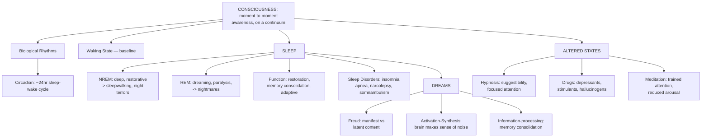

# GP1 Unit 3 — Consciousness

Covers: what consciousness means, the biological rhythms that regulate it, the waking state, the stages and functions of sleep, sleep disorders, dreams and dream theories, and the altered states produced by hypnosis, drugs, and meditation.

## Consciousness: definition and biological rhythms

**Consciousness** is defined as a person's moment-to-moment awareness of themselves, their internal states, and their environment. It is not an all-or-nothing switch — psychologists treat it as existing on a continuum, from fully alert waking awareness down through drowsiness, sleep, and unconsciousness, with "altered states" (later in this unit) sitting outside the normal waking-sleeping cycle altogether.

**Biological rhythms** are the periodic, largely internally-generated fluctuations in physiological and behavioural functioning that consciousness moves through:
- **Circadian rhythms** — roughly 24-hour cycles (the term literally means "about a day"), the most important of which is the sleep-wake cycle, regulated by the brain's internal clock (the suprachiasmatic nucleus) and synchronised by external cues like sunlight.
- Other rhythms exist on shorter (ultradian, e.g., the ~90-minute sleep-stage cycle within a night) or longer (infradian, e.g., the menstrual cycle) timescales, but the circadian sleep-wake rhythm is the one most directly explored in this unit.

## The Waking State and Sleep: stages and function

The **waking state** is ordinary conscious awareness — alert, oriented, responsive to the environment — and functions as the baseline against which every other state (drowsiness, sleep, altered states) is defined.

**Sleep** is a naturally recurring, altered state of consciousness characterised by reduced responsiveness to the environment, studied through EEG (brainwave) recordings that reveal distinct stages:
- **NREM (non-rapid eye movement) sleep**, progressing through lighter to deeper stages, where the body's physical restoration largely happens (slower brain waves, reduced heart rate and body temperature).
- **REM (rapid eye movement) sleep**, where brain activity resembles waking activity, eyes move rapidly, most vivid dreaming occurs, and the body is essentially paralysed (preventing you from acting out dreams). A full night alternates through several NREM–REM cycles.

**Function of sleep**: sleep is not simply "downtime" — theories point to restoration (repairing and restoring the body and brain), memory consolidation (REM and deep sleep help consolidate and organise what was learned during the day), and adaptive/evolutionary function (staying still and quiet at night kept ancestral humans safer, and conserved energy). All three functions are usually taught together as complementary rather than competing explanations.

## Sleep Disorders

Common sleep disorders taught in this unit include:
- **Insomnia** — persistent difficulty falling or staying asleep.
- **Sleep apnea** — repeated interruptions in breathing during sleep, causing fragmented, poor-quality sleep.
- **Narcolepsy** — sudden, uncontrollable episodes of falling asleep during waking hours, sometimes with sudden muscle weakness (cataplexy).
- **Somnambulism (sleepwalking)** and **night terrors** — both occur during deep NREM sleep (unlike nightmares, which occur during REM), which is why a sleepwalker is hard to wake and rarely remembers the episode afterward.

The NREM/REM distinction is worth carrying forward here: nightmares (vivid, remembered bad dreams) are a REM phenomenon, while night terrors and sleepwalking are deep-NREM phenomena — a frequently tested contrast.

## Dreams and Theories of Dreaming

A **dream** is a sequence of images, emotions, and thoughts experienced during sleep, most vivid and narratively organised during REM sleep. Competing theories try to explain why we dream at all:
- **Freud's psychoanalytic theory** — dreams are the disguised (symbolic) expression of unconscious wishes and unresolved conflicts; the *manifest content* (the dream as remembered) hides a deeper *latent content* (its true unconscious meaning).
- **Activation-synthesis theory** (Hobson & McCarley) — dreams are the brain's attempt to make sense of essentially random neural activity generated during REM sleep; the "story" of a dream is the cortex synthesising meaning out of noise, not a hidden message.
- **Information-processing / memory-consolidation view** — dreaming helps sort, consolidate, and integrate the day's experiences into memory, echoing the memory-consolidation function of sleep discussed above.

You don't need to pick a "correct" theory for exam purposes — you need to be able to state each one's core claim and how it differs from the others (symbolic/unconscious meaning vs. neural byproduct vs. memory processing).

## Altered States of Consciousness: hypnosis, drugs, and meditation

An **altered state of consciousness** is any mental state noticeably different from ordinary, alert waking consciousness — where awareness, perception of self and surroundings, or responsiveness is measurably changed. The syllabus covers three deliberately induced altered states:

- **Hypnosis** — a state of heightened suggestibility and focused attention, typically induced by a hypnotist's instructions, in which a person may experience altered perception, memory, or voluntary action in response to suggestion. It remains debated whether hypnosis is a genuinely distinct state of consciousness or simply a state of highly focused, compliant attention.
- **Drugs (psychoactive substances)** — chemical substances that alter consciousness by acting on the nervous system; broadly grouped into **depressants** (slow down nervous system activity, e.g., alcohol, sedatives), **stimulants** (speed up nervous system activity, e.g., caffeine, amphetamines), and **hallucinogens** (distort perception and create sensory experiences not grounded in reality, e.g., LSD). Each category produces a characteristically different altered state.
- **Meditation** — a set of practices (e.g., focused attention or open monitoring) deliberately used to train attention and awareness, typically producing a calm, focused state associated with reduced physiological arousal (lower heart rate, altered brain-wave patterns) and is studied both as a consciousness-altering technique and as a well-being intervention.

## Concept Map

## Flashcards
Q: How is consciousness defined, and is it all-or-nothing?
A: Moment-to-moment awareness of oneself and the environment; treated as existing on a continuum, not a simple on/off state.

Q: What is a circadian rhythm, and what regulates it?
A: A roughly 24-hour biological cycle (e.g., sleep-wake), regulated by the brain's internal clock (suprachiasmatic nucleus) and synchronised by light.

Q: What are the two broad categories of sleep, and how do they differ?
A: NREM (deeper, restorative, slower brain waves) and REM (brain activity resembles waking, rapid eye movement, most vivid dreaming, body paralysed).

Q: During which sleep stage do sleepwalking and night terrors occur, versus nightmares?
A: Sleepwalking and night terrors occur during deep NREM sleep; nightmares occur during REM sleep.

Q: Name three theorised functions of sleep.
A: Physical restoration, memory consolidation, and adaptive/evolutionary safety-and-energy conservation.

Q: In Freud's dream theory, what is the difference between manifest and latent content?
A: Manifest content is the dream as consciously remembered; latent content is its true underlying unconscious meaning.

Q: What does activation-synthesis theory claim about dreams?
A: Dreams are the brain's attempt to make sense of essentially random neural activity generated during REM sleep, not a hidden symbolic message.

Q: What is narcolepsy?
A: A sleep disorder involving sudden, uncontrollable episodes of falling asleep during waking hours, sometimes with sudden muscle weakness.

Q: Name the three broad categories of psychoactive drugs and how each affects the nervous system.
A: Depressants slow it down (e.g., alcohol), stimulants speed it up (e.g., caffeine), and hallucinogens distort perception (e.g., LSD).

Q: What physiological changes are typically associated with meditation?
A: Reduced physiological arousal — lower heart rate and altered brain-wave patterns — alongside a calm, focused mental state.
