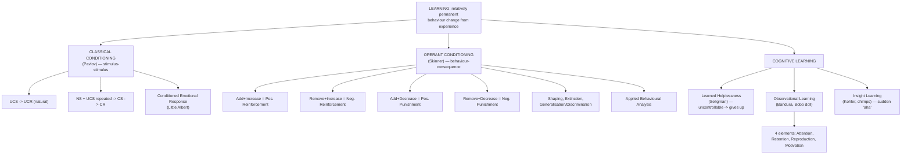

# GP1 Unit 4 — Learning

Covers: the definition of learning, classical conditioning and Pavlov's experiment, operant conditioning (reinforcement and punishment), cognitive learning theory, learned helplessness, observational learning, and insight learning — essentially the full spread from the most mechanical to the most cognitive accounts of how behaviour changes.

## Learning: definition, and the three big families of theory

**Learning** is defined as a relatively permanent change in behaviour (or behavioural potential) that occurs as a result of experience or practice — the "relatively permanent" part rules out temporary changes from fatigue or drugs, and "as a result of experience" rules out changes from maturation alone (a baby doesn't "learn" to grow taller). This unit covers four theoretical families that each explain learning differently: **classical conditioning** (learning by association between stimuli), **operant conditioning** (learning by consequences of behaviour), **cognitive learning** (learning through mental processes, expectations, and insight), and **observational learning** (learning by watching others). Keep these four buckets distinct — most exam confusion comes from mixing up classical and operant conditioning specifically.

## Classical Conditioning: elements and Pavlov's experiment

**Classical conditioning** is a type of learning in which a neutral stimulus comes to trigger a response after being repeatedly paired with a stimulus that already triggers that response naturally. It was discovered and formalised by **Ivan Pavlov**, whose experiment is the canonical example: Pavlov noticed dogs salivating not just to food but to cues that predicted food (like the presence of the lab assistant), and formally tested this by pairing a bell with food delivery.

The **elements** of classical conditioning, using Pavlov's experiment as the running example:
- **Unconditioned Stimulus (UCS)**: a stimulus that naturally and automatically triggers a response without any learning — food.
- **Unconditioned Response (UCR)**: the automatic, unlearned response to the UCS — salivation to food.
- **Neutral Stimulus (NS)**: a stimulus that initially produces no relevant response — the bell, before any pairing.
- **Conditioned Stimulus (CS)**: what the neutral stimulus becomes once it has been repeatedly paired with the UCS and can now trigger the response on its own — the bell, after conditioning.
- **Conditioned Response (CR)**: the learned response to the CS, essentially the same response as the UCR but now triggered by a stimulus that only *predicts* the original one — salivation to the bell alone.

The general procedure: pair NS + UCS repeatedly (bell + food → salivation) until the NS alone (now the CS) can produce the response (bell alone → salivation).

**Conditioned emotional response (CER)** is the specific application of classical conditioning to emotions — an emotional reaction (commonly fear) becomes attached to a previously neutral stimulus through pairing, the classic demonstration being Watson's "Little Albert" study, where a neutral white rat was paired with a loud frightening noise until the rat alone triggered a fear response. This shows classical conditioning is not just about reflexes like salivation, but can shape emotional life too, which is directly relevant to how phobias are understood to develop.

## Operant Conditioning: reinforcement, punishment, and basic concepts

**Operant conditioning** is learning in which the *consequences* that follow a behaviour determine whether that behaviour becomes more or less likely to occur again — the organism "operates" on its environment and learns from the results, in contrast to classical conditioning's passive association between two stimuli. This framework was developed principally by **B.F. Skinner**, building on Thorndike's earlier Law of Effect (responses followed by satisfying consequences are more likely to recur).

The core building block is the **consequence matrix** — always cross two dimensions: whether something is *added or removed*, and whether the goal is to *increase or decrease* the behaviour:

| | Increases behaviour | Decreases behaviour |
|---|---|---|
| **Add something** | Positive Reinforcement (add a pleasant stimulus, e.g., praise for studying) | Positive Punishment (add an unpleasant stimulus, e.g., scolding for misbehaviour) |
| **Remove something** | Negative Reinforcement (remove an unpleasant stimulus, e.g., turning off a loud alarm by getting out of bed) | Negative Punishment (remove a pleasant stimulus, e.g., taking away screen time) |

The single most common error here: "negative" does **not** mean "bad" or "punishing" — it means something is *removed*. Negative reinforcement still increases behaviour (it is a form of reinforcement), it just does so by taking away something unpleasant rather than adding something pleasant.

**Basic concepts** that refine this framework:
- **Schedules of reinforcement** — reinforcement can be continuous (every correct response reinforced) or partial/intermittent, delivered on fixed or variable *ratio* (based on number of responses) or *interval* (based on time) schedules; variable-ratio schedules (like gambling) produce the most persistent behaviour.
- **Shaping** — reinforcing successive approximations toward a final desired behaviour, used to teach complex behaviours that wouldn't otherwise occur spontaneously.
- **Extinction** — the gradual weakening and disappearance of a learned response when reinforcement is withheld.
- **Generalisation and discrimination** — responding similarly to stimuli resembling the original (generalisation) versus learning to respond only to the specific original stimulus and not to similar ones (discrimination).

**Applied Behavioural Analysis (ABA)** is the practical, applied extension of operant principles: systematically using reinforcement, shaping, and related techniques to build up desired behaviours and reduce problem behaviours, widely used in areas like autism intervention and classroom management.

## Cognitive Learning Theory: beyond stimulus and response

**Cognitive learning theory** argues that learning involves internal mental processes — expectations, mental representations, and understanding — not just observable stimulus-response links, pushing back against a purely behaviourist account.

- **Learned helplessness** (Martin Seligman) — when an organism repeatedly experiences an uncontrollable negative event, it eventually stops trying to escape or avoid it even when escape later becomes possible, because it has *learned* (cognitively) that its responses don't affect outcomes. This is a cognitive phenomenon precisely because it is about an expectation ("nothing I do matters") rather than a direct stimulus-response bond, and it has become an important model for understanding human depression.
- **Observational learning** (Albert Bandura's social learning theory) — learning by watching a model perform a behaviour and observing its consequences, without needing to perform the behaviour oneself or receive direct reinforcement (demonstrated in Bandura's Bobo doll experiments, where children imitated aggressive behaviour they had merely watched). Bandura specified **four elements** required for observational learning to occur:
  1. **Attention** — the learner must actually notice and attend to the model's behaviour.
  2. **Retention** — the learner must remember what was observed.
  3. **Reproduction (motor reproduction)** — the learner must be physically/mentally capable of reproducing the behaviour.
  4. **Motivation** — the learner must have a reason or incentive to actually perform the behaviour (this is where vicarious reinforcement/punishment — seeing the model rewarded or punished — plays in).
- **Insight learning** (Wolfgang Köhler, studied with chimpanzees) — a sudden reorganisation of a problem in the mind, producing a solution abruptly ("aha!") rather than through gradual trial and error; Köhler's chimps suddenly realised they could stack boxes or join sticks to reach food, without ever practising that exact solution before. Insight learning is the clearest example of the cognitive, "mental restructuring" side of learning, standing in the sharpest possible contrast to the gradual, trial-based shaping of operant conditioning.

## Concept Map

## Flashcards
Q: Define learning.
A: A relatively permanent change in behaviour or behavioural potential resulting from experience or practice.

Q: In Pavlov's experiment, identify the UCS, UCR, CS, and CR.
A: UCS = food, UCR = salivation to food, CS = bell (after pairing), CR = salivation to the bell alone.

Q: What is a conditioned emotional response, and which classic study demonstrated it?
A: An emotional reaction (often fear) attached to a previously neutral stimulus through classical conditioning; demonstrated by Watson's "Little Albert" study.

Q: Does negative reinforcement increase or decrease behaviour, and how?
A: It increases behaviour, by removing an unpleasant stimulus when the behaviour occurs.

Q: Distinguish positive punishment from negative punishment.
A: Positive punishment adds an unpleasant stimulus to decrease behaviour; negative punishment removes a pleasant stimulus to decrease behaviour.

Q: What is shaping in operant conditioning?
A: Reinforcing successive approximations toward a final desired behaviour.

Q: What is learned helplessness, and who proposed it?
A: The tendency to stop trying to escape an aversive situation after repeated exposure to uncontrollable negative events, even when escape becomes possible; proposed by Martin Seligman.

Q: Name Bandura's four elements required for observational learning.
A: Attention, retention, reproduction (motor reproduction), and motivation.

Q: What did Bandura's Bobo doll experiment demonstrate?
A: That children can learn aggressive behaviour simply by observing a model perform it, without direct reinforcement themselves.

Q: What is insight learning, and how does it differ from gradual trial-and-error learning?
A: A sudden mental reorganisation of a problem that produces an abrupt solution, rather than a solution reached gradually through repeated trial and error; demonstrated by Kohler's chimpanzees.
