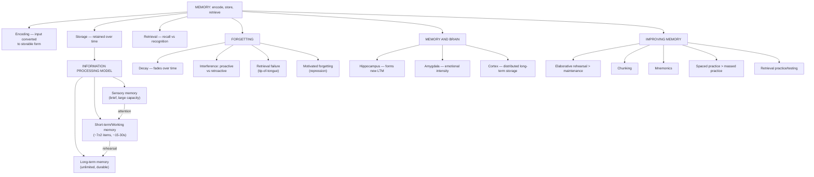

# GP1 Unit 5 — Memory and Forgetting

Covers: the definition of memory and its three processes (encoding, storage, retrieval), the information-processing model of memory with its three stores, why forgetting happens, the memory-brain relationship, and practical ways to improve memory.

## Memory: definition and the three processes

**Memory** is the mental system for encoding, storing, and retrieving information over time — the capacity to keep past experience available for present use. That definition already contains the three processes that structure the whole unit, and every memory failure can be traced to a breakdown in one of them:

- **Encoding** — converting incoming sensory information into a form the memory system can use and store (e.g., converting the sound of a spoken word into a meaningful, storable representation). Poor encoding (not really paying attention in the first place) is one of the most common reasons people believe they have "forgotten" something they never actually stored.
- **Storage** — retaining encoded information over time, in one of the memory system's stores (see the model below).
- **Retrieval** — pulling stored information back out when needed, either through *recall* (retrieving information with no strong external cues, e.g., an essay question) or *recognition* (identifying information when it's presented, e.g., a multiple-choice question) — recognition is reliably easier than recall because the cues do more of the retrieval work for you.

## The Information Processing Model of memory: three stores

The dominant model of memory (Atkinson & Shiffrin's multi-store model) treats memory as information flowing through three distinct stores, each with a different capacity and duration:

| Store | Duration | Capacity | Role |
|---|---|---|---|
| **Sensory memory** | Very brief (a fraction of a second to a few seconds) | Large, holds a near-complete snapshot of sensory input | Holds raw sensory impressions just long enough for attention to select what matters |
| **Short-term memory (STM)** | Roughly 15-30 seconds without rehearsal | Limited (classically "seven plus or minus two" items) | Active, temporary workspace for information currently in use |
| **Long-term memory (LTM)** | Potentially permanent | Effectively unlimited | Relatively stable storage for information over the long run |

The flow is sequential: sensory memory feeds selected information into STM (via attention), and STM feeds information into LTM (via rehearsal, elaboration, or meaningful processing) — this is precisely why superficial exposure (barely attending, no rehearsal) rarely makes it past STM into lasting learning, which is the whole rationale behind the "improving memory" techniques below.

Short-term memory is often further described functionally as **working memory** — not just a passive holding bin but an active workspace where information is manipulated (e.g., doing mental arithmetic, holding a phone number in mind while dialling).

## Forgetting: causes

**Forgetting** is the inability to retrieve previously stored information. Several theories explain why it happens, and they are not mutually exclusive — different forgetting episodes can be explained by different mechanisms:

- **Decay theory** — memory traces simply fade with the mere passage of time if not used or reactivated, particularly relevant to sensory and short-term memory.
- **Interference theory** — forgetting happens because other information competes with or disrupts the memory, not because it faded on its own. Two directions:
  - *Proactive interference*: older information disrupts recall of newer information (e.g., an old phone number keeps intruding when you try to recall your new one).
  - *Retroactive interference*: newer information disrupts recall of older information (e.g., learning a new password makes an old one harder to recall).
- **Retrieval failure** — the information is actually still stored, but the right retrieval cues aren't available at the moment (the classic "tip-of-the-tongue" experience), which is why the same forgotten fact can suddenly come back the moment a good cue appears.
- **Motivated forgetting** — an emotionally driven kind of forgetting where distressing or threatening memories are actively (often unconsciously) suppressed or repressed, a concept with roots in Freud's psychoanalytic theory.

## Memory and the Brain

Memory is not stored in one single location; different brain structures support different aspects of memory:
- The **hippocampus** plays a central role in forming new long-term memories, particularly explicit/declarative memories (facts and events) — damage here characteristically produces an inability to form *new* long-term memories while older memories and other cognitive functions remain intact.
- The **amygdala** is closely tied to the emotional intensity of memories, which is why emotionally charged events are typically remembered more vividly and durably than neutral ones.
- The **cerebral cortex** (various regions) stores long-term memories in a distributed way once they are consolidated, and different cortical regions support different types of memory content (e.g., visual vs. verbal information).
- **Neural/synaptic level**: memory formation is linked to changes in the strength of connections between neurons (synaptic changes), meaning memory is fundamentally a biological, not just abstract, process — learning something new is, at the physical level, changing your brain's wiring.

## Improving Memory

Because encoding quality and rehearsal quality drive what actually reaches long-term memory, most memory-improvement techniques work by strengthening one of these two steps:
- **Elaborative rehearsal** — connecting new information to existing knowledge or meaning (rather than mindless repetition), which produces far deeper, more durable encoding than *maintenance rehearsal* (simply repeating information over and over).
- **Chunking** — grouping individual pieces of information into larger, meaningful units to work around short-term memory's limited capacity (e.g., remembering a phone number as three chunks rather than ten separate digits).
- **Mnemonic devices** — memory aids that impose structure or imagery on to-be-remembered material (acronyms, the method of loci/memory palace, rhymes) to make retrieval easier.
- **Spaced/distributed practice** — spreading study across multiple sessions over time, which produces far better long-term retention than **massed practice** (cramming everything into one session) — directly relevant to how this very study-planner app schedules recall.
- **Retrieval practice/testing** — actively practising recall (e.g., flashcards, self-testing) strengthens memory more effectively than passive re-reading, because it exercises the retrieval process itself rather than just re-exposing the encoding process.

## Concept Map

## Flashcards
Q: What are the three processes involved in memory?
A: Encoding, storage, and retrieval.

Q: Distinguish recall from recognition, and which is generally easier?
A: Recall retrieves information with minimal cues (e.g., essay questions); recognition identifies information when presented (e.g., multiple choice). Recognition is generally easier.

Q: Name the three stores in the information processing (multi-store) model of memory.
A: Sensory memory, short-term memory (working memory), and long-term memory.

Q: What is the classic capacity limit of short-term memory?
A: Seven plus or minus two items ("the magical number seven").

Q: Distinguish proactive interference from retroactive interference.
A: Proactive interference is old information disrupting recall of new information; retroactive interference is new information disrupting recall of old information.

Q: What is retrieval failure, and what everyday experience illustrates it?
A: Information is stored but the right cue is unavailable at the moment; illustrated by the "tip-of-the-tongue" phenomenon.

Q: Which brain structure is critical for forming new long-term memories, and what happens when it is damaged?
A: The hippocampus; damage typically produces an inability to form new long-term memories while older memories remain intact.

Q: Why are emotionally charged memories typically remembered more vividly?
A: The amygdala's involvement in emotional processing strengthens the encoding and durability of emotionally intense memories.

Q: What is the difference between elaborative rehearsal and maintenance rehearsal?
A: Elaborative rehearsal connects new information to existing meaning/knowledge and produces deeper encoding; maintenance rehearsal is mindless repetition and produces weaker, shorter-lived encoding.

Q: Why does spaced practice produce better long-term retention than massed practice (cramming)?
A: Spreading study across multiple sessions over time strengthens encoding and consolidation more effectively than concentrating all study into one session.
