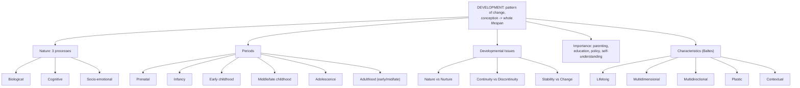

# LSD1 Unit 1 — Introduction to Lifespan Development

Covers: the concept and nature of development, the periods it's divided into, the recurring issues/debates in the field, why the subject matters, and the defining characteristics of a lifespan approach.

## Concept of Development: definition

**Development** is defined as the pattern of change in human capabilities that begins at conception and continues through the entire life span. Two things in that definition matter: development is a *pattern* (organised, not random), and it runs the *entire* lifespan — not just childhood, which is the whole point of a "life span" course as opposed to a purely "child psychology" course. Development includes both growth (adding capacities) and decline (losing capacities, e.g., in late adulthood), so it is broader than just "growing up."

## Nature of Development: three processes

Development is conventionally analysed through three interacting processes, and almost every topic in this paper can be sorted into one of these three buckets:

- **Biological processes** — changes in the physical body: brain development, height and weight gain, hormonal changes, motor skills, puberty, aging. Prenatal development and physical growth in infancy (Units II and III) are mostly biological-process topics.
- **Cognitive processes** — changes in thought, intelligence, language, and problem-solving. Piaget's stages (covered later in this unit and expanded across the paper) are the anchor theory here.
- **Socio-emotional processes** — changes in relationships, emotions, personality, and social context (family, peers, culture). Unit V (Socio-Emotional Development) is built entirely around this process.

Crucially, these three processes are not separate tracks running in parallel — they are **interwoven**. A biological change (like the physical maturity of puberty) triggers cognitive changes (new abstract reasoning capacities) and socio-emotional changes (new peer relationships, identity concerns) all at once. Any real developmental event usually involves all three at the same time.

## Periods of Development

Lifespan development is conventionally divided into periods, each defined by a characteristic set of biological, cognitive, and socio-emotional features:
- **Prenatal period** (conception to birth)
- **Infancy** (birth to roughly 18–24 months)
- **Early childhood** (roughly 2–5/6 years, the preschool years)
- **Middle and late childhood** (roughly 6–11 years, the elementary school years)
- **Adolescence** (roughly 10–12 through late teens)
- **Early adulthood, middle adulthood, and late adulthood** (the adult periods, beyond the scope of Semester I's units but part of the full concept of "lifespan")

This semester's syllabus covers prenatal development through middle/late childhood in detail (Units II–V); the adult periods are conceptually part of "lifespan development" as a discipline even though they aren't the focus of this particular course.

## Developmental Issues (the recurring debates)

Certain questions recur across every period and every theory in this field — they are the "debates" that any developmental theory has to take a position on:
- **Nature vs. Nurture** — how much of development is due to biological/genetic inheritance ("nature") versus environmental experience ("nurture")? Modern developmental psychology generally treats this as an interaction rather than an either/or.
- **Continuity vs. Discontinuity** — is development a smooth, gradual, continuous process (like a plant growing), or does it proceed through distinct qualitative stages with abrupt jumps (like a caterpillar becoming a butterfly)? Stage theories (Piaget, Erikson) take the discontinuity side; other approaches favour continuous, incremental change.
- **Stability vs. Change** — do early traits and characteristics remain stable throughout life, or can people change substantially as they develop? Again, most modern positions land somewhere in between rather than at either extreme.

These three debates are worth memorising as a set because a common exam-style question simply asks you to state and briefly explain "the issues in development."

## Importance of Studying Lifespan Development

Studying lifespan development matters practically and professionally: it helps in understanding what to expect at each life stage (parenting, teaching, healthcare), identifying when development is atypical or delayed (early intervention), designing age-appropriate policies and institutions (schools, workplaces, eldercare), and understanding oneself and others across the full arc of life rather than just childhood.

## Characteristics of the Lifespan Development Approach

The lifespan perspective (most associated with Paul Baltes) treats development as:
- **Lifelong** — development happens across the entire life span; no single period (like childhood) dominates or determines all the rest.
- **Multidimensional** — development involves biological, cognitive, and socio-emotional dimensions simultaneously (echoing the "nature of development" section above).
- **Multidirectional** — development is not simply "onward and upward"; some dimensions expand while others shrink at the same point in life (e.g., certain forms of intelligence keep growing in adulthood while raw processing speed declines).
- **Plastic (plasticity)** — capacities are not fixed; skills can be trained and improved at many points across the lifespan, though the degree of plasticity varies by domain and age.
- **Contextual** — development always occurs embedded within physical and social contexts (family, culture, historical period, socioeconomic conditions) that shape its course.

## Concept Map

## Flashcards
Q: Define development as used in lifespan development psychology.
A: The pattern of change in human capabilities that begins at conception and continues through the entire life span.

Q: Name the three processes of development.
A: Biological, cognitive, and socio-emotional processes.

Q: Why are the three processes of development described as "interwoven" rather than separate tracks?
A: Because a single developmental event (e.g., puberty) typically produces biological, cognitive, and socio-emotional changes simultaneously.

Q: List the periods of development covered from prenatal through middle/late childhood.
A: Prenatal period, infancy, early childhood, and middle/late childhood.

Q: What are the three classic developmental issues/debates?
A: Nature vs. nurture, continuity vs. discontinuity, and stability vs. change.

Q: What position does modern developmental psychology generally take on nature vs. nurture?
A: That development results from an interaction between nature and nurture, not one factor alone.

Q: Who is most associated with the lifespan perspective, and name its five characteristics.
A: Paul Baltes; lifelong, multidimensional, multidirectional, plastic, and contextual.

Q: What does "multidirectional" mean in the lifespan perspective?
A: Development is not uniformly onward and upward — some dimensions can grow while others decline at the same life stage.

Q: What does "plasticity" mean in development?
A: Capacities are not fixed; skills can be trained and improved at many points across the lifespan, though the degree varies by domain and age.

Q: Give one practical reason why studying lifespan development matters.
A: It helps identify when development is atypical or delayed, enabling early intervention (among other practical uses like parenting, teaching, and policy design).
