# LSD1 Unit 2 — Theories of Development and Prenatal Period

Covers: Erikson's psychosocial theory, Piaget's cognitive developmental theory, the genetic foundations of development (genes and chromosomes), and the full arc of the prenatal period from conception through the hazards that can disrupt it.

## Erikson's Psychosocial Theory

**Erik Erikson** proposed that development proceeds through **eight psychosocial stages** across the entire lifespan, each defined by a specific conflict/crisis that must be resolved, with the outcome shaping personality going forward. Unlike Freud (whose stages centre on psychosexual conflict), Erikson's stages centre on the person's evolving relationship with their social world — hence "psychosocial."

| Stage (approx. age) | Crisis | Positive resolution |
|---|---|---|
| Infancy (0-1) | Trust vs. Mistrust | Trust in caregivers and the world |
| Toddlerhood (1-3) | Autonomy vs. Shame/Doubt | Sense of independence |
| Early childhood (3-6) | Initiative vs. Guilt | Purposeful, self-directed activity |
| Middle/late childhood (6-12) | Industry vs. Inferiority | Competence through mastering skills |
| Adolescence (12-18) | Identity vs. Role Confusion | A coherent sense of self |
| Young adulthood | Intimacy vs. Isolation | Capacity for close relationships |
| Middle adulthood | Generativity vs. Stagnation | Contributing to the next generation |
| Late adulthood | Integrity vs. Despair | Sense of a life well-lived |

For this semester's coverage (infancy through middle/late childhood), the first four stages are the most directly relevant, since they map onto the same age periods covered in Units III–V of this paper — worth actively cross-referencing as you study those units.

## Piaget's Cognitive Developmental Theory

**Jean Piaget** proposed that children actively construct their understanding of the world through a fixed sequence of **four cognitive stages**, each qualitatively different from the last (this is a discontinuity/stage theory, in the terms introduced in Unit I):

1. **Sensorimotor stage** (birth–2 years) — infants understand the world through sensory experiences and physical/motor actions; the key achievement is **object permanence** (understanding that objects continue to exist even when out of sight).
2. **Preoperational stage** (2–7 years) — children begin using symbols and language but reasoning is intuitive rather than logical; marked by **egocentrism** (difficulty taking another's perspective) and lack of **conservation** (not yet understanding that quantity stays the same despite changes in appearance, e.g., pouring liquid into a taller, thinner glass).
3. **Concrete operational stage** (7–11 years) — children can perform logical operations on concrete, physical things, and master conservation; this is the stage directly discussed in Unit IV's coverage of middle/late childhood cognition.
4. **Formal operational stage** (11+ years) — abstract, hypothetical, and systematic reasoning becomes possible.

Piaget's central mechanisms for *how* movement between stages happens are **assimilation** (fitting new information into existing mental structures/schemas) and **accommodation** (changing existing schemas to fit new information that doesn't fit) — together producing cognitive growth through a constant push-and-pull with the environment.

## Genetic Foundations of Development: Genes and Chromosomes

Before development can even begin, the genetic material that will guide it must be assembled:
- **Chromosomes** are thread-like structures made of DNA found in the nucleus of every cell; humans normally have **46 chromosomes arranged in 23 pairs**, with one member of each pair inherited from each parent.
- **Genes** are the specific segments of DNA on a chromosome that carry the hereditary instructions for particular traits.
- At conception, a sperm cell and an egg cell (each carrying 23 chromosomes, having gone through **meiosis**, cell division that halves the chromosome number) combine to form a **zygote** with the full 46 chromosomes — this is the genetic starting point for the entire prenatal period discussed next.
- The 23rd pair determines biological sex (XX typically female, XY typically male), and mutations or errors during this genetic assembly stage underlie many prenatal hazards and genetic disorders.

## Prenatal Period: meaning and the three stages of Prenatal Development

The **prenatal period** is defined as the time from conception to birth, roughly 38 weeks (9 months) in humans, during which a single fertilised cell develops into a fully formed newborn — the single most rapid period of physical development across the entire lifespan.

**The course of prenatal development** unfolds through three sequential stages:
1. **Germinal stage** (conception to ~2 weeks) — the zygote undergoes rapid cell division, travels down the fallopian tube, and implants in the uterine wall.
2. **Embryonic stage** (~2–8 weeks) — now called an embryo; this is the period of most critical organ and structural formation (heart, neural tube, limb buds), making it the period of greatest vulnerability to hazards, since organs are actively being formed.
3. **Fetal stage** (~8 weeks to birth) — now called a fetus; existing structures grow, mature, and become functional (organs refine, movement begins, the fetus becomes capable of surviving outside the womb as the stage progresses toward term).

## Prenatal Care and Hazards to Prenatal Development

**Prenatal care** — regular medical monitoring and support for the mother through pregnancy — matters precisely because the embryonic and early fetal stages are so vulnerable; adequate nutrition, avoidance of harmful substances, and monitoring for complications during this window substantially affect developmental outcomes.

**Hazards to prenatal development** are commonly grouped as:
- **Teratogens** — any external agent that can cause abnormal prenatal development: drugs (including alcohol, which can cause Fetal Alcohol Spectrum Disorders), tobacco, certain maternal illnesses/infections, environmental pollutants, and radiation exposure.
- **Maternal factors** — maternal age (both very young and older maternal age carry elevated risk), maternal nutrition (deficiencies affecting fetal growth), maternal emotional states/stress, and maternal diseases (e.g., rubella, diabetes) that can cross-affect the developing fetus.
- **Genetic/chromosomal hazards** — errors arising from the genetic foundations covered above (e.g., chromosomal abnormalities), which can produce developmental conditions independent of the environment.

The critical-period principle ties this whole section together: because the embryonic stage is when organs are actively forming, exposure to a hazard during that narrow early window can have a far more severe effect than the same exposure later in the fetal stage, when structures are already formed and simply maturing.

## Concept Map

```mermaid
graph TD
    TH["THEORIES OF DEVELOPMENT"] --> ER["Erikson: 8 PSYCHOSOCIAL<br/>stages, crisis-based"]
    ER --> E1["Trust vs Mistrust (infancy)"]
    ER --> E2["Autonomy vs Shame (toddler)"]
    ER --> E3["Initiative vs Guilt (early child)"]
    ER --> E4["Industry vs Inferiority (mid/late child)"]
    TH --> PI["Piaget: 4 COGNITIVE stages"]
    PI --> P1["Sensorimotor — object permanence"]
    PI --> P2["Preoperational — egocentrism,<br/>no conservation"]
    PI --> P3["Concrete operational — conservation"]
    PI --> P4["Formal operational — abstract reasoning"]
    PI --> MECH["Assimilation + Accommodation"]
    GF["GENETIC FOUNDATIONS"] --> CH["46 chromosomes, 23 pairs"]
    GF --> GN["Genes carry hereditary instructions"]
    GF --> ZY["Sperm + Egg -> Zygote"]
    PP["PRENATAL PERIOD: conception -> birth"] --> S1["Germinal (0-2wk)"]
    PP --> S2["Embryonic (2-8wk)<br/>-- organs form, MOST vulnerable"]
    PP --> S3["Fetal (8wk-birth)<br/>-- growth + maturation"]
    PP --> PC["Prenatal Care"]
    PP --> HZ["Hazards: teratogens,<br/>maternal factors, genetic errors"]
    GF --> PP
```

## Flashcards
Q: What determines whether Erikson's stages are resolved positively or not?
A: How the person navigates the specific psychosocial crisis/conflict of that stage (e.g., trust vs. mistrust in infancy).

Q: Name Piaget's four cognitive stages in order.
A: Sensorimotor, preoperational, concrete operational, formal operational.

Q: What is object permanence, and in which Piagetian stage is it achieved?
A: Understanding that objects continue to exist even when out of sight; achieved in the sensorimotor stage.

Q: What is conservation, and in which stage is it achieved?
A: Understanding that quantity remains the same despite changes in appearance (e.g., shape of a container); achieved in the concrete operational stage.

Q: Distinguish assimilation from accommodation in Piaget's theory.
A: Assimilation fits new information into existing schemas; accommodation changes existing schemas to fit new information that doesn't fit.

Q: How many chromosomes do humans normally have, and how are they arranged?
A: 46 chromosomes, arranged in 23 pairs, one member of each pair from each parent.

Q: Name the three stages of prenatal development in order.
A: Germinal stage, embryonic stage, fetal stage.

Q: Which prenatal stage is considered most vulnerable to hazards, and why?
A: The embryonic stage, because major organs and structures are actively being formed during this period.

Q: What is a teratogen?
A: Any external agent (e.g., drugs, alcohol, maternal illness, radiation) that can cause abnormal prenatal development.

Q: Why does the timing of exposure to a hazard matter so much during pregnancy?
A: Because of the critical-period principle — exposure during the embryonic stage (when organs are forming) can cause far more severe damage than the same exposure during the later fetal stage.
