# LSD1 Unit 3 — Infancy and Its Development

Covers: birth itself and how the newborn is assessed, the postpartum period for the mother, infancy's physical growth patterns, motor development, and the sensory development of vision, hearing, touch/pain, smell, and taste.

## Introduction: Stages of Birth and Assessing the Newborn

Birth unfolds through recognised **stages**: the first stage (onset of regular uterine contractions and cervical dilation), the second stage (the baby moving through the birth canal and being born), and the third stage (delivery of the placenta). Complications can occur at any stage, which is why newborns are assessed immediately.

**Assessing the newborn** is done through standardised measures immediately after birth, most notably the **Apgar Scale**, administered at 1 and 5 minutes after birth, scoring the newborn on five signs (Appearance/skin colour, Pulse/heart rate, Grimace/reflex irritability, Activity/muscle tone, Respiration) each on a 0–2 scale, giving a quick, standardised snapshot of the newborn's immediate physical condition and need for medical attention.

## The Postpartum Period

The **postpartum period** is the time following childbirth during which the mother's body (and psychological state) returns toward its pre-pregnancy condition — typically considered to last around six weeks, though psychological adjustment can extend well beyond that.

- **Physical development (postpartum)** — the uterus contracts back to its pre-pregnancy size, hormone levels shift dramatically (a sharp drop in the pregnancy hormones estrogen and progesterone), and the body recovers from the physical demands of labour.
- **Emotional and psychological adjustment** — the hormonal shift, combined with the demands of caring for a newborn and disrupted sleep, commonly produces a period of emotional vulnerability. This ranges from the very common, mild, and short-lived "baby blues" to the more serious and clinically significant **postpartum depression**, which needs professional attention when it persists.
- **Bonding** — the process of forming a close emotional connection between parent(s) and newborn, considered important for the child's subsequent socio-emotional development (this directly sets up the "attachment" material in Unit V).

## Infancy: Patterns of Physical Growth

Infancy shows the fastest rate of physical growth of any post-natal period:
- **Height and weight** — infants typically gain weight rapidly and roughly double their birth weight by around 4–5 months and triple it by the first birthday; height increases substantially in the first year as well, then the growth rate slows in the following years.
- **Brain development** — the brain grows dramatically in infancy, both in size and through the proliferation of neural connections (synapses); experience during this period actively shapes which neural connections are retained and strengthened (a process sometimes summarised as "use it or lose it" at the level of synaptic pruning).
- **Nutrition and malnutrition** — adequate nutrition (breast milk or formula, then appropriate solid foods) is critical to support this rapid physical and brain growth; malnutrition during infancy can produce lasting deficits in physical growth and cognitive development precisely because this window of growth is so rapid and foundational.

## Motor Development: reflexes and skills

**Reflexes** are the newborn's built-in, automatic motor responses to specific stimuli, present from birth without any learning required — examples include the *rooting reflex* (turning the head toward a touch on the cheek, to find a nipple), the *sucking reflex*, the *grasping (palmar) reflex*, and the *Moro (startle) reflex*. These reflexes are important both functionally (survival, feeding) and diagnostically (their presence and disappearance on schedule is used to check neurological health).

As development proceeds, voluntary motor skills replace and build on these reflexes, developing along two tracks:
- **Gross motor skills** — movements of large muscle groups: controlling the head, rolling over, sitting, crawling, standing, and eventually walking, developing in a broadly predictable sequence across the first year or so.
- **Fine motor skills** — small, precise movements, especially of the hands and fingers: reaching, grasping objects, and eventually the pincer grasp (thumb and forefinger), which develops later than the whole-hand grasp and enables much more precise manipulation.

## Sensory Development in Infancy

Contrary to older assumptions that newborns are essentially blank sensory slates, infants arrive with functioning (if still-maturing) senses that develop rapidly across infancy:
- **Visual development** — vision is the least mature sense at birth (newborn visual acuity is quite poor compared to later infancy), but it improves rapidly over the first months; infants show an early preference for faces and high-contrast patterns, and depth perception (studied classically with the "visual cliff" apparatus) develops as infants gain mobility.
- **Hearing** — hearing is relatively well developed even before birth (fetuses respond to sound in the womb) and is quite functional at birth; newborns show a preference for their mother's voice and can discriminate speech sounds from very early on, which underlies later language development.
- **Touch and pain** — the sense of touch is present and functional from birth (indeed, touch/pressure receptors develop very early prenatally) and is central to bonding (skin-to-skin contact) and self-soothing; pain sensitivity is also present at birth, contrary to older medical assumptions that once led to under-treatment of infant pain.
- **Smell** — the olfactory sense is well developed at birth; newborns can distinguish and show a preference for the scent of their own mother (e.g., recognising the mother's breast milk scent among others).
- **Taste** — taste preferences are present from birth or even prenatally; newborns show an innate preference for sweet tastes and an aversion to bitter/sour tastes, a pattern with a plausible survival rationale (sweetness signals safe, energy-rich food).

## Concept Map

```mermaid
graph TD
    IN["INTRODUCTION"] --> BS["Stages of Birth:<br/>contractions -> delivery -> placenta"]
    IN --> AN["Assessing Newborn:<br/>APGAR at 1 & 5 min"]
    PP["POSTPARTUM PERIOD"] --> PD["Physical: uterus contracts,<br/>hormones shift"]
    PP --> EA["Emotional: baby blues -><br/>postpartum depression"]
    PP --> BD["Bonding"]
    PG["PHYSICAL GROWTH"] --> HW["Height & Weight —<br/>doubles by 4-5mo"]
    PG --> BR["Brain — rapid synapse growth"]
    PG --> NU["Nutrition & Malnutrition"]
    MD["MOTOR DEVELOPMENT"] --> RF["Reflexes: rooting, sucking,<br/>grasping, Moro"]
    MD --> GM["Gross motor: sit, crawl, walk"]
    MD --> FM["Fine motor: reach, grasp,<br/>pincer grasp"]
    SD["SENSORY DEVELOPMENT"] --> VI["Vision — least mature at birth,<br/>improves fast"]
    SD --> HE["Hearing — well developed<br/>even prenatally"]
    SD --> TO["Touch & Pain — functional<br/>from birth"]
    SD --> SM["Smell — recognises mother's scent"]
    SD --> TA["Taste — prefers sweet"]
```

## Flashcards
Q: What is the Apgar Scale used for, and when is it administered?
A: A standardised assessment of a newborn's immediate physical condition, scored on five signs at 1 and 5 minutes after birth.

Q: What five signs does the Apgar Scale score?
A: Appearance (skin colour), Pulse (heart rate), Grimace (reflex irritability), Activity (muscle tone), and Respiration.

Q: What is the postpartum period, and roughly how long does the physical component last?
A: The period after childbirth during which the mother's body returns toward its pre-pregnancy state; typically around six weeks physically, though psychological adjustment can take longer.

Q: Distinguish "baby blues" from postpartum depression.
A: Baby blues are common, mild, and short-lived emotional lows after birth; postpartum depression is more serious, persistent, and clinically significant, requiring professional attention.

Q: By roughly what age does an infant typically double its birth weight?
A: Around 4 to 5 months.

Q: Name four newborn reflexes.
A: Rooting, sucking, grasping (palmar), and Moro (startle) reflexes.

Q: Distinguish gross motor skills from fine motor skills, with an example of each.
A: Gross motor skills involve large muscle movements (e.g., crawling, walking); fine motor skills involve small, precise movements (e.g., the pincer grasp).

Q: Which infant sense is least mature at birth, and which is relatively well developed even before birth?
A: Vision is least mature at birth; hearing is relatively well developed even prenatally.

Q: What taste preference do newborns show from birth?
A: A preference for sweet tastes and an aversion to bitter or sour tastes.

Q: What can newborns recognise using their sense of smell?
A: The scent of their own mother, including the specific scent of her breast milk.
