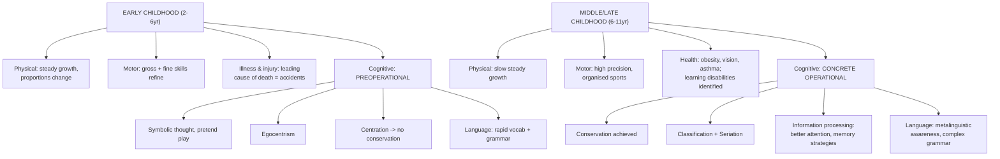

# LSD1 Unit 4 — Physical, Motor and Cognitive Development

Covers: early childhood's physical/motor development and its health challenges, middle/late childhood's parallel physical/motor development including children with disabilities, and the cognitive development of both periods through Piaget's theory, information processing, and language.

## Early Childhood: Physical and Motor Development

**Early childhood** (roughly ages 2–6) is characterised by a slower, steadier rate of physical growth compared to infancy's dramatic pace, but with major gains in coordination and control:
- **Body growth and change** — height and weight increase steadily (rather than the rapid infancy pace); body proportions change, with the head becoming proportionally smaller relative to the body compared to infancy, and the "baby fat" of infancy gradually reduces as muscle develops.
- **Motor development** — both gross motor skills (running, jumping, climbing, hopping, throwing) and fine motor skills (using scissors, drawing, buttoning clothes, holding a pencil) become dramatically more refined and controlled during this period, driven by both brain maturation and practice.
- **Illness and death** — early childhood involves frequent minor illnesses (colds, common infections) as the immune system is still developing and exposure to other children increases (e.g., starting preschool); this section is also where the syllabus flags accidents/injuries as a leading cause of death in this age group (more than illness itself), tied to increasing mobility and curiosity outpacing judgment of danger.

## Middle and Late Childhood: Physical and Motor Development

**Middle and late childhood** (roughly ages 6–11) continues the pattern of slow, steady physical growth (compared to both the infancy burst and the coming adolescent growth spurt):
- **Growth and change** — height and weight increase gradually and consistently; motor skills continue to refine with increasing strength, balance, and coordination, enabling participation in organised sports and more complex physical activities.
- **Motor development** — both gross and fine motor skills reach much higher levels of precision, speed, and endurance compared to early childhood, supporting activities like writing fluently, playing musical instruments, and competitive sports.
- **Health, illness, and disease** — this is generally one of the healthiest periods of life, though obesity, vision problems requiring correction, and asthma are common health concerns that can affect participation in activities.
- **Children with disabilities** — this period is when learning disabilities and attention disorders (like ADHD) are frequently identified and formally diagnosed, since children are now consistently in a structured academic setting that makes atypical learning or attention patterns more visible; inclusive education support becomes an important theme here.

## Cognitive Development: Early Childhood (Piaget's Preoperational Stage)

Early childhood falls within Piaget's **preoperational stage** (introduced in Unit II), and this unit expands on what that stage actually looks like in practice:
- Children can now use **symbolic thought** — words, images, and pretend play stand in for real objects and events (a stick "becomes" a sword in pretend play).
- **Egocentrism** — difficulty seeing a situation from another's perspective; a young child may assume others see, think, and feel exactly what they do.
- **Centration** — focusing on only one aspect of a situation while ignoring others, which is precisely why conservation tasks fail at this stage (a preoperational child focuses only on the height of liquid in a glass and ignores the change in width).
- **Lack of conservation** — the child has not yet grasped that quantity remains constant despite changes in appearance (this is the direct continuation of the "no conservation" point from Unit II, now shown in early-childhood behaviour).
- **Information processing** in early childhood also improves — attention becomes somewhat more sustained and selective, and memory capacity begins expanding, though both remain limited compared to later childhood.
- **Language development** in early childhood is rapid: vocabulary expands enormously, grammar (sentence structure, tense, plurals) develops quickly, and by the end of early childhood most children can produce fluent, grammatically complex sentences.

## Cognitive Development: Middle and Late Childhood (Piaget's Concrete Operational Stage)

Middle and late childhood corresponds to Piaget's **concrete operational stage** (also introduced in Unit II), and represents a major cognitive advance over the preoperational period:
- Children can now perform genuine logical operations on **concrete** (physically present or easily imaginable), real-world objects and situations — but still struggle with fully abstract or hypothetical reasoning (that arrives later, in the formal operational stage).
- **Conservation is achieved** — the child now understands quantity remains the same despite changes in appearance, having overcome the centration problem of the preoperational stage.
- Additional concrete-operational abilities include **classification** (organising objects into categories and hierarchies) and **seriation** (arranging items in an ordered series, e.g., smallest to largest).
- **Information processing (middle and late childhood)** continues to improve substantially: attention becomes more selective and sustained, memory strategies (like rehearsal and organisation) are used more deliberately, and processing speed increases — all of which directly support the growing academic demands of this school-age period.
- **Language development (middle and late childhood)** shifts from the rapid vocabulary/grammar acquisition of early childhood toward more sophisticated skills: understanding more complex grammar, metalinguistic awareness (thinking about language itself, e.g., understanding jokes and double meanings), and increasingly fluent reading and writing.

## Concept Map

## Flashcards
Q: What happens to body proportions during early childhood compared to infancy?
A: The head becomes proportionally smaller relative to the body, and baby fat gradually reduces as muscle develops.

Q: What is a notable leading cause of death in early childhood, more so than illness?
A: Accidents/injuries, tied to increasing mobility and curiosity outpacing judgment of danger.

Q: In middle/late childhood, why are learning disabilities and attention disorders often first identified during this period?
A: Because children are now consistently in a structured academic setting, which makes atypical learning or attention patterns more visible.

Q: What is centration, and what cognitive failure does it cause in preoperational children?
A: Focusing on only one aspect of a situation while ignoring others; it causes failure on conservation tasks.

Q: What is egocentrism in Piaget's preoperational stage?
A: Difficulty taking another person's perspective; assuming others see, think, and feel exactly what the child does.

Q: What major cognitive achievement marks the shift from preoperational to concrete operational thinking?
A: The achievement of conservation — understanding that quantity remains the same despite changes in appearance.

Q: Name two additional cognitive abilities gained in the concrete operational stage besides conservation.
A: Classification (organising objects into categories/hierarchies) and seriation (ordering items in a series).

Q: How does language development differ between early childhood and middle/late childhood?
A: Early childhood shows rapid vocabulary and grammar acquisition; middle/late childhood develops more sophisticated skills like metalinguistic awareness and complex grammar.

Q: What limitation remains even in the concrete operational stage?
A: Children can reason logically about concrete, real-world objects but still struggle with fully abstract or hypothetical reasoning.

Q: What kinds of information-processing gains occur in middle/late childhood?
A: More selective and sustained attention, deliberate use of memory strategies (rehearsal, organisation), and increased processing speed.
