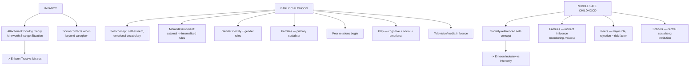

# LSD1 Unit 5 — Socio-Emotional Development

Covers: attachment and social understanding in infancy, the self/emotional/moral/gender development of early childhood along with the influence of families, peers, play, and television, and the emotional/personality development of middle and late childhood through families, peers, and schools.

## Emotional and Personality Development of Infancy: Attachment and Social Contacts

**Social orientation/understanding and attachment** — from very early on, infants are socially oriented: they preferentially attend to faces and voices (setting up the sensory preferences covered in Unit III) and gradually build an understanding of other people as distinct social partners. This culminates in **attachment**, the strong, enduring emotional bond that forms between an infant and a primary caregiver, most influentially studied by **John Bowlby** (attachment as an evolved survival mechanism keeping the infant close to a protector) and empirically tested by **Mary Ainsworth**'s "Strange Situation" procedure, which identified attachment patterns/styles based on how infants respond to separation from and reunion with the caregiver (broadly: secure attachment, and several forms of insecure attachment). Quality of early attachment is considered foundational because it shapes the infant's basic expectations about relationships going forward — directly connecting back to Erikson's "Trust vs. Mistrust" crisis from Unit II.

**Social contacts** — beyond the primary caregiver, infants increasingly interact with and respond to other family members and, later in infancy, show interest in other infants/children, laying the earliest groundwork for peer relationships.

## Early Childhood: The Self, Emotional Development, and Moral Development

- **The self and emotional development** — early childhood is when children develop a clearer sense of **self-concept** (understanding of who they are) and **self-esteem** (evaluation of their own worth), alongside an expanding emotional vocabulary and growing (if still developing) ability to regulate emotions rather than being overwhelmed by them.
- **Moral development** — early childhood is where the earliest forms of moral reasoning appear, generally starting from an external, consequence-based understanding of right and wrong (something is "bad" because you get punished for it) and gradually moving toward an internalised sense of rules — this period lays the groundwork for the more sophisticated moral reasoning studied in later developmental stages.
- **Gender** — children develop **gender identity** (understanding of themselves as a boy or girl) and begin absorbing **gender roles** (behaviours and expectations associated with each gender) during early childhood, shaped heavily by family modelling, peer reinforcement, and broader cultural/media messages.

## Early Childhood: Families, Peer Relations, Play, and Television

- **Families** — remain the primary socialising influence in early childhood; parenting style (warmth, control, consistency) substantially shapes the child's emotional security, self-regulation, and early social behaviour.
- **Peer relations** — interactions with same-age children become increasingly important in early childhood, providing a context (distinct from the family) for practising social skills like sharing, turn-taking, and conflict resolution.
- **Play** — is not incidental but a primary vehicle for development in early childhood: it supports cognitive growth (through pretend/symbolic play, echoing the "symbolic thought" of Unit IV), social skill practice (through play with peers), and emotional expression/processing.
- **Television (media exposure)** — is included as an influence on early childhood socio-emotional development because content and viewing patterns at this age can shape attention span, behaviour (including modelling of both prosocial and aggressive behaviour, echoing observational learning from General Psychology I), and social understanding.

## Middle and Late Childhood: Emotional and Personality Development

Moving into the school-age years (6–11), emotional and personality development is shaped increasingly by contexts outside the immediate family:
- Children develop a more complex and **socially-referenced self-concept** — increasingly defined by comparison with peers and performance in structured settings (school, sports) rather than purely family-based self-evaluation, connecting directly to Erikson's "Industry vs. Inferiority" crisis (Unit II): success in mastering skills and tasks at this age builds a sense of competence, while repeated failure or comparison can produce feelings of inferiority.
- Emotional regulation continues to mature, alongside a growing understanding of more complex emotions (like pride, guilt, and embarrassment) that depend on evaluating oneself against social standards.

## Middle and Late Childhood: Families, Peers, and Schools

- **Families** — remain important, but the *nature* of the family's influence shifts: from direct behavioural control toward more indirect influence through monitoring, communication, and shared values, as the child spends increasing time outside direct parental supervision.
- **Peers** — take on a substantially larger role in middle/late childhood than in early childhood; peer acceptance, friendship quality, and peer group status become significant contributors to self-esteem and emotional well-being, and peer rejection at this age is a recognised risk factor for later socio-emotional difficulties.
- **Schools** — become a central socialising institution in their own right during this period: academic experiences directly feed into the Industry vs. Inferiority dynamic above, and the structured social environment of school (teachers, classroom rules, group activities) shapes social skill development in ways that go well beyond just peers and family.

## Concept Map

## Flashcards
Q: What is attachment, and who are the two key theorists associated with it?
A: The strong, enduring emotional bond between an infant and primary caregiver; associated with John Bowlby (attachment theory) and Mary Ainsworth (the Strange Situation procedure).

Q: What does Ainsworth's Strange Situation procedure measure?
A: An infant's attachment style/pattern, based on how the infant responds to separation from and reunion with the caregiver.

Q: How does attachment quality in infancy connect to Erikson's psychosocial stages?
A: Secure early attachment supports a positive resolution of Erikson's "Trust vs. Mistrust" crisis in infancy.

Q: How does moral reasoning typically develop across early childhood?
A: It starts from an external, consequence-based understanding of right and wrong and gradually moves toward an internalised sense of rules.

Q: What roles does play serve in early childhood development?
A: Cognitive growth (through symbolic/pretend play), social skill practice, and emotional expression/processing.

Q: How does the family's influence typically shift from early childhood to middle/late childhood?
A: From direct behavioural control in early childhood toward more indirect influence through monitoring, communication, and shared values in middle/late childhood.

Q: Why do peers become more influential in middle/late childhood than in early childhood?
A: Peer acceptance, friendship quality, and peer group status become significant contributors to self-esteem and emotional well-being, and peer rejection becomes a recognised risk factor.

Q: How does middle/late childhood's self-concept differ from early childhood's?
A: It becomes more socially-referenced, defined increasingly through comparison with peers and performance in structured settings like school and sports.

Q: Which Erikson crisis maps onto the school-age emphasis on mastering skills and comparing performance with others?
A: Industry vs. Inferiority.

Q: What new socialising institution becomes central in middle/late childhood beyond family and peers?
A: The school.
