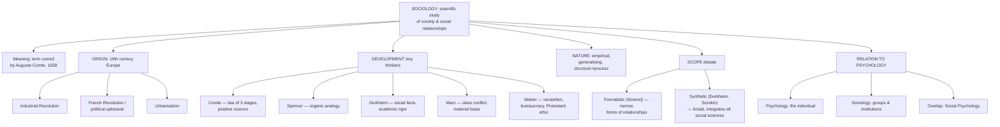

# SOC Unit 1 — Sociology: Origin and Development

Covers: what sociology is and means, where and how it originated, how it developed as a discipline, its nature and scope, and how it relates to psychology — the natural first unit for a psychology student taking sociology as a companion paper.

## Sociology: Definition and Meaning

**Sociology** is formally defined as the scientific study of society, social relationships, social institutions, and social behaviour — it studies people not as isolated individuals (which is closer to psychology's focus) but as members of groups, organisations, and societies, and asks how those group-level structures shape behaviour. The term itself was coined by **Auguste Comte** in 1838, combining the Latin *socius* (companion/associate) and the Greek *logos* (study/science) — literally, "the study of companionship" or, more broadly, the study of society. Comte is accordingly regarded as the "father of sociology."

The **meaning** of sociology is best grasped through what's called the "sociological imagination" (a term from later sociologist C. Wright Mills, useful for framing this unit even though not always named in the syllabus): the ability to see connections between individual, personal experiences ("private troubles") and larger social forces and structures ("public issues"). For example, an individual losing a job might feel like a personal failure, but sociology asks whether large-scale unemployment trends, economic policy, or automation are shaping that outcome across many people at once.

## Origin of Sociology

Sociology emerged as a distinct discipline in the **19th century in Europe**, and its rise was not accidental — it responded directly to the massive social upheavals of the time:
- The **Industrial Revolution** transformed economies from agrarian to industrial, uprooting traditional rural communities and creating new urban working classes, factory labour conditions, and class conflicts.
- The **French Revolution** and the broader wave of political revolutions shook traditional social and political order, raising urgent questions about social stability, authority, and change.
- **Urbanisation** concentrated large, diverse populations into cities, producing new forms of social organisation (and disorganisation) that older frameworks (religious, purely philosophical) struggled to explain.

Early thinkers wanted a *scientific* (empirical, systematic) way to understand these rapid changes, rather than relying purely on philosophical speculation — this scientific ambition is precisely why Comte modelled sociology on the natural sciences and originally even called it "social physics."

## Development of Sociology

Beyond Comte, several early theorists shaped the discipline's development, and each is worth knowing by their core contribution:
- **Auguste Comte** — founded the term "sociology," proposed the "law of three stages" (societies pass through theological, metaphysical, and positive/scientific stages of understanding), and argued sociology should be a positive science of society.
- **Herbert Spencer** — applied an evolutionary, organic analogy to society (society develops and evolves like a biological organism, with interdependent "organs"/institutions).
- **Émile Durkheim** — established sociology as a rigorous academic discipline with clear methods, emphasised **social facts** (ways of acting, thinking, and feeling that exist externally to and constrain the individual) as sociology's proper subject matter, and studied social solidarity and phenomena like suicide to show that even seemingly individual acts have social causes and patterns.
- **Karl Marx** — though often studied as an economist/philosopher too, contributed foundational sociological ideas about class conflict, the economic (material) basis of social structure, and how economic relations shape all other social institutions.
- **Max Weber** — emphasised understanding social action through the subjective meaning individuals attach to their behaviour (a method called *verstehen*, or interpretive understanding), and studied topics like bureaucracy, authority, and the relationship between religious belief (e.g., the Protestant ethic) and economic behaviour (capitalism).

Sociology then spread from Europe and developed further, including significant institutional growth in the United States (Chicago School and beyond) and, relevant to this syllabus, its own development within India (covered further as the discipline matured with Indian sociologists studying caste, village society, and social change specific to Indian contexts).

## Nature and Scope of Sociology

The **nature** of sociology as a discipline includes these defining features:
- It is a **social science** — uses systematic, empirical methods (echoing General Psychology I's methods unit) rather than pure speculation.
- It is a **generalising science** — seeks to find general patterns and principles across societies, rather than only describing one particular event (contrast with history, which focuses on particular events).
- It studies **both social structure and social processes** — the relatively stable patterns of institutions (structure) and the ongoing interactions and changes within them (process).
- It is **both theoretical and applied** — it builds abstract theory about society while also informing practical policy and social work.

The **scope** of sociology is famously debated between two positions worth knowing as a pair:
- The **formalistic school** (e.g., Georg Simmel) — argues sociology should have a narrow, specific scope, focusing only on the *forms* of social relationships (e.g., competition, cooperation, domination) as a distinct field, separate from other social sciences.
- The **synthetic school** (e.g., Durkheim, Sorokin) — argues sociology should have a broad scope, synthesising and integrating insights from all social sciences (economics, political science, psychology, history) into a comprehensive study of society as a whole.

In practice, modern sociology tends toward the synthetic view, studying everything from small-group interaction to entire global social structures, which is exactly why the rest of this paper's units (society and community, family and marriage, social control, culture and change) look so broad in scope.

## Relation Between Sociology and Psychology

Since this is a sociology paper taken alongside psychology, the syllabus explicitly asks students to place the two disciplines side by side:
- **Psychology** primarily studies the *individual* — their behaviour, mental processes, personality, and internal experience, even when that individual is influenced by others (as in social psychology).
- **Sociology** primarily studies **groups, institutions, and society** — social structures, relationships, and collective patterns that exist beyond any single individual.
- The two disciplines overlap significantly and depend on each other: individual behaviour (psychology's focus) is always shaped by the social context, groups, and institutions the person is embedded in (sociology's focus), and conversely, social structures are ultimately made up of and enacted by individuals. This overlap is formalised in the sub-field of **social psychology**, which studies exactly this individual-in-society intersection.
- A simple way to remember the distinction for exam purposes: psychology asks "why does this *person* behave this way?"; sociology asks "why does *this pattern* appear across so many people, and what social structure produces it?"

## Concept Map

## Flashcards
Q: Who coined the term "sociology," and what does the term literally mean?
A: Auguste Comte, in 1838; literally "the study of companionship" (Latin socius + Greek logos), broadly the study of society.

Q: Name three major historical forces in 19th-century Europe that drove the emergence of sociology.
A: The Industrial Revolution, the French Revolution/political upheaval, and urbanisation.

Q: What did Auguste Comte's "law of three stages" propose?
A: That societies pass through theological, metaphysical, and positive (scientific) stages of understanding.

Q: What are "social facts" according to Durkheim, and why do they matter?
A: Ways of acting, thinking, and feeling that exist externally to and constrain the individual; Durkheim proposed them as sociology's proper subject matter.

Q: What method did Max Weber emphasise for understanding social action?
A: Verstehen — interpretive understanding of the subjective meaning individuals attach to their behaviour.

Q: What core sociological contribution is Karl Marx associated with?
A: Class conflict and the idea that the economic (material) basis of society shapes all other social institutions.

Q: Contrast the formalistic and synthetic schools on the scope of sociology.
A: The formalistic school (Simmel) argues for a narrow scope focused only on forms of social relationships; the synthetic school (Durkheim, Sorokin) argues for a broad scope integrating all social sciences.

Q: What is the primary focus of psychology versus sociology?
A: Psychology studies the individual's behaviour and mental processes; sociology studies groups, institutions, and society-level patterns.

Q: Which sub-field formally studies the overlap between individual behaviour and social/group influence?
A: Social psychology.

Q: Why is sociology called a "generalising" science?
A: Because it seeks general patterns and principles across societies, rather than describing only one particular event (unlike history).
